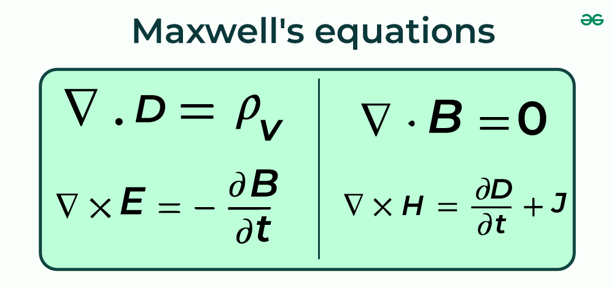

# Teorie obvodu - "stavove rovnie"

## Kapacitance

Zjednodusene:
$$ C = \frac{Q}{U} \Rightarrow \frac{C}{t} = \frac{1}{R} = \frac{I}{U} $$
$$ u = \frac{1}{C} \int i \mathrm{d}t $$

## Induktance

Zjednodusene:
$$ L = \frac{\phi}{I} $$
$$ \nabla \times E = -\frac{\partial B}{\partial t}\text{, kde } \phi = B\cdot S\text{, } E = \frac{U}{d}$$
$$ \frac{U}{d^2} = -\frac{1}{S}\frac{\partial\phi}{\partial t} $$
$$ \frac{U}{d^2} = -\frac{L}{d^2} \frac{\partial I}{\partial t} \Rightarrow u = L \frac{\mathrm{d}i}{\mathrm{d}t}$$

*Spravneji pres Faradayuv zakon:*
$$ L = \frac{\phi}{i} $$
$$ u = -\frac{\mathrm{d}\phi}{\mathrm{d}t} $$
$$ u = L \frac{\mathrm{d}i}{\mathrm{d}t} $$

## Laplace

Popisuje vse jako exponencialu v case:
$$ F(s) = \mathcal{L}\left\{ f(t) \right\} = \int_0^\infty f(t) \exp\left( -st \right) \mathrm{d} t\text{, kde } t\ge 0\text{, }s\in\mathbb{C} $$

Vztahy pro integraci a derivaci exponencial:
$$ \int \exp\left( -st \right) \mathrm{d}t \propto -\frac{1}{s}\exp\left( -st \right) \Rightarrow \int \mathrm{d}t \rightarrow \frac{1}{s}$$
$$ \frac{\mathrm{d}\exp\left( -st \right)}{\mathrm{d}t} \propto -s \exp\left( -st \right) \Rightarrow \frac{\mathrm{d}}{\mathrm{d}t} \rightarrow s $$

Podle rovnic vyse:
$$ \text{induktance}  \rightarrow U(s) = LsI(s) \Rightarrow Ls $$
$$ \text{kapacitance} \rightarrow I(s) = CsU(s) \Rightarrow \frac{1}{Cs} $$