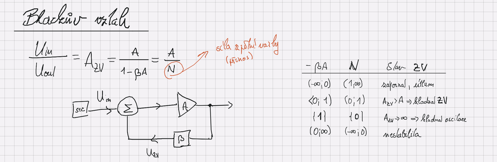
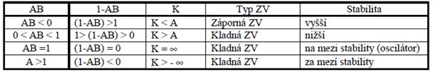
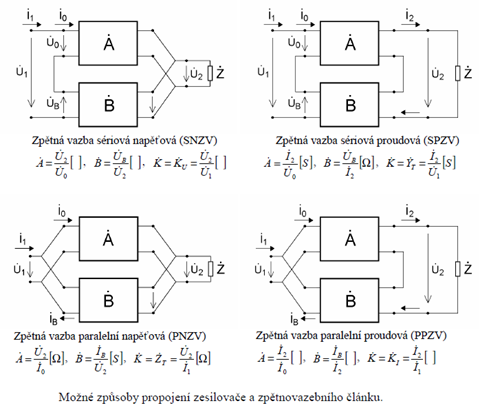

# 1\. Zpětná vazba - druhy, Blackův vztah, vliv zpětné vazby na parametry zesilovačů.

## Zpetne vazby
*Zpracovane otazky:* Při parametrické zpětné vazbě zpracovává zpětnovazební článek výstupní signál zesilovače a jeho výstupní signál podle toho nastavuje parametry zesilovače.
Při signálové zpětné vazbě se část výstupního signálu zesilovače přivádí zpět na vstup a je znovu zesilován. To ovlivňuje zejména celkové zesílení zesilovače, ale i různé další parametry. Signálová zpětná vazba je pro analýzu zesilovačů důležitější. Pro popis signálové zpětné vazby se používají 4 veličiny.




### Dukaz Blackova vztahu ze schematu
podle schematu nahore plati
$$U_{out} = (U_{in} + U_{zv})\cdot A\text{, kde } U_{zv} = \beta U_{out}$$
upravou:
$$U_{out} (1 - \beta A) = A U_{in}$$

## Druhy vazeb
```text
NOTE: Stava po nas chtel v modelovani, studoval jsem si kybernetiku
```


Chat uvaril:
```text
Feedback systems
│
├── By sign
│   ├── Negative
│   └── Positive
│
├── By topology (MOST IMPORTANT in circuits)
│   ├── Series–Shunt
│   ├── Shunt–Series
│   ├── Series–Series
│   └── Shunt–Shunt
│
└── By dynamics (control theory)
    ├── P
    ├── I
    ├── D
    └── PID combinations
```