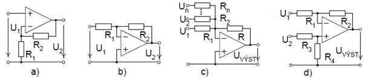

# 2\. Operační zesilovač VFA - vlastnosti, základní zapojení jako lineární zesilovač.

VFA - voltage feedback amplifier

### OTA, chybi vystupni prvek prevodu na napeti:

### ZV pro OPA

## Realne parametry

| Param | Popis |
|-------|-------|
| SR    | Slew Rate - doba prebehu |
| GBW   | Gain Band Width - od K0 do 0 dB |
| Uref  | kompenzace Uoff |
| UH    | rozsah hysterezniho napeti |
| CMRR  | Common Mode Rejection Ratio |
| A0    | Amp @0Hz |
| Uoff  | napeti Uin offsetu v Uout(Uin) |
| Rin   | inp res |
| Rout  | out res |
