# 4\. Kmitočtové filtry: dělení podle tvaru a podle aproximace kmitočtové charakteristiky, podle realizace.

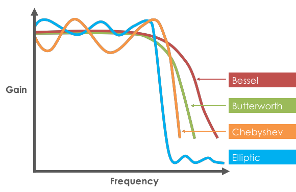
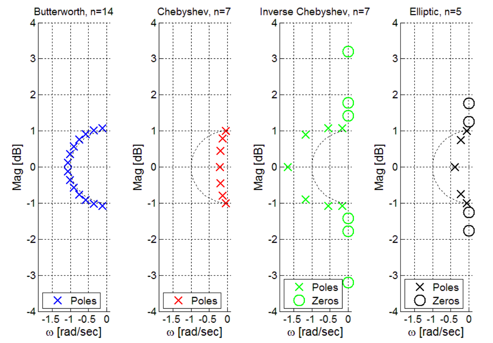

## Butterworth
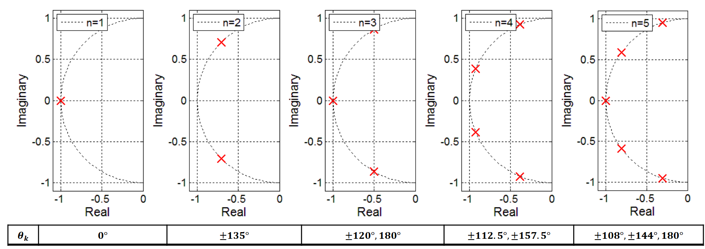
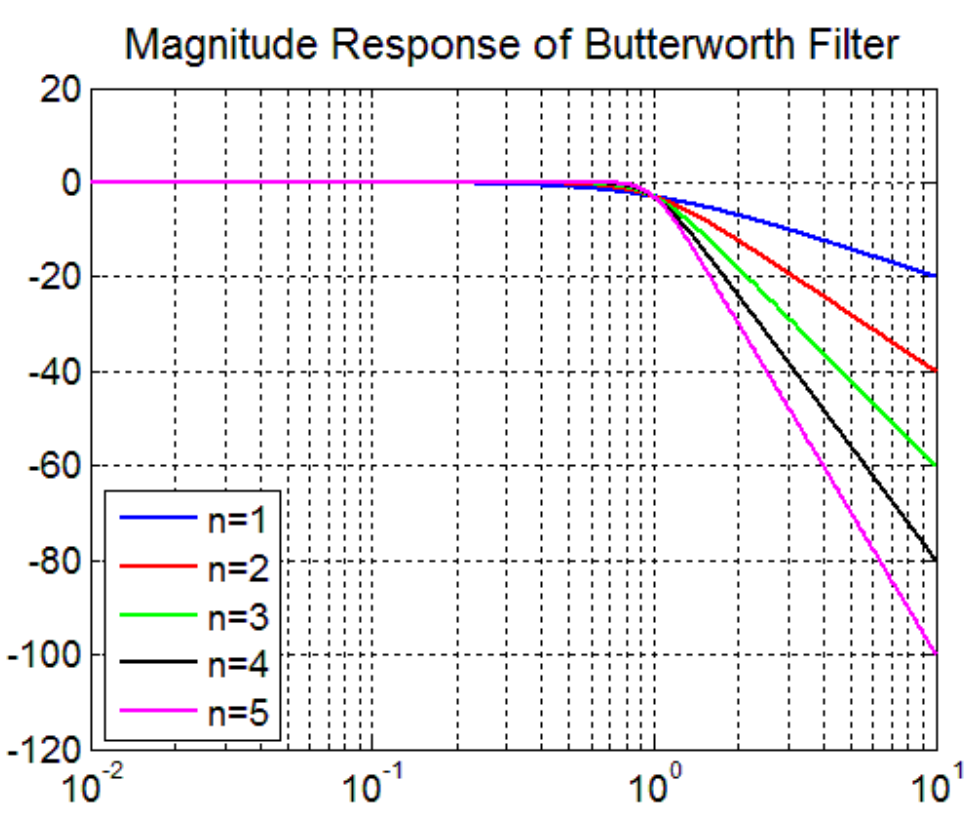

## Bessel
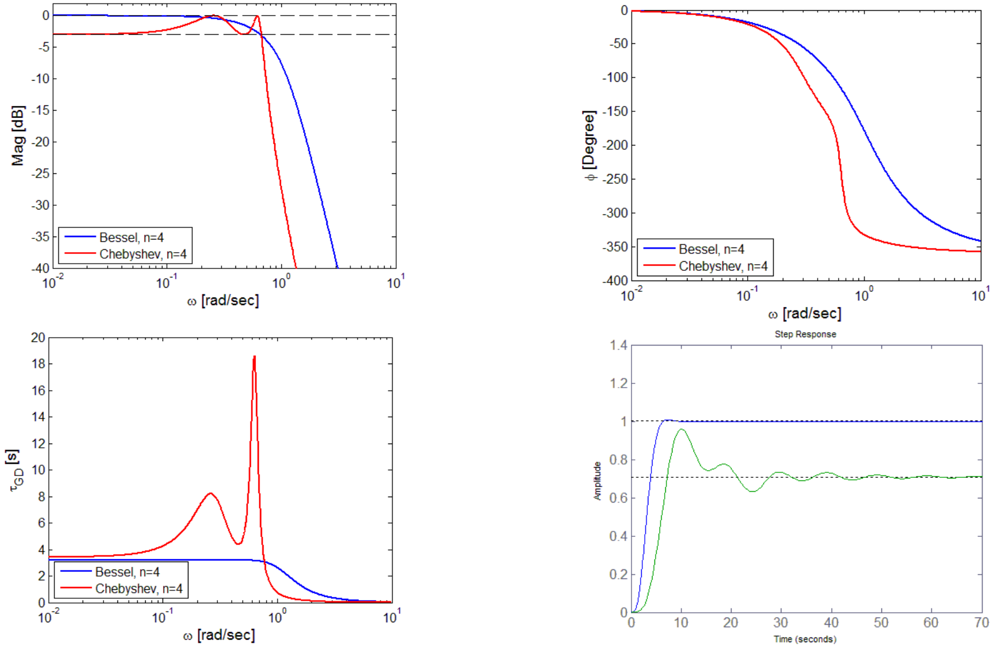
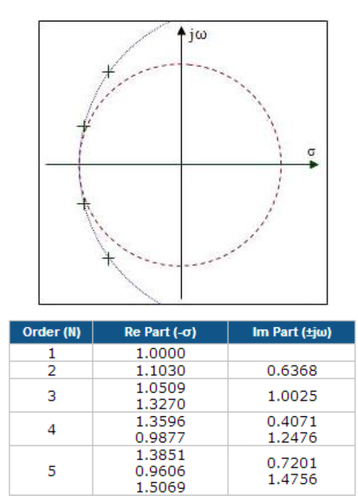

## Cebysev
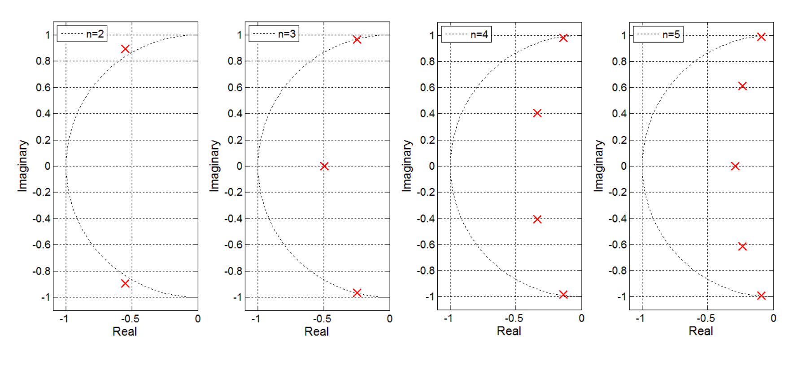
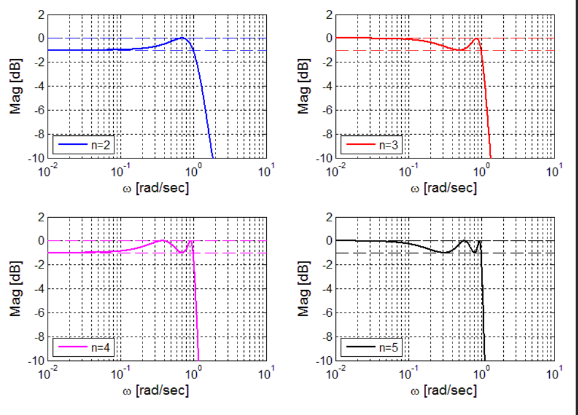

## Inverzni Cebysev
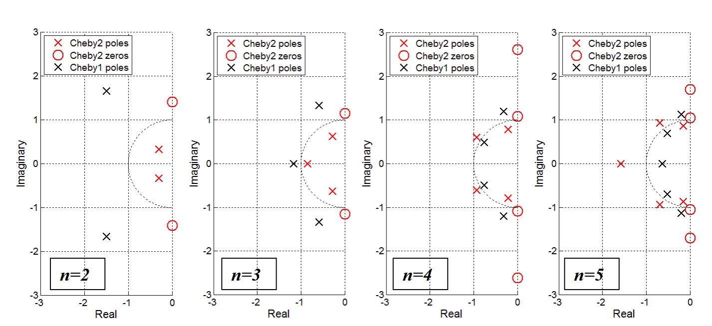
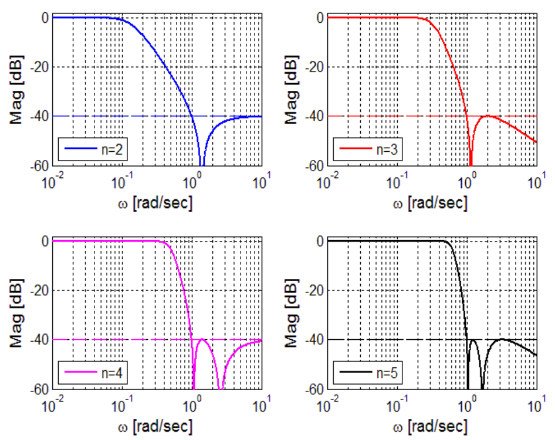

## Kauer (elipticky)
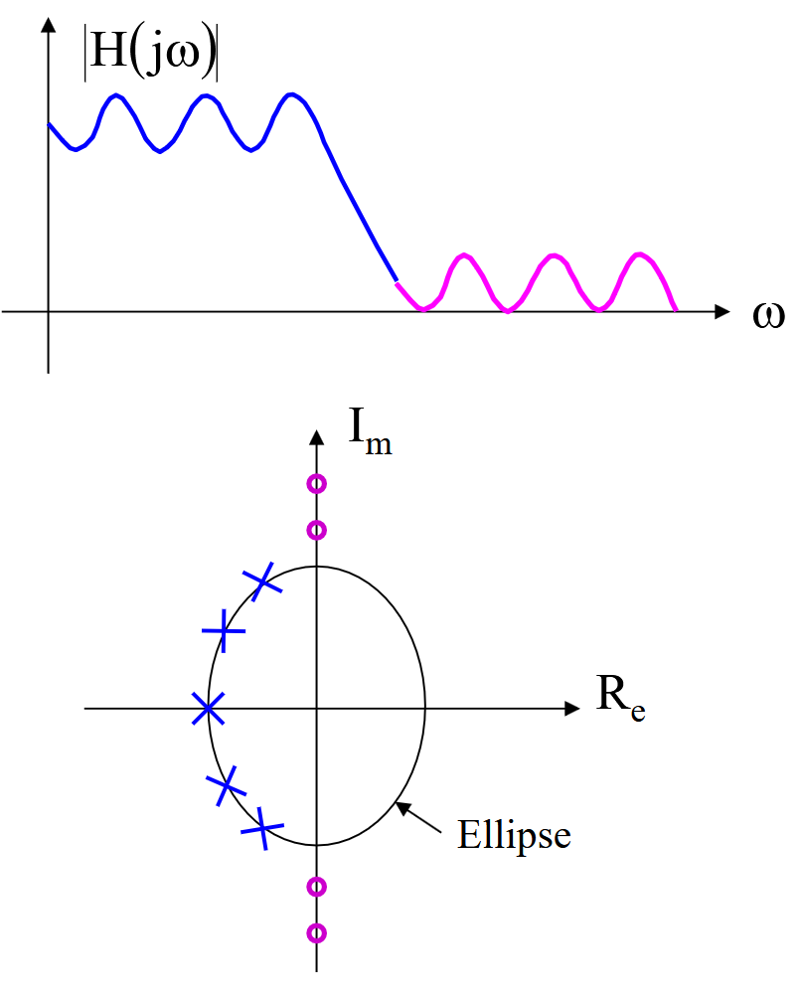
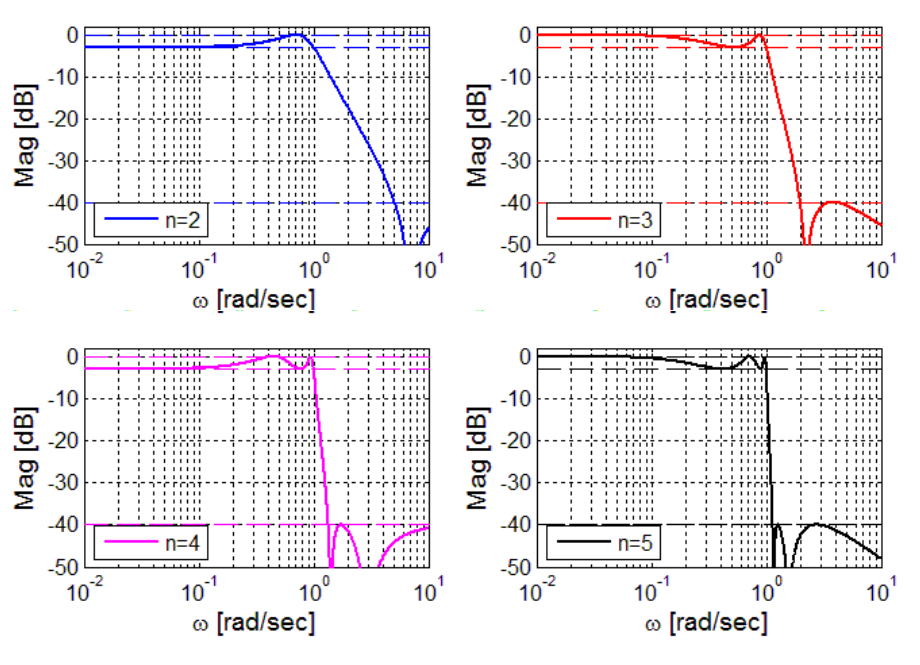