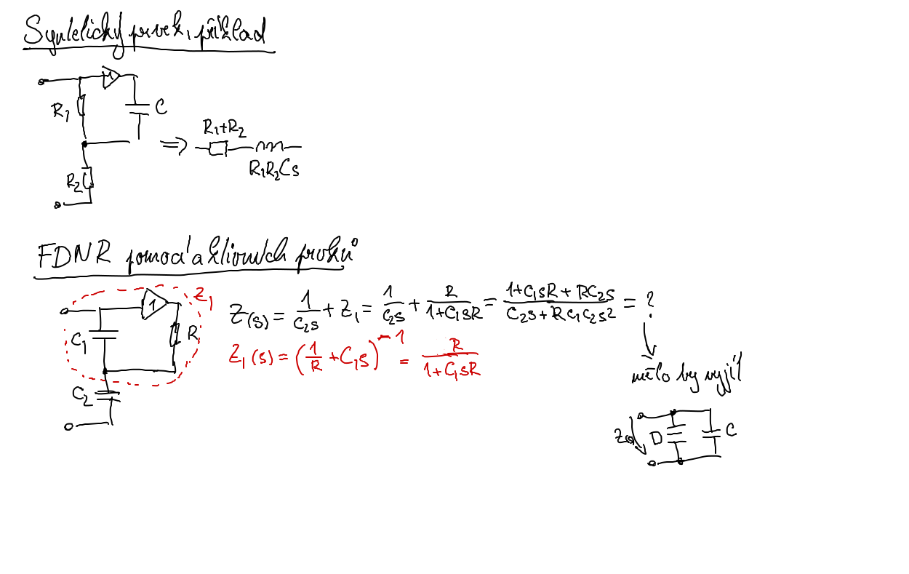

# 5\. Aktivní kmitočtové filtry "continuous-time" a se spínanými kapacitory: princip a příklady zapojení filtrů 2. řádu.

Viz prezentace z [ELF pro aktivni filtry](https://vutbr-my.sharepoint.com/:b:/g/personal/256660_vutbr_cz/IQBc_XakIv7zTIr2ShjhqtJ_AdWdSo_kR1qaMaXaGdZStLw?e=wjeDlV)

