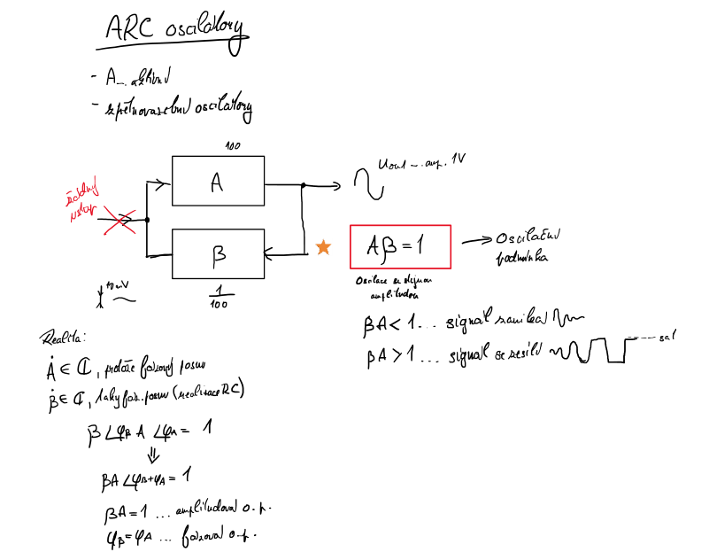
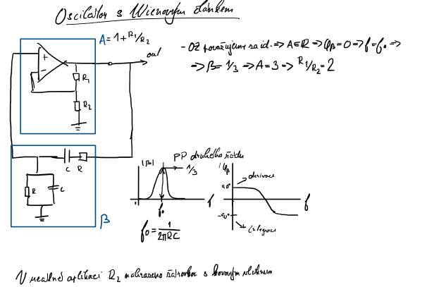
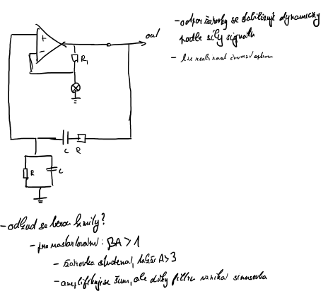

# 6\. RC oscilátory pro integrované realizace: zpětnovazební princip, příklady realizace, funkce obvodu pro stabilizaci amplitudy kmitů.

Oscilátory = generátory harmonického signálu. Vlastnosti oscilátoru ovlivňuje hlavně zpětnovazební článek B. Pro vytvoření oscilátoru se používá model pro simulaci zesilovačů s kladnou zpětnou vazbou, kde AB=1, čili obvod se nachází na mezi stability. Tato hodnota musí být nastavena naprosto přesně. Pro správnou harmonickou funkci je ještě důležité aby fázový posuv obou článků byl roven násobkům 2k∏. Tyto dvě podmínky označujeme jako amplitudovou a fázovou podmínku. V RC oscilátorech se obvykle ve zpětnovazebním článku B používá pásmová propust RC. Vlastnosti RC oscilátoru jsou určeny hlavně způsobem realizace RC článku.

