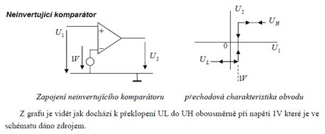
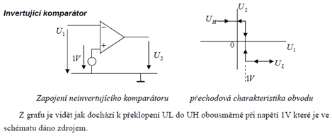
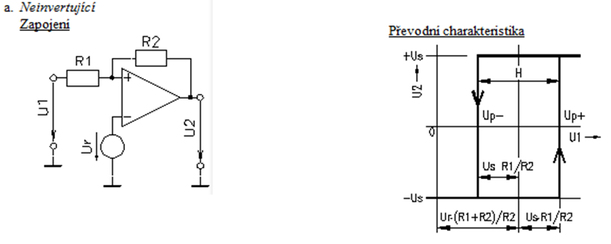
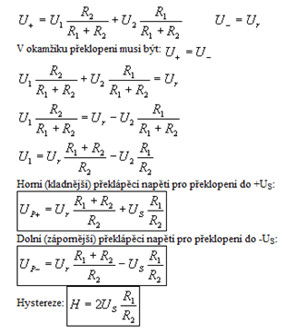
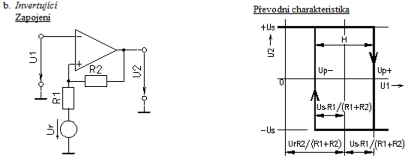
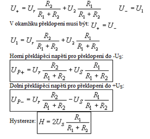

# 7\. Komparátory - invertující a neinvertující komparátor na bázi operačního zesilovače, způsoby zavádění hystereze.

### Zavedeni hystereze
Podivne hrani si

### Vypracovane - neinvertujici

### Vypracovane - invertujici

