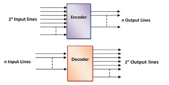
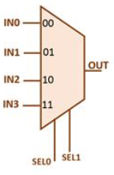

# 4\. Kombinační logické obvody. Popis kombinačních logických obvodů v jazyce VHDL. Dekodér, enkodér, multiplexor, číslicový komparátor a další. Minimalizace logické funkce.

## Obecný popis ve VHDL
**(claude):**

VHDL (VHSIC Hardware Description Language) popisuje digitální obvody pomocí **entit** a **architektur**.
- **Entity** definuje vstupy/výstupy obvodu (rozhraní).
- **Architecture** popisuje chování nebo strukturu obvodu.
- Kombinační logika se typicky popisuje pomocí *`process` (se sensitivity listem všech vstupů)* nebo přímým přiřazením signálů.

```vhdl
library IEEE;
use IEEE.STD_LOGIC_1164.ALL;

entity NAZEV_OBVODU is
    port (
        A, B : in  STD_LOGIC;       -- vstupy
        Y    : out STD_LOGIC        -- výstup
    );
end entity NAZEV_OBVODU;

architecture Behavioral of NAZEV_OBVODU is
begin
    -- přímé přiřazení (concurrent statement)
    Y <= A AND B;

    -- nebo pomocí process
	-- nejsem si jisty, zda neni preferovano:
	-- - process pro sekvencni
	-- - prime prirazeni pro kombinacni
    process(A, B)
    begin
        Y <= A AND B;
    end process;
end architecture Behavioral;
```


## Dekodér
[Obecna znacka dekoderu/enkoderu](https://cs.wikipedia.org/wiki/Dekod%C3%A9r#/media/Soubor:Decoder.svg):


**(claude):**

Převádí binárně kódovaný vstup na jeden aktivní výstup z $2^n$ možných. Typické použití: adresování paměti, řízení displeje (BCD → 7-segment).

```vhdl
library IEEE;
use IEEE.STD_LOGIC_1164.ALL;

entity DECODER_2to4 is
    port (
        A   : in  STD_LOGIC_VECTOR(1 downto 0);  -- 2-bitový vstup
        EN  : in  STD_LOGIC;                     -- enable
        Y   : out STD_LOGIC_VECTOR(3 downto 0)   -- 4 výstupy
    );
end entity;

architecture Behavioral of DECODER_2to4 is
begin
    process(A, EN)
    begin
        Y <= "0000";
        if EN = '1' then
            case A is
                when "00" => Y <= "0001";
                when "01" => Y <= "0010";
                when "10" => Y <= "0100";
                when "11" => Y <= "1000";
                when others => Y <= "0000";
            end case;
        end if;
    end process;
end architecture;
```


## Enkodér


**(claude):**

Opak dekodéru — převádí jeden aktivní vstup z $2^n$ na binární kód. **Prioritní enkodér** řeší případ, kdy je aktivních vstupů více najednou.

```vhdl
library IEEE;
use IEEE.STD_LOGIC_1164.ALL;

entity PRIORITY_ENCODER_4to2 is
    port (
        I : in  STD_LOGIC_VECTOR(3 downto 0);  -- 4 vstupy
        Y : out STD_LOGIC_VECTOR(1 downto 0);  -- 2-bitový výstup
        V : out STD_LOGIC                      -- valid (aspoň 1 vstup aktivní)
    );
end entity;

architecture Behavioral of PRIORITY_ENCODER_4to2 is
begin
    process(I)
    begin
        V <= '1';
        if    I(3) = '1' then Y <= "11";
        elsif I(2) = '1' then Y <= "10";
        elsif I(1) = '1' then Y <= "01";
        elsif I(0) = '1' then Y <= "00";
        else                  Y <= "00"; V <= '0';
        end if;
    end process;
end architecture;
```


## Multiplexor (MUX)


**(claude):**

Vybírá jeden z $2^n$ datových vstupů na základě řídicích (selekčních) signálů.

```vhdl
library IEEE;
use IEEE.STD_LOGIC_1164.ALL;

entity MUX_4to1 is
    port (
        D   : in  STD_LOGIC_VECTOR(3 downto 0);  -- datové vstupy
        SEL : in  STD_LOGIC_VECTOR(1 downto 0);  -- výběr
        Y   : out STD_LOGIC
    );
end entity;

architecture Behavioral of MUX_4to1 is
begin
    with SEL select
        Y <= D(0) when "00",
             D(1) when "01",
             D(2) when "10",
             D(3) when "11",
             '0'  when others;
end architecture;
```


## Číslicový komparátor
**(claude):**

Porovnává dvě binární čísla a vrací výsledek: `A < B`, `A = B`, `A > B`.

```vhdl
library IEEE;
use IEEE.STD_LOGIC_1164.ALL;
use IEEE.NUMERIC_STD.ALL;

entity COMPARATOR is
    port (
        A, B    : in  STD_LOGIC_VECTOR(3 downto 0);
        A_LT_B  : out STD_LOGIC;  -- A < B
        A_EQ_B  : out STD_LOGIC;  -- A = B
        A_GT_B  : out STD_LOGIC   -- A > B
    );
end entity;

architecture Behavioral of COMPARATOR is
    signal A_uns, B_uns : unsigned(3 downto 0);
begin
    A_uns <= unsigned(A);
    B_uns <= unsigned(B);

    A_LT_B <= '1' when A_uns < B_uns else '0';
    A_EQ_B <= '1' when A_uns = B_uns else '0';
    A_GT_B <= '1' when A_uns > B_uns else '0';
end architecture;
```


## Další obvody
**(claude):**

### Poloviční sčítačka (Half Adder)

Sčítá 2 jednobitové vstupy, výstup: součet `S` a přenos `C`.

```vhdl
entity HALF_ADDER is
    port (
        A, B : in  STD_LOGIC;
        S, C : out STD_LOGIC   -- Sum, Carry
    );
end entity;

architecture Behavioral of HALF_ADDER is
begin
    S <= A XOR B;
    C <= A AND B;
end architecture;
```

### Úplná sčítačka (Full Adder)

Sčítá 2 bity + vstupní přenos `Cin`.

```vhdl
entity FULL_ADDER is
    port (
        A, B, Cin : in  STD_LOGIC;
        S, Cout   : out STD_LOGIC
    );
end entity;

architecture Behavioral of FULL_ADDER is
begin
    S    <= A XOR B XOR Cin;
    Cout <= (A AND B) OR (B AND Cin) OR (A AND Cin);
end architecture;
```

### Paritní generátor/kontrolor

Vrací paritu (sudou/lichou) vícebitového vstupu.

```vhdl
entity PARITY is
    port (
        D    : in  STD_LOGIC_VECTOR(7 downto 0);
        ODD  : out STD_LOGIC   -- '1' = lichý počet jedniček
    );
end entity;

architecture Behavioral of PARITY is
begin
    ODD <= XOR D;   -- VHDL 2008: redukční XOR
    -- Pro starší VHDL: ODD <= D(7) XOR D(6) XOR D(5) XOR D(4)
    --                         XOR D(3) XOR D(2) XOR D(1) XOR D(0);
end architecture;
```


## Minimalizace logicke funkce
**(archivace [clanku o pravidlech minimalizace](https://web.archive.org/web/20170418140519/http://www.ee.surrey.ac.uk/Projects/Labview/minimisation/karrules.html))**:
<ol>
<li>No zeros allowed.
</li><li>No diagonals.
</li><li>Only power of 2 number of cells in each group.
</li><li>Groups should be as large as possible.
</li><li>Every one must be in at least one group.
</li><li>Overlapping allowed.
</li><li>Wrap around allowed.
</li><li>Fewest number of groups possible.
</li></ol>
<i>Composed by David Belton - April 98</i>