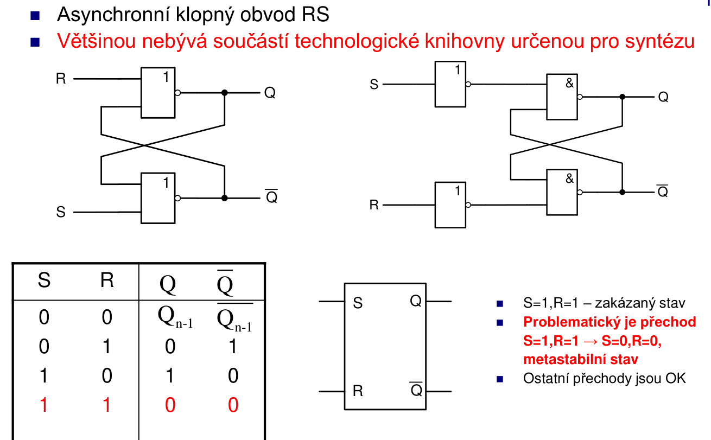
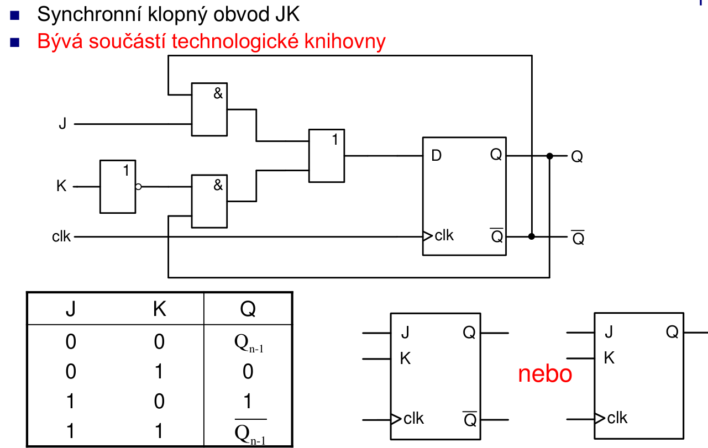
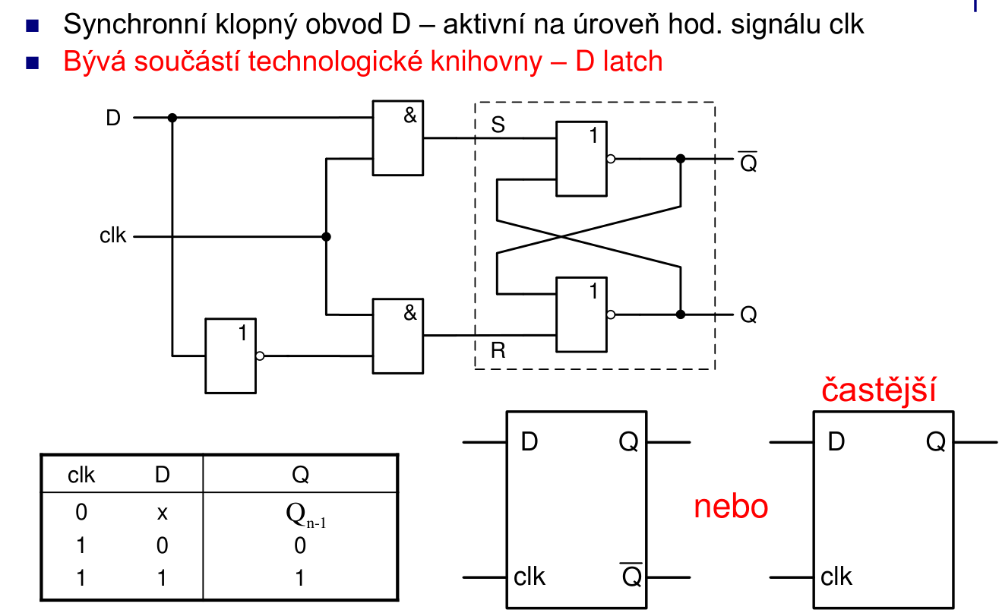
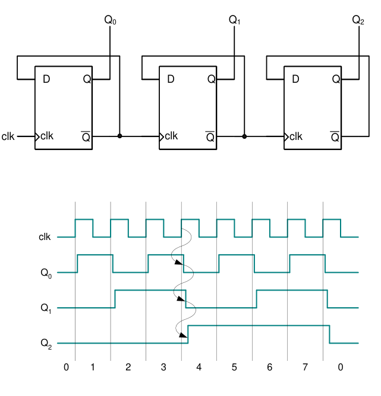
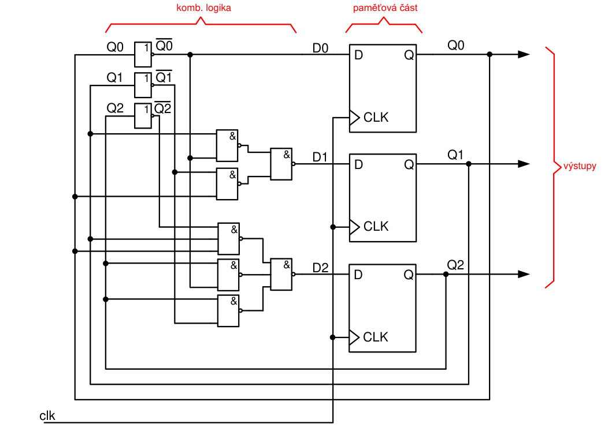
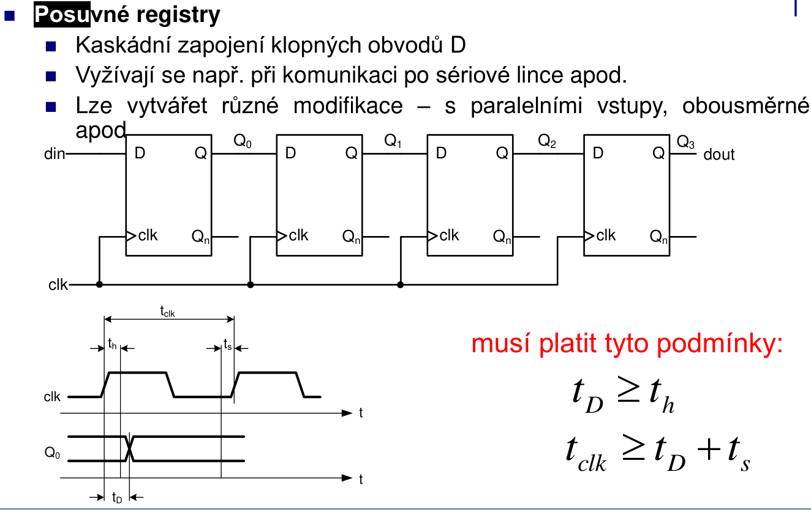

# 5\. Sekvenční logické obvody. Popište základní klopné obvody RS, JK, D, T. Popište asynchronní a synchronní čítače, posuvné registry a další. Podrobně popište využití procesů v jazyce VHDL.

**(claude):**

## Úvod

Sekvenční obvody mají **paměť** — jejich výstup závisí nejen na aktuálních vstupech, ale i na předchozím stavu. Základní stavební prvek je **klopný obvod (flip-flop / latch)**.

*Pozn. 1: Latch neni citlivy na `clk`, FF ano.*
*Pozn. 2: Všechny klopné obvody popsány v `BDIO06.pdf`*
*Pozn. 3: Asynchronni citace popsany v `BDIO06.pdf` a synchronni v `BDIO08.pdf`.

---

## Základní klopné obvody

### RS (Set-Reset) latch

**(p)**:



### JK klopný obvod

**(p)**:


### D klopný obvod (Data / Delay)

**(p)**:

Casteji vsak aktivni na **nabeznou hranu `clk`**

```vhdl
entity D_FF is
    port (
        CLK, D  : in  STD_LOGIC;
        RST     : in  STD_LOGIC;   -- asynchronní reset
        Q       : out STD_LOGIC
    );
end entity;

architecture Behavioral of D_FF is
begin
    process(CLK, RST)
    begin
        if RST = '1' then           -- asynchronní reset (mimo CLK)
            Q <= '0';
        elsif rising_edge(CLK) then
            Q <= D;
        end if;
    end process;
end architecture;
```

### T klopný obvod (Toggle)

Pokud `T=1`, výstup se při každé hraně přepne. Základ čítačů.

```vhdl
entity T_FF is
    port (
        CLK, T, RST : in  STD_LOGIC;
        Q           : out STD_LOGIC
    );
end entity;

architecture Behavioral of T_FF is
    signal Q_int : STD_LOGIC := '0';
begin
    process(CLK, RST)
    begin
        if RST = '1' then
            Q_int <= '0';
        elsif rising_edge(CLK) then
            if T = '1' then
                Q_int <= not Q_int;
            end if;
        end if;
    end process;

    Q <= Q_int;
end architecture;
```

---

## Čítače

**(p)**:
| citace | asyn. citace | sync. citace
|---|---|---
| citani pozadovane sekvence, delicky kmitoctu... | `clk` na prvni FF | `clk` na vsechny FF
| inkrementace nebo dekrementace | mene vyuzivany, velke zpozdeni | velke kmitoctu
| rozdeleni na asyn. a syn. | mala plocha (jen FFs) | velka plocha (i kombinacni obvody)
| |  | 

### Asynchronní čítač (ripple counter)

Každý FF je taktován výstupem předchozího — jednoduché zapojení, ale **zpoždění se kumuluje** (ripple delay). Nevhodné pro vysoké frekvence.

```vhdl
-- Asynchronní 4-bitový čítač (řetězení T-FF)
-- Každý bit taktován výstupem nižšího bitu
entity ASYNC_COUNTER is
    port (
        CLK, RST : in  STD_LOGIC;
        Q        : out STD_LOGIC_VECTOR(3 downto 0)
    );
end entity;

architecture Behavioral of ASYNC_COUNTER is
    signal cnt : STD_LOGIC_VECTOR(3 downto 0) := (others => '0');
begin
    -- Bit 0: taktován CLK
    process(CLK, RST)
    begin
        if RST = '1' then cnt(0) <= '0';
        elsif rising_edge(CLK) then cnt(0) <= not cnt(0);
        end if;
    end process;

    -- Bit 1: taktován výstupem bitu 0
    process(cnt(0), RST)
    begin
        if RST = '1' then cnt(1) <= '0';
        elsif rising_edge(cnt(0)) then cnt(1) <= not cnt(1);
        end if;
    end process;

    -- ... analogicky pro bity 2 a 3
    Q <= cnt;
end architecture;
```

---

### Synchronní čítač

Všechny FF jsou taktovány **stejným CLK** — žádné kumulované zpoždění. Preferovaný přístup v FPGA.

```vhdl
library IEEE;
use IEEE.STD_LOGIC_1164.ALL;
use IEEE.NUMERIC_STD.ALL;

entity SYNC_COUNTER is
    generic (WIDTH : integer := 4);
    port (
        CLK, RST, EN : in  STD_LOGIC;
        Q            : out STD_LOGIC_VECTOR(WIDTH-1 downto 0)
    );
end entity;

architecture Behavioral of SYNC_COUNTER is
    signal cnt : unsigned(WIDTH-1 downto 0) := (others => '0');
begin
    process(CLK, RST)
    begin
        if RST = '1' then
            cnt <= (others => '0');
        elsif rising_edge(CLK) then
            if EN = '1' then
                cnt <= cnt + 1;
            end if;
        end if;
    end process;

    Q <= std_logic_vector(cnt);
end architecture;
```

### Čítač s předvolbou a směrem (up/down)

```vhdl
architecture Behavioral of UPDOWN_COUNTER is
    signal cnt : unsigned(3 downto 0) := (others => '0');
begin
    process(CLK, RST)
    begin
        if RST = '1' then
            cnt <= (others => '0');
        elsif rising_edge(CLK) then
            if LOAD = '1' then
                cnt <= unsigned(D);     -- paralelní načtení
            elsif UP = '1' then
                cnt <= cnt + 1;
            else
                cnt <= cnt - 1;
            end if;
        end if;
    end process;

    Q <= std_logic_vector(cnt);
end architecture;
```

---

## Posuvné registry

**(p)**:


---

## Procesy ve VHDL — podrobný popis

### Základní struktura procesu

```vhdl
process(sensitivity_list)
    -- lokální proměnné (volitelné), v DIO nezadouci
    variable v : STD_LOGIC := '0';
begin
    -- sekvenční příkazy
    Y <= A AND B;
end process;
```

### Inferování latchů (nežádoucí chování)

Pokud v kombinačním procesu **není pokryt všechny kombinace vstupů**, syntetizátor inferuje **latch** — obvykle nežádoucí.

```vhdl
-- ŠPATNĚ: latch inferován, protože Y není přiřazeno pro SEL='0'
process(SEL, A)
begin
    if SEL = '1' then
        Y <= A;
    end if;   -- co je Y když SEL='0'? → latch
end process;

-- SPRÁVNĚ: výchozí přiřazení pokryje všechny větve
process(SEL, A)
begin
    Y <= '0';           -- výchozí hodnota
    if SEL = '1' then
        Y <= A;
    end if;
end process;
```

### Více procesů — paralelní běh

Všechny procesy v architektuře běží **souběžně** (concurrent). Komunikují přes sdílené signály.

```vhdl
architecture Behavioral of EXAMPLE is
    signal reg : STD_LOGIC_VECTOR(7 downto 0);
    signal full : STD_LOGIC;
begin
    -- Proces 1: registr
    process(CLK)
    begin
        if rising_edge(CLK) then
            reg <= DATA_IN;
        end if;
    end process;

    -- Proces 2: detekce plnosti (kombinační)
    process(reg)
    begin
        full <= AND reg;   -- VHDL 2008 redukční AND
    end process;
end architecture;
```

