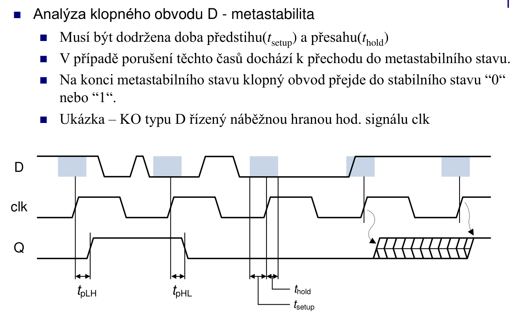
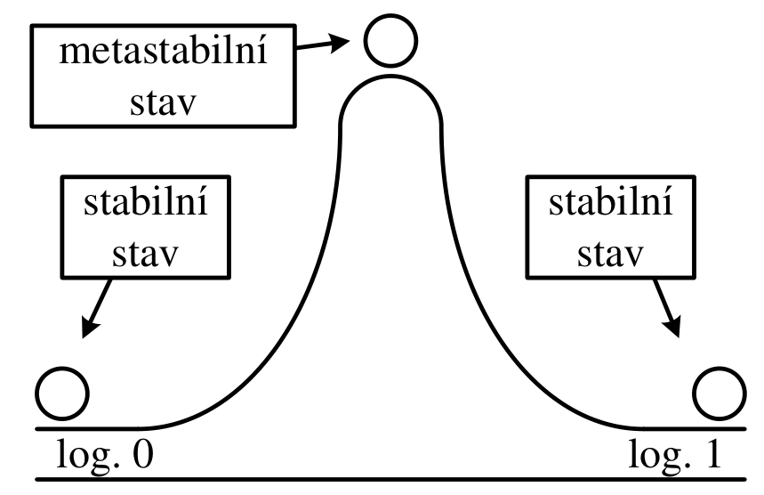

# 6\. Sekvenční logické obvody. Popište dobu předstihu a dobu přesahu na klopném obvodu D. Co je to metastabilita? Kde se metastabilita může vyskytnout? Jak je možné zabránit projevům metastability?

**(p)**:



## Metastabilita

### Co je metastabilita?

Klopný obvod je **analogový bistabilní obvod**. Pokud je `D` změněno v okně porušení (setup/hold violation), FF se dostane do **metastabilního stavu** — výstup Q je někde mezi `0` a `1`, není ani logická 0 ani 1.

- FF se z metastabilního stavu **nakonec ustálí** — buď na 0 nebo na 1.
- Čas ustálení je **náhodný** (exponenciálně distribuovaný).
- Pokud FF nestihne se ustálit před dalším vzorkováním, chyba se **propaguje dál**.



---

## Kde se metastabilita může vyskytnout?

### 1. Přechod mezi hodinami (Clock Domain Crossing — CDC)

Signál generovaný v **jedné doméně** (CLK_A) je vzorkován v **jiné doméně** (CLK_B) bez synchronizace. Hrany CLK_A a CLK_B jsou nesouvisející → setup/hold může být kdykoli porušen.

### 2. Asynchronní vstupy

Signály z vnějšího světa (tlačítka, UART RX, GPIO) přicházejí **nezávisle na interním CLK** — mohou se měnit kdykoli.

### 3. Arbitráž (Arbiter)

Obvody, které rozhodují mezi dvěma souběžnými požadavky — oba mohou přijít ve stejný okamžik.

---

## Jak zabránit projevům metastability?

### Synchronizér (2-FF synchronizer)

Nejzákladnější řešení: zařadit **dva D-FF za sebou** ve stejné cílové doméně. První FF může být metastabilní, ale pravděpodobnost, že se neustálí za celý taktovací cyklus před druhým FF, je exponenciálně malá.

```vhdl
entity SYNCHRONIZER is
    port (
        CLK     : in  STD_LOGIC;
        RST     : in  STD_LOGIC;
        ASYNC_IN : in  STD_LOGIC;
        SYNC_OUT : out STD_LOGIC
    );
end entity;

architecture Behavioral of SYNCHRONIZER is
    signal stage1, stage2 : STD_LOGIC := '0';
    -- Zakázat optimalizaci (Xilinx/Intel atribut)
    attribute ASYNC_REG : string;
    attribute ASYNC_REG of stage1 : signal is "TRUE";
    attribute ASYNC_REG of stage2 : signal is "TRUE";
begin
    process(CLK, RST)
    begin
        if RST = '1' then
            stage1 <= '0';
            stage2 <= '0';
        elsif rising_edge(CLK) then
            stage1 <= ASYNC_IN;   -- může být metastabilní
            stage2 <= stage1;     -- s vysokou pravděpodobností již stabilní
        end if;
    end process;

    SYNC_OUT <= stage2;
end architecture;
```

> **Důležité:** Atribut `ASYNC_REG` říká syntetizátoru, aby umístil oba FF **fyzicky blízko sebe** (minimalizace $t_{cq}$) a nezasahoval do cesty optimalizacemi.

---

### 3-FF synchronizér (pro velmi vysoké frekvence)

```vhdl
process(CLK, RST)
begin
    if RST = '1' then
        s1 <= '0'; s2 <= '0'; s3 <= '0';
    elsif rising_edge(CLK) then
        s1 <= ASYNC_IN;
        s2 <= s1;
        s3 <= s2;   -- třetí stupeň pro ještě nižší MTBF
    end if;
end process;
SYNC_OUT <= s3;
```

---

### MTBF (Mean Time Between Failures)

Střední doba mezi chybami způsobenými metastabilitou. Roste **exponenciálně** s časem vyhrazeným pro ustálení (tj. s počtem synchronizačních FF a délkou periody CLK).

$$MTBF = \frac{e^{t_{resolve}/\tau}}{f_{clk} \cdot f_{data} \cdot T_w}$$

kde:
- $t_{resolve}$ — čas pro ustálení (perioda CLK − $t_{cq}$ − $t_{su}$)
- $\tau$ — časová konstanta FF (závisí na technologii)
- $f_{clk}$, $f_{data}$ — frekvence hodin a dat
- $T_w$ — šířka metastabilního okna FF

---

### Shrnutí opatření

| Opatření | Popis |
|----------|-------|
| 2-FF synchronizér | Základní ochrana pro jednobitové signály |
| 3-FF synchronizér | Pro vyšší frekvence nebo kritické aplikace |
| Handshake protokol | Pro vícebitové signály — synchronizuje „valid" signál |
| Šedý kód (Gray code) | Pro čítače přecházející mezi doménami — mění se vždy jen 1 bit |
| Asynchronní FIFO | Bezpečný přenos dat mezi dvěma hodinovými doménami |
| `ASYNC_REG` atribut | Instruuje nástroje pro správné umístění a routing synchronizéru |

```vhdl
-- Příklad: přenos vícebitové hodnoty přes Gray kód
-- (pouze 1 bit se mění najednou → bezpečné pro 2-FF sync)
process(CLK_A)
begin
    if rising_edge(CLK_A) then
        gray_out <= binary_to_gray(counter);  -- konverze před přechodem
    end if;
end process;
-- V CLK_B doméně: synchronizovat gray_out, pak zpět na binární
```