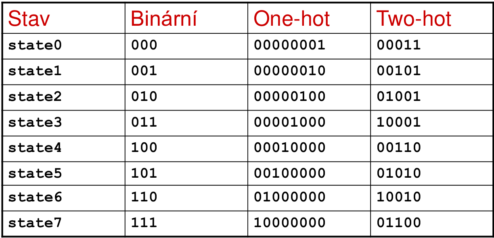
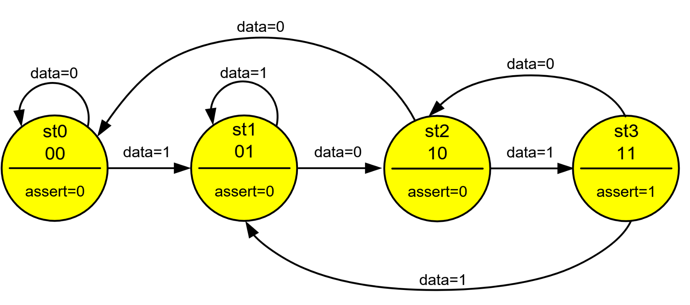

# 7\. Popište metodiku návrhu sekvenčních obvodů pomocí stavových automatů. Jaké typy stavových automatů existují. Enkódování stavových automatů. Výhody a nevýhody jednotlivých typů enkódování. Ošetření nevyužitých stavů při návrhu stavových automatů.

**(Claude):**
## Metodika návrhu FSM

1. **Specifikace** — slovní popis chování
2. **Stavový diagram** — stavy + přechody + podmínky
3. **Stavová tabulka** — formalizace přechodů
4. **Enkódování stavů** — přiřazení binárních hodnot stavům
5. **Implementace ve VHDL** — typicky 1–3 procesy
6. **Verifikace** — simulace, testbench


## Typy stavových automatů

### Moore vs Mealy FSM

Mealy: Výstup závisí na **aktuálním stavu i na vstupech**.
- Méně stavů než Moore pro stejné chování.
- Výstup se mění **asynchronně** se vstupy → možné glitche.

Moore: Výstup závisí **pouze na aktuálním stavu**, ne na vstupech.
- Výstup se mění synchronně (s CLK), stabilnější.
- Potřebuje obvykle **více stavů** než Mealy.

| Vlastnost | Moore | Mealy |
|-----------|-------|-------|
| Výstup závisí na | stavu | stavu + vstupech |
| Počet stavů | více | méně |
| Glitche na výstupu | ne | možné |
| Reakce na vstup | o 1 CLK zpožděna | okamžitá |
| Typické použití | protokoly, bezpečné výstupy | datové cesty, rychlé reakce |


## Enkódování stavů

| Typ | FF na stav | Logika | Vhodné pro |
|-----|-----------|--------|------------|
| Binary | $\lceil \log_2 N \rceil$ | složitější | ASIC, velký počet stavů |
| One-hot | 1 FF / stav | jednoduchá | FPGA (CLB bohaté na FF) |
| Gray | $\lceil \log_2 N \rceil$ | střední | CDC přechody, nízká spotřeba |



## Ošetření nevyužitých stavů

Při enkódování může vzniknout více binárních kombinací, než je stavů (např. 3 stavy → 2 bity → 4 kombinace → 1 nevyužitý stav). Při **one-hot** je nevyužitých stavů ještě více.

### Řešení 1: `when others` větev

```vhdl
case state is
    when S_IDLE   => next_state <= S_ACTIVE;
    when S_ACTIVE => next_state <= S_DONE;
    when S_DONE   => next_state <= S_IDLE;
    when others   => next_state <= S_IDLE;  -- bezpečný reset stav
end case;
```

### Řešení 2: Explicitní default + výstup

```vhdl
process(state)
begin
    -- Výchozí hodnoty pro všechny výstupy
    next_state <= S_IDLE;
    OUTPUT <= '0';

    case state is
        when S_IDLE   => ...
        when S_ACTIVE => ...
        when S_DONE   => ...
        -- Nevyužité stavy: padnou na výchozí next_state <= S_IDLE
    end case;
end process;
```

### Řešení 3: Explicitní enkódování + kontrola platnosti

```vhdl
-- Manuální one-hot s kontrolou
process(CLK)
begin
    if rising_edge(CLK) then
        -- Kontrola: právě 1 bit musí být nastaven
        if (state /= "0001" and state /= "0010" and
            state /= "0100" and state /= "1000") then
            state <= "0001";  -- recovery do výchozího stavu
        end if;
    end if;
end process;
```

[Zkouska](../../undefined):
[Priklad modulu pro detekci posloupnosit 101](../../_resources/101.v):
