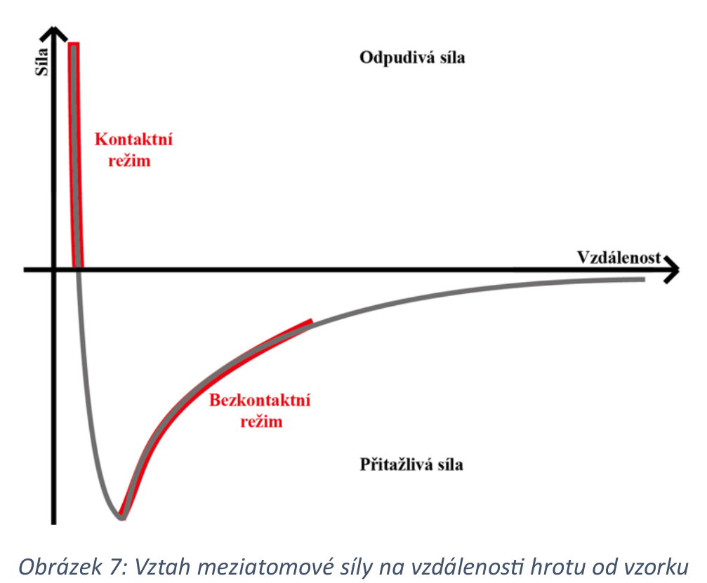
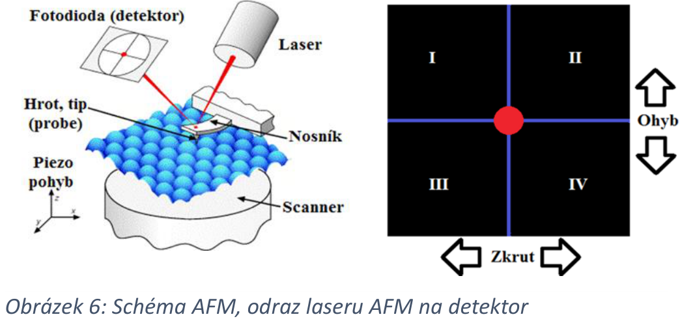

# 1\. Mikroskopie atomárních sil. Princip funkce AFM, základní metody pozorování vzorků, požadavky na vzorky.

## Princip AFM
**(szz_SPM.pdf):** 
hrot: $l \approx 1 \mu m$, $d_{diam} < 10 nm$
nosnik: $l \in (100-200) \mu m$

detektor: 

## Metody AFM
1. Kontaktni AFM
	a. rezim konstantni vysky
	b. rezim konstantni sily
2. Bezkontaktni AFM
	- resonance nosniku na vlastni frekvenci (ampl. ~nm), ta zmenena polem atomu (popr. zachovana a snimany zmeny amplitudy)
3. Poklepove AFM
	- eliminace lateralnich sil (pritomny pri kontaktnim AFM), velke amplitudy oscilace (dochazi ke kontaktu)
<text style="color:gray">
Dalsi typy:
*4. Lateral Force Microscopy*
*5. Force Modulation Microscopy*
*6. Electrostatic Force Microscopy*
*7. Kelvin Probe Force Microscopy*
*8. Phase Shift Detection Microscopy*
*9. Magnetic Force Microscopy*
*10. Scanning Thermal Microscopy*
</text>

## Pozadavky na vzorky
**([AZO Nano](https://www.azonano.com/article.aspx?ArticleID=6227)):** the sample must be adhered rigidly and properly dispersed on the substrate; the roughness of the substrate should not be bigger than the size of the nanoparticle sample surface.