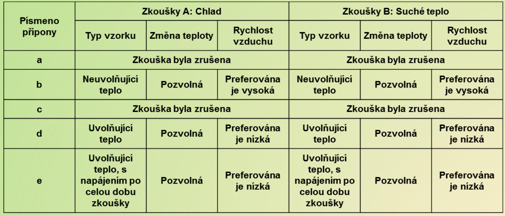

# 10\. Klimatické a mechanické zkoušky, přehled metod, průběhy zkoušek a využití v praxi. 

Vse z **(P)**

## Klimaticke zkousky
1. chladem
	a. pro predmety, ktere nejsou zdrojem tepla (tepelnym razem a pozvolnym ochlazenim)
	b. pro predmety, ktere jsou zdrojem tepla (tepelnym razem a pozvolnym ochlazenim)
2. suchym teplem

3. vlhkym teplem
4. nizkym tlakem vzduchu
5. zmena teploty
6. plisnemi
7. slunecnim zarenim
8. znecistenym ovzdusim
9. prachem a piskem
10. hermeticnosti
11. kryti

## Mechanicke zkousky
1. udery
	- dle prubehu uderu (sin, saw, lichobeznikovy)
2. razy
3. narazy a preklopeni
4. pady
5. stalym zrychlenim
6. chvenim
	- kombinovatelne postupy:
		1. vyhledani rezonanci frekvence
		2. unava materialu chvenim
			a. roznitani $\omega$
			b. na $\omega_{r}$ (resonance)
			c. na predepsanych $\omega$
			d. souvislym spektrem kmitoctu
		3. vyhledani $\omega_r$ po kroku 2.

---
- pro vetsinu zkousek pouzito zarizeni "mechanicky zkusebni stul"