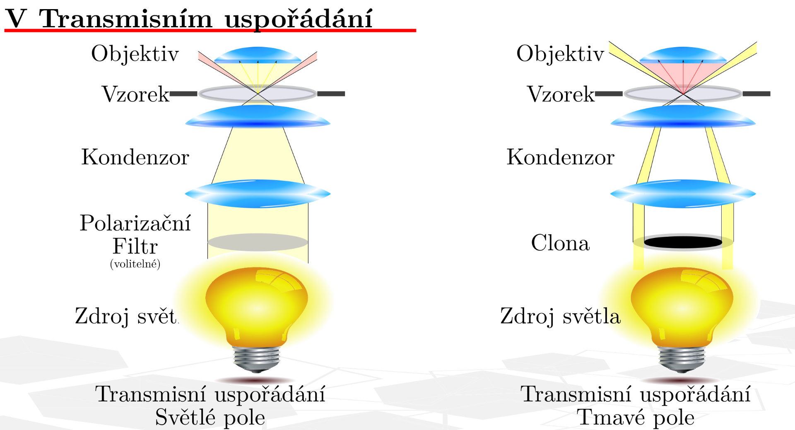
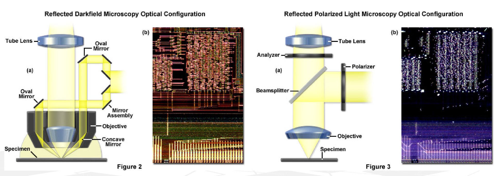

# 2\. Metody optické mikroskopie. Způsoby pozorování ve světlém a tmavém poli

## Opticky mikroskop

- cocky
	- objektiv
		- dle principu zobrazeni: cockovy, zrcadlovy
		- dle prostredi: imerzni, suchy
		- dle korekce: achromaticky *(ch. kompenzovana jen pro 2 barvy)*, planachromaticky *(achromatika + kompenzace sklenuti pole)*, apochromaticky *(kompenzace ch. pro 3 barvy)*, planapochromaticky *(apochromaticky + kompenzace sklenuti pole)*
		- vyjadrena $NA$ urcujici $\alpha_p$
	- okular
		- dle konstrukce: Huygens (2 plankonvexni), periplanaticky (clona mezi cockami, ocni cocka dvojita achromaticka, kompenzace ch.), kompenzacni
	 
- tubus
	- vzdalenost mezi objektivem a okularem
 
