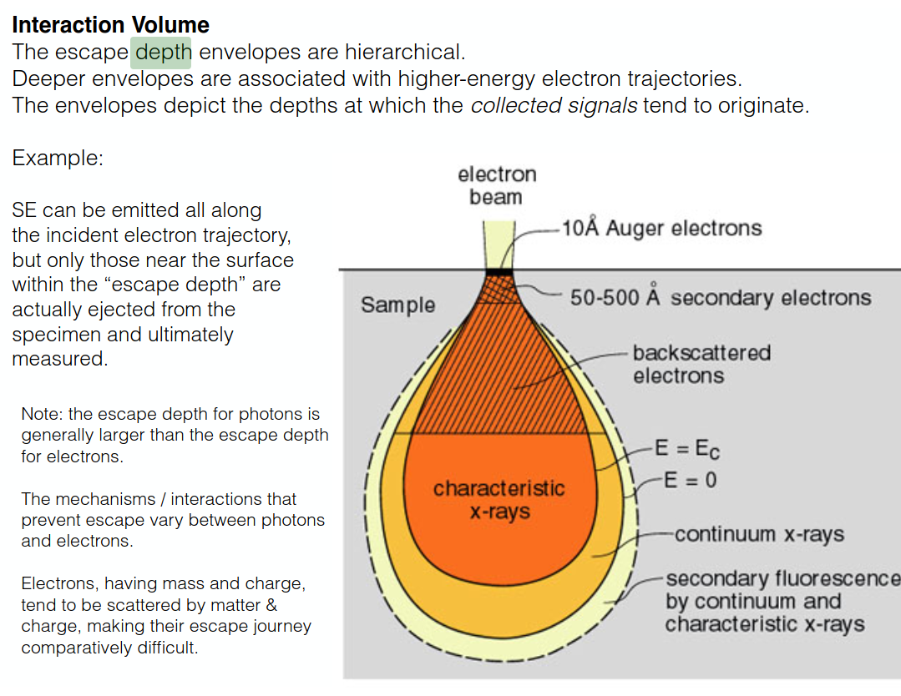
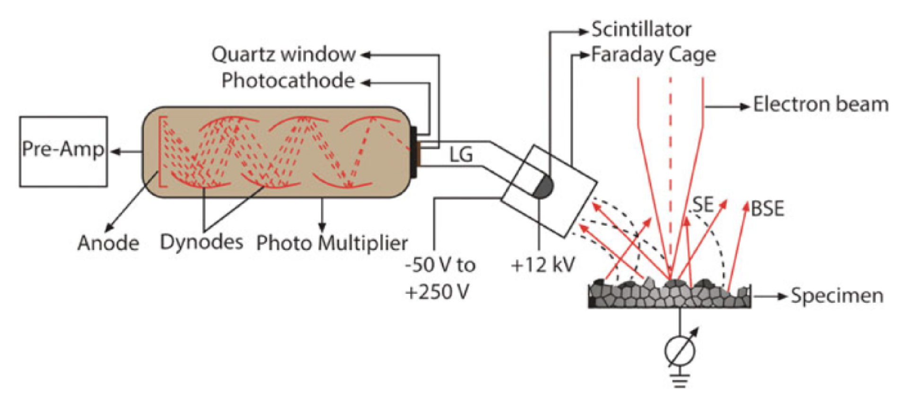
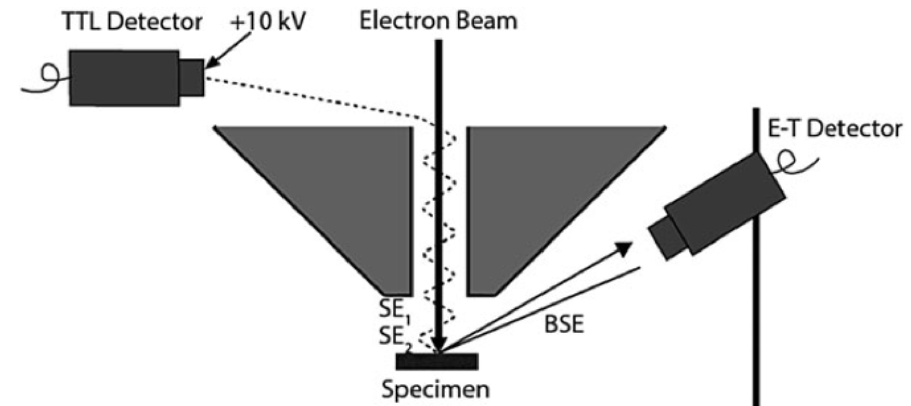

# 5\. Rastrovací elektronová mikroskopie. Detekce sekundárních a zpětně odražených elektronů.

#### SE

- ETD
	- 
- TTL
	- 
- IML

#### BSE

- ETD
- Solid State Diode (SSD)
- Scintilacni pod PP
- Kanalovy nasobic