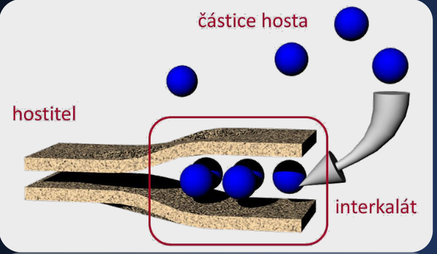
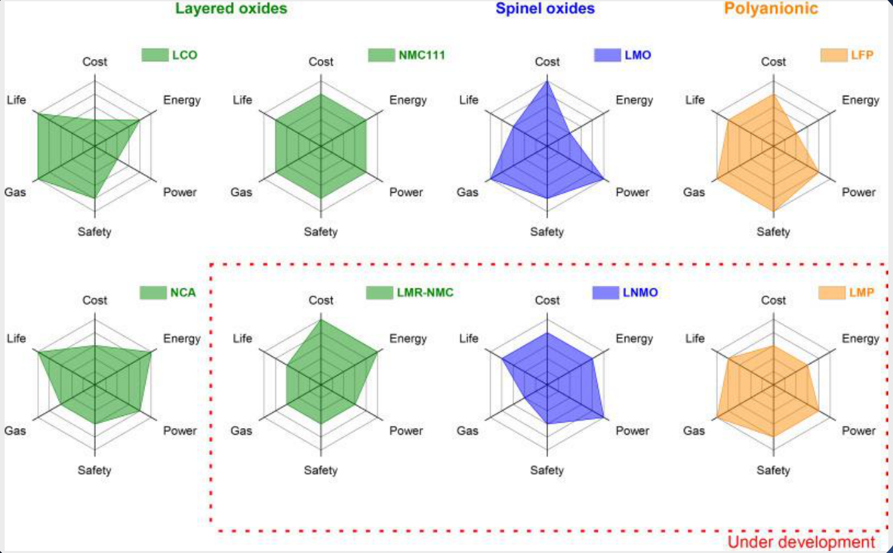

# 7\. Lithno-iontové baterie, interkalační proces, princip funkce a materiálové složení.

## Interkalace
**(P):**
- 

## SEI
- solid electrolyte interface
- tvorba pri cyklovani, na zaporne elektrode
- zabranuje reakcim, ale propousti lithne iony
- ztrata kapacity

## Anodove materialy
- uhlikove (LiC6) - *vrstvene, nizky potencial proti lithiu*
- LTO (lithium titan-oxide) - *keramicky, tepelne stabilni spinelitova struktura, vysoke P*
- kremikove (Li4,4Si) - *legovana elektroda, 400 \% narust objemu behem cyklu*
- kovovoe lithium - *mekky, reaktivni, kovove dendrity*

## Katodove materialy
- LCO (LiCoO2) - *vrstvena struktura, teplotne nestabilni (retezova reakce s organickymi sl.)*
- LMO (LiMn2O4) - *spinelova struktura, stabilni, eko*
- LFP (LiFePO4) - *olivinova struktura, stabilni, netoxicky, levny*
- LNO (LiNiO2) - *pokles kapacity, nestabilni*

