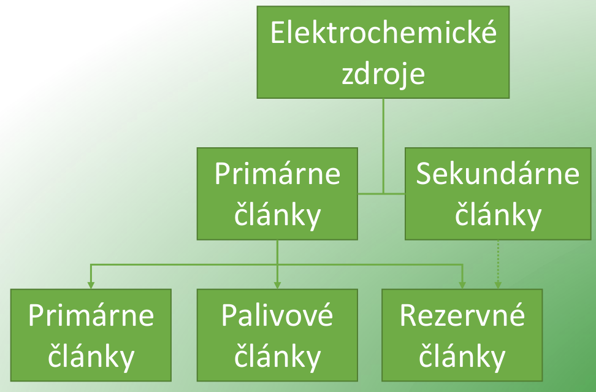
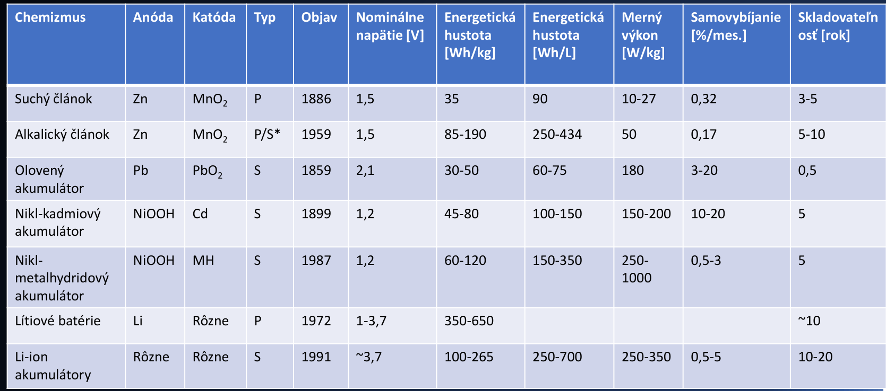

# 8\. Elektrochemické zdroje elektrické energie. Terminologie, princip funkce a dělení baterií. Základní vlastnosti a rozdíly mezi bateriemi.

## Elchem zdroje
**(P):**
- *def.:* zarizeni, prima premena ch. energie na elektrickou
- 

## Terminologie, princip fce a deleni baterii
**(P):**
Terminologie
- elchem clanek (galvanicky): elektrody, elektrolyt, seprator
- baterie: zarizeni z elchem clanku, redoxni reakce
- anoda (oxidace) - uvolni e-
- katoda (redukce) - prijma e-
- separator - propousti vodive iony, zabranuje zkratu
- kapacita \[Ah]
- gravimetricka energeticka hustota \[Wh/kg]
- volumetricka energeticka hustota \[Wh/l]
- vykonova hustota \[W/kg, W/l]
- C-rate: proud baterii vztazen k jeji kapacite jako nasobek C
- standardni elektrodovy potencial (E°): *pontecial elektrody ponorene do roztoku vlastni soli*

## Zakladni vlastnosti a rozdily mezi bateriemi
**(P):**
- Pb clanek:
	- prvni akumulator
	- Pb // H2O + H2SO4 // PbO2
- Suchy clanek (Zn-C, Zn-Cl2)
	- Zn // NH4Cl + ZnCl2 // MnO2 + C
- Alkalicky clanek:
	- Zn // KOH // MnO2 + C
	- vyssi energeticka hustota nez suchy clanek, delsi zivotnost
- Li-ion
	- Li // LiI // I2
	- typy:
		1. s rozpustnou katodou
		2. s pevnou katodou
		3. s pevnym elektrolytem
	 
