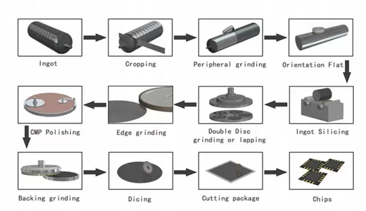

# 10\. Výroba základních polovodičových materiálů. Příprava waferu. Epitaxní růst. Metody dotování polovodičových materiálů.

Nejčastěji Si.

## Získání čistého Si

Redukce SiO₂:

\[
SiO_2 + 2C \rightarrow Si + 2CO
\]

→ metalurgický Si

Chemické čištění (např. přes SiHCl₃) → vysoce čistý polykrystalický Si.

---

# Růst monokrystalu

## Czochralski (CZ)

Nejběžnější metoda.

Postup:
1. Roztavení polykrystalického Si
2. Přidání dopantů
3. Ponoření seed krystalu
4. Pomalé vytahování a rotace
5. Vznik monokrystalického ingotu

Velké wafery, ale vyšší obsah kyslíku.

---

## Float Zone (FZ)

Lokální roztavená zóna se pohybuje podél tyče.

Velmi čistý Si s nízkým obsahem kyslíku.

---

# Příprava waferu

## 1. Ořezání a broušení ingotu

- úprava délky a průměru
- vytvoření notch/plošky pro orientaci

---

## 2. Slicing

Řezání ingotu na wafery:
- diamantová/drátová pila

Vzniká poškozená a nerovná vrstva.

---

## 3. Lapování (lapping)

Mechanické obrušování waferu.

Účel:
- zploštění
- kontrola tloušťky
- odstranění poškození po řezání

Charakter:
- větší úběr materiálu
- µm přesnost
- matný povrch

---

## 4. Leštění (polishing, CMP)

Chemicko-mechanické leštění.

Účel:
- velmi hladký povrch
- odstranění poškozené vrstvy

Charakter:
- malý úběr materiálu
- nm přesnost
- zrcadlový povrch

---

## 5. Čištění waferu

Odstranění:
- organických nečistot
- částic
- oxidů

např. RCA clean.

---

# Epitaxní růst

Růst monokrystalické vrstvy na monokrystalickém substrátu.

Vrstva přebírá orientaci substrátu.

## Homoepitaxe
\[
Si \ on \ Si
\]

## Heteroepitaxe
\[
GaAs \ on \ Si
\]

---

## Metody epitaxe

### VPE / CVD

Chemická reakce plynů na povrchu waferu.

Např.:
\[
SiH_4 \rightarrow Si + 2H_2
\]

---

### MBE

Molecular Beam Epitaxy:
- ultravysoké vakuum
- velmi přesné tenké vrstvy

---

### LPE

Liquid Phase Epitaxy:
- růst z kapalné fáze

---

# Dotování polovodičů

Účel:
řízení koncentrace nosičů náboje.

## N-typ (donory)

Prvky V. skupiny:
- P
- As
- Sb

---

## P-typ (akceptory)

Prvky III. skupiny:
- B
- Al
- Ga

---

# Metody dotování

## 1. Dotování při růstu krystalu

Přidání dopantu do taveniny při CZ růstu.

---

## 2. Difuze

Difuze dopantu při vysoké teplotě.

Kroky:
1. nanesení dopantu na povrch
2. tepelná difuze

Řídí se Fickovým zákonem.

---

## 3. Iontová implantace

Urychlené ionty jsou vstřeleny do waferu.

Přesné dávkování a hloubka implantace.

Po implantaci následuje annealing:
- oprava mřížky
- aktivace dopantů

---

# Dicing

Rozřezání waferu na jednotlivé čipy:
- diamantová pila
- laser

---

# Shrnutí technologického postupu

1. Čištění Si
2. Růst monokrystalu (CZ/FZ)
3. Ořezání a broušení ingotu
4. Slicing waferů
5. Lapování
6. Leštění
7. Čištění waferu
8. Epitaxe
9. Dotování
10. Annealing
11. Dicing
12. Packaging