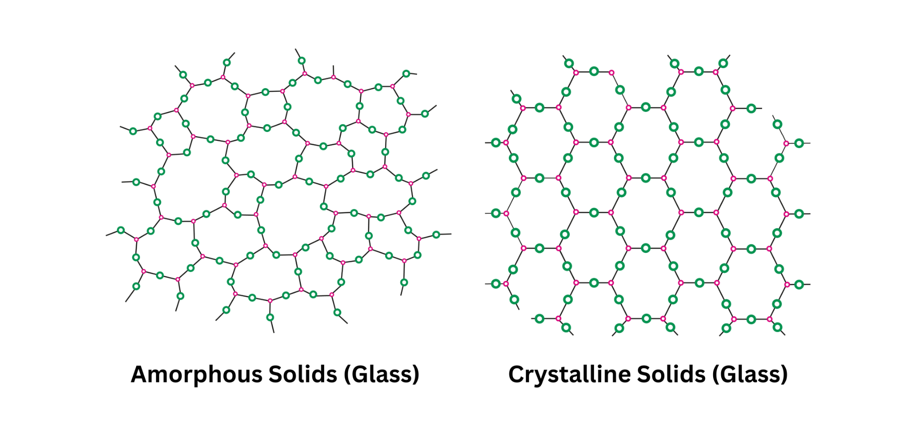

**NOTE:** bylo by dobre zpracovat otazku vice na bazi modifikovatelneho markdownu; pull requests welcome:)

# 2\. Anorganická dielektrika. Azbest, slída a slídové výrobky, upravená slída. Sklo v elektrotechnice. Vnitřní uspořádání. Pravidla tvorby skel. Elektrické vlastnosti skel. Druhy skel. Výroba a zpracování skla. Speciální skla.

### Vyroba a tvorba skel
Popsana ve Vypracovanych otazkach k SZZ (1, Nowass)

Sklo, el vl:
- vodivost iontoveho charakteru
- dom. polarizace: iontova relaxacni

### Azbest
