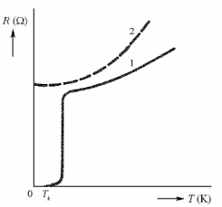

# 5\. Vodivé a odporové materiály. Elektrická vodivost kovů. Kovové a oxidové supravodiče. Kovové materiály pro speciální aplikace. Konstrukční materiály. Tváření kovů za studena a za tepla. Výroba drátů.

$$\sigma = q ( n\mu_n + p\mu_p )$$

## Elektrovodne materialy
- pozadavky
	- mala rezistivita
	- zpracovatelnost
	- odolnost korozi
	- mechanicke vlastnosti
	- llehkost spojovani a pajeni
	- dostupnost a cena
- medi (standardizovano jako *vzorne vyzihana med*)
	- jednostranne / oboustranne platovani
- hliniky
	- oxidace na vzduchu, elektrolyticka koroze (eloxovani - anodicka oxidace hliniku)
	- konstrukcni: dural (Al-Cu-Mg)
	- elektrovodne: Aldrey, Condal

## Odporove materialy
- vlivy rezistivity
	- slozeni vodice
	- koncentrace primesi a necistot
	- teplota
	- zpusob zpracovani
	- mechanicke namahani
- pozadavky na odporove materialy
	- velka rezistivita
	- male TCR, male TCE, mechanicka pevnost
	- stalost vlastnosti
	- technologicke vlastnosti
	- cena
 
## Supravodivost
- jev, kdy rezistivita nekterych kovu klesa pv teplotni oblastni absolutni nuly (nemeritelna hodnota, ~10e-12$\Omega m$)
- $T_k$ ... kriticka teplota
- Nb (9.25 K), Pb (7.26 K)
- intermetalicke: Nb3Al, Nb3Sn (18 K), V3Ga, ...
- **klasifikace**: idealni (mag. mekke), neidealni (mag. tvrde)
- supervodivost je u cistych kovu, supra muze byt i u nekterych keramik
