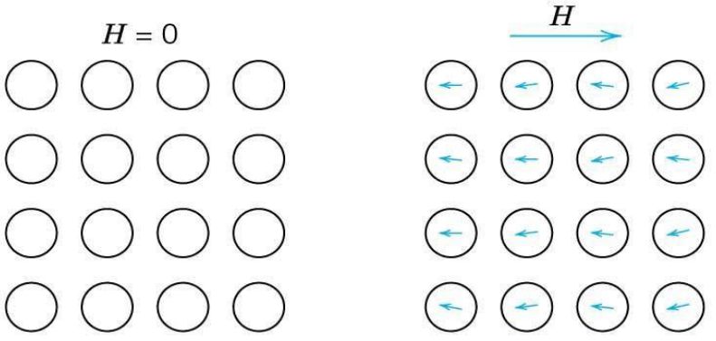
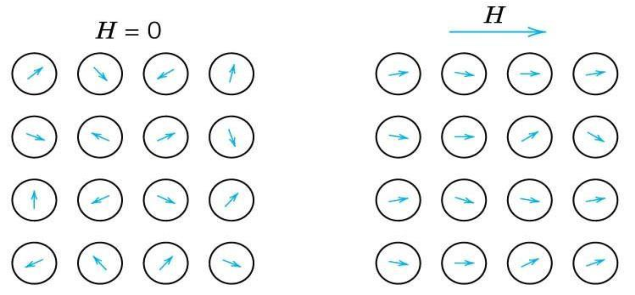
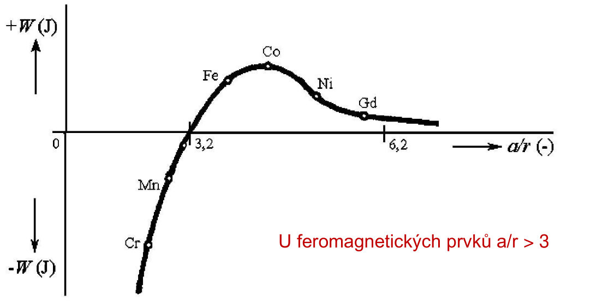
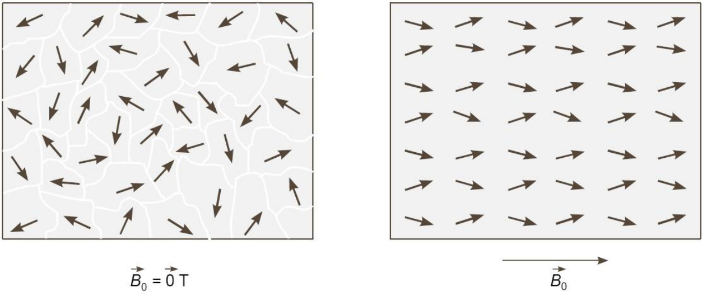
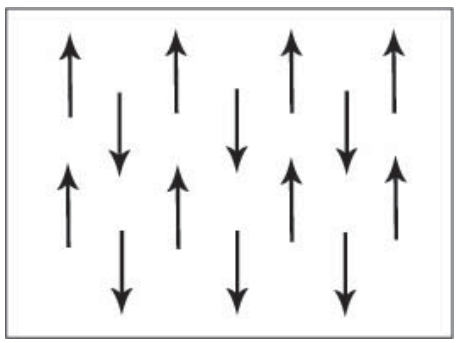
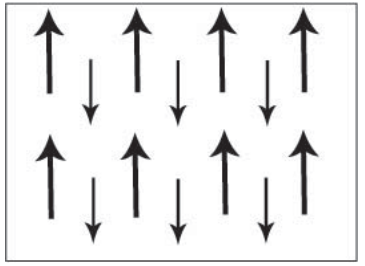
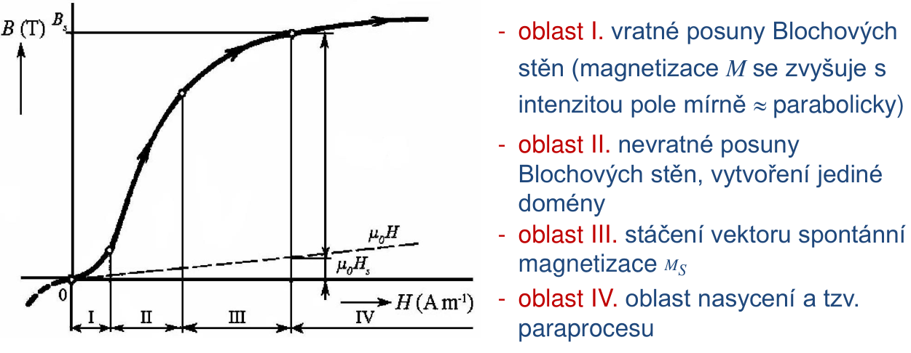
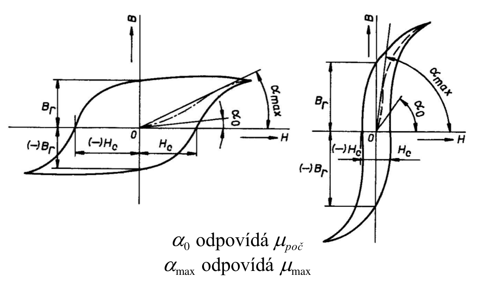

# 6\. Magnetické materiály. Fyzikální podstata magnetismu. Vnitřní struktura. Interakce s magnetickým polem. Magnetické ztráty. Ferro- a ferri- magnetické materiály. Magneticky měkké materiály a ferity. Magneticky tvrdé materiály a ferity. Výroba magnetických materiálů

V Nowass SZZ otazkach (1, Nowass) **neni tato otazka** zpracovana.

| **Diamagnetika** | **Paramagnetika** |
|------------------|-------------------|
| Atomy s vyslednym mag. momentem = 0 | Atomy s nenulovym magnetickym momentem | 
| Vykompenzovane mag momenty | Nevykompenzovane spinove momenty |
| $\chi_m < 0$, nezavisle na $T$, $\mathbf{B}$ |  $\chi_m > 0$, nezavisle na $\mathbf{B}$
|  |  |
| Vzacne plyny, uslechntile kovy (plne obsazene orbitaly) | 

Pokud: nevykompenzovane momenty pouze ve vnitrnich slupkach, pak podle pomeru $\alpha$ - vzdalenost atomu a $r$ - polomeru slupky (pokud ale $\alpha/r$ < 3, pak **paramagnetika**)

| Feromagnetika | Antiferomagnetika | Ferimagnetika |
|---------------|-------------------|---------------|
| $\alpha/r$ > 3 | |
| Muze nastat paralelni orientace $\mathbf{B}$ (vznik mag. domen) | Vznik podmrizek (napr. A a B), kdy A\|\|A, ale anipar. na B | Anipar. podmrizky, ale ruzne velke
|  |  |  |
|||$FeO \cdot Fe_2O_3$, ...|

### Magnetizace

### Hystereze

Pokud vysoke frekvence, pak rozsireni krivky na ukor ostrosti hran a vysky (redukce plochy)

### Magneticke materialy
| Mekke              | Tvrde               |
|--------------------|---------------------|
| mala $\Delta H_C$  | velka $\Delta H_C$  |
| mala plocha krivky | velka plocha krivky |
| velka $B_r$        | vysoka $H_c$, velka $B_r$ |
| nizke $P_h$        | nizke $P_h$         |
|                    | mala $\mu_0$, $\mu_{max}$, velky energeticky soucin $(B\cdot H)_{max}$ |
| trafa, civky       | vyroba magnetu (praskova metalurgie) |
| sendust (Fe,Al,Si), Permalloy, ... | AlNi, AlNiCo, CuNiFe, CuNiCo |

### Fyzikalni podstata

### Ferity - technologie vyroby 
- podobne jako keramika
1. homogenizace smesi, predzehnuti @800-1000C
2. opetovne rozemleti, lisovani
3. suseni horkym vzduchem (**sintrovani**) @1100-1400C
4. opracovani (brouseni, lesteni, rezani diam.)