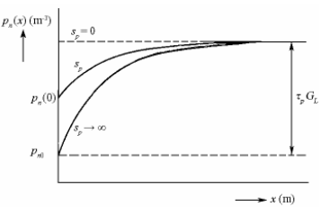

# 8\. Kinetika rekombinačního procesu. Generace, rekombinace a doba života nosičů. Elektrostatické řešení PN přechodu.

| extrakce | injekce|
|---|---|
| $np < n_i^2$ | $np > n_i^2$

## Generace
Priklad Ntyp generace v celem objemu s okrajovou podminkou:
1. povrchove rekombinace $D_p \frac{\partial p_n}{\partial x}|_{x=0}=s_p\left[ p_n(0) - p_{n0} \right]$, kde $s_p$ je povrchova rekombinacni rychlost der
2. limitni koncentrace $p(\infty) = p_{nL} = p_{n0} + \tau G_L$

reseni rce pro okrajove podminky a ustaleny stav zavadi $L_p$:
$$L_p = \sqrt{D_p \tau_p}$$
(difuzni delka nosice), ktera ovlivnuje hloubku krivky

pokud $s_p \rightarrow \infty$, nastava na povrchu rovnovazny stav

## Mechanismus rekombinace

Prechod mezi pasy a pri nem rekombinace: **mezipasmovy rekombinacni prechod** (vetsinou pro primou pasovou strukturou - napr. GaAs)

Rekombinace pomoci **generacnich (rekombinacnich) center**:
- nachazi se v zakazanem pasu blizko stredu
- vytvareno primesemi
- ovlivnuji $\tau$ mensinovych nosicu
- $Ag$ v $Si$ vytvareji 4 hladiny

