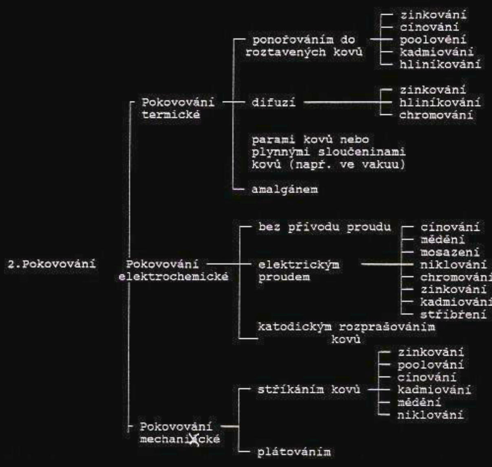
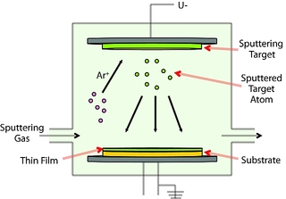
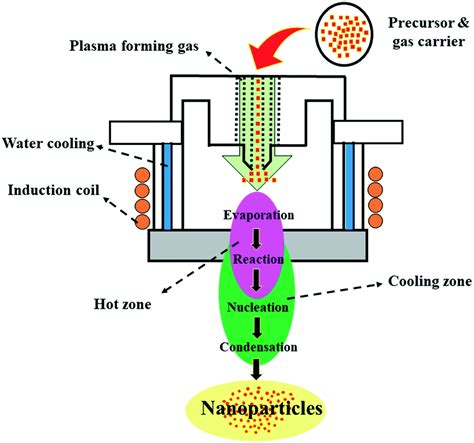

# 1\. Povrchové úpravy: hlavní principy tvorby ochranných vrstev, výběr technologií, výrobní zařízení, materiály. Korozní odolnosti. Testování kvality

## Povrchove upravy
**(Z):** 
POVRCHOVÁ ÚPRAVA KOVŮ A SLITIN
1. Povrchová úprava chemická :
- oxidací
- chromátování
	- fosfátování
	- eloxování

3. Povlaky barev
- poléváním
- natíráním
- ( specifický způsob elektrostatický )
- máčením
- fermežové, olejové, syntetické, nitrocelulózové, asfaltové, lihové a akrylové

4. Povlaky dehtu, asfaltu, kaučuku
- nanášením
- máčením (ponořováním)
- stříkáním

5. Povlaky plastickými hmotami
- lepením
- natíráním
- lisováním
- žárovým stříkáním

6. Smaltování

7. Elchem (galvanicke) metody
	a. Galvanické povlaky
	-	buď nanášíme kov na základ ušlechtilejší, pak chrání kov tím, že koroduje dřív než tento kov. Póry v povlaku pak neovlivňují korozní odolnost
	-	Nebo chrání základní kov tím, že sám je ušlechtilejší a sám nekoroduje. Póry v povlaku pak výrazně ovlivní korozní odolnost, protože obnaží základní méně ušlechtilý materiál a ten pak koroduje.
	
	b. Galvanické pokovování
	-	před pokovením odstranění nečistot, mastnoty, rzi a okují
	-	odmaštění – dříve v parách perchoretylenu, účinné, ale neekologické
	
		
### Pokoveni
- Zinkování
	- standardní elektrodový potenciál je -0,76 V
	- značně reaktivní kov s malou odolností vůči korozi
	- koroduje již ve vlhké atmosféře
	- pokrývá se vrstvou oxidu a uhličitanu zinečnatého, korozní látky pak další korozi zpomalují
	- působením vnější atmosféry je zinkový povlak napadán nepatrně na rozdíl od mořské vody a průmyslových exhalátů
- Niklování 
	- stříbrno bílý kov s nádechem do žluta
	- vyznačuje se značnou tvrdostí
	- odolává alkáliím, kyselinám a plynům
	- standardní
- Nikl-seal
	- v niklovací lázni jsou nevodivé tuhé částice – vylučují se spolu s niklem
	S ténové niklování
	- obdoba nikl-seal
	- větší množství přísad (15%)
	- saténový vzhled
- Chromování
	- podle elektrodového potenciálu
	- neušlechtilý kov
- Cínování
	- měkký
	- chemicky odolný
	- zdravotně nezávadný
- Stříbření
	- výborná elektrická a tepelná vodivost
   
### Povrchové úpravy před pokovením
-	moření – v kyselinách (H2SO4, H3PO3, HNO3)
-	ložení lázní pro moření
o	HCI 37% - vhodná pro odstranění okují rzi z uhlíkové oceli
o	Kyselina fosforečná 15% - vhodné pro oceli
o	Kyselina sýrová

### Povrchové úpravy – souhrn
Základní materiály
-	železo, slitiny
-	nerezi
-	hliník, měď, slitiny Cn + Zn, Sn
-	plasty
Základní typy povrchových úprav
-	galvanické pokovení – Sn, Zn, Sn, Sn – Pb, Ag, Cr (tvrdý, měkký), Au (Ir,Co), Ni, Cd
-	chemické pokovení – Cu, Ni
-	žárové pokovení – Zn + Al
-	eloxování + barvení
-	plasmové nanášení, šopování
-	vakuové systémy nanášení
Fluorizace
-	lakování (klasické) – barvy – ředidlové, vodou rozpustitelné, se sníženým obsahem ředidla
-	lakování s předehřevem
-	lakování v elektrostatickém polo
-	lakování práškové – kinetické, elektrostatické
-	dekorativní lakování – plastický povrch, matný
Speciální typy povlaků
-	pokrytí povrchů sintrováním – PTFE, sklo – keramické povlaky, smaltování
-	mechanické nanášení ochranných folií Al
-	izolační vrstvy na bázi celulózy – trafo plechy
-	zastříknutí do plastu – plastikářské technologie
-	povlakovaní plastovými systémy – PVC

## Zarizeni
- naprasovani (sputtering, PVD (physical vapor deposition)) 
- CVD 
- PECVD