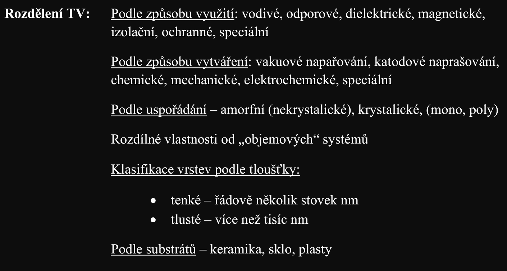
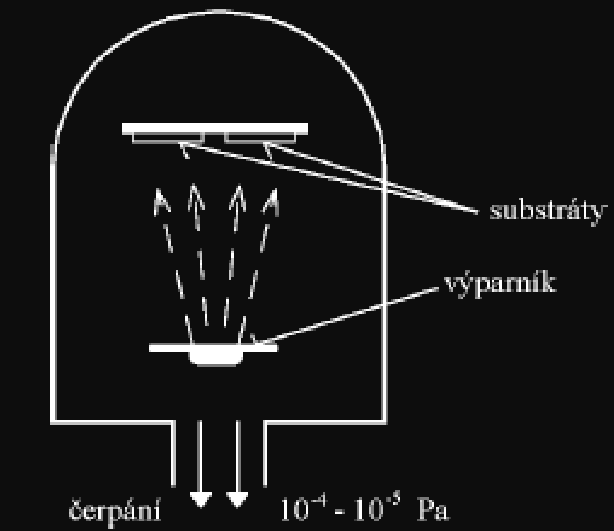
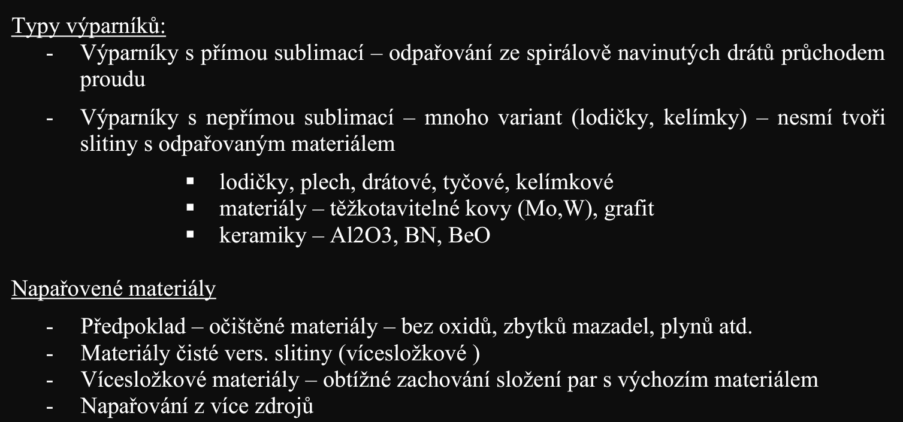
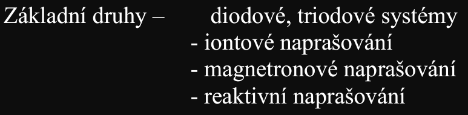
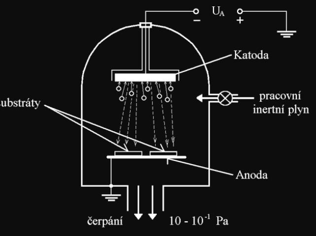

# 2\. Tenké vrstvy: základní dělení, teoretický rozbor tvorby vrstev, výběr substrátů, speciální technologie. Využití tenkých vrstev.

## TV, deleni
**(Z):** 

## Prehled technologii
**(AI):** 
| Deposition Method | Typical Applications | Deposition Materials | Common Substrates | Deposition Speed (Typical Range) |
| :--- | :--- | :--- | :--- | :--- |
| **Thermal / E-Beam Evaporation** (PVD) | Optical coatings (mirrors, anti-reflective), contact metallization in microelectronics, organic electronics. | Metals (Au, Ag, Al, Cu, Ti, Cr), dielectrics, organics. | Silicon, Glass, Quartz, Polymers (PET, Polyimide). | **Fast** 0.5 to 10+ nm/s (30 - 600+ nm/min) |
| **Magnetron Sputtering** (PVD) | Hard coatings for cutting tools, semiconductor interconnects, architectural glass coatings, flat antennas. | Broad range: Metals, Alloys, Semiconductors, Insulators (SiO₂, Al₂O₃). | Silicon, Glass, Ceramics, Metals, Flexible Plastics. | **Moderate to Fast** 0.1 to 3+ nm/s (6 - 180+ nm/min) |
| **Molecular Beam Epitaxy (MBE)** (PVD) | Advanced quantum devices, high-frequency transistors (GaAs/GaN), semiconductor lasers. | Ultra-pure elements (Ga, As, In, Al, Si, Ge). | Single-crystal substrates matching the film lattice (GaAs, InP, Si). | **Very Slow** ~0.01 to 0.3 nm/s (~0.1 - 2 nm/min) |
| **Chemical Vapor Deposition (CVD)** | Semiconductor manufacturing (dielectrics, polysilicon), synthetic diamond growth, carbon nanotubes, protective hard coatings. | Silane (SiH₄) derivatives, Oxides (SiO₂), Nitrides (Si₃N₄), Polysilicon, Tungsten, Carbon. | Silicon wafers, Tungsten carbide tools, Glass, Ceramics. | **Moderate to Very Fast** 0.1 to 20+ nm/s (6 - 1200+ nm/min depending on APCVD/LPCVD) |
| **Plasma-Enhanced CVD (PECVD)** | Low-temperature dielectric passivation, solar cell anti-reflective layers, display backplanes. | Silicon dioxide (SiO₂), Silicon nitride (SiNx), Amorphous Silicon (a-Si:H). | Silicon, Glass, Temperature-sensitive substrates. | **Fast** 0.5 to 5+ nm/s (30 - 300+ nm/min) |
| **Atomic Layer Deposition (ALD)** | High-k gate dielectrics (FinFETs), DRAM capacitors, conformal barrier layers for high-aspect-ratio 3D structures. | Metal oxides (Al₂O₃, HfO₂, TiO₂), Nitrides (TiN, TaN), certain pure metals. | Silicon, Porous materials, complex 3D microstructures. | **Extremely Slow** 0.01 to 0.05 nm/s (0.05 - 0.2 nm/min) *(Measured cycle-by-cycle, ~0.1 nm per cycle)* |
| **Electrodeposition / Electroplating** | Thick copper interconnects (Damascene process) in PCBs/IC manufacturing, decorative hardware coatings. | Pure metals (Cu, Ni, Au, Cr, Fe, Pd) and basic alloys. | Conductive substrates, Seeded Silicon, Metals. | **Very Fast** 1.0 to 100+ nm/s (60 - 6000+ nm/min) |x

**(Z):** 
### Vakuove technologie
#### Termalni naparovani

#### Naprasovani
- doutnavy vyboj, material katodou

#### Dip coating
proces:
1. ponoreni
2. vytahovani
3. odpareni redidla

#### Spin coating
proces:
1. prekurzory a redidla
2. rozliti, odpareni redidla
3. vznik vrstvy

#### Elektrochemicke metody
viz predchozi otazku: [1. Povrchové úpravy](../../text/EMV2/1.%20Povrchové%20úpravy.md)