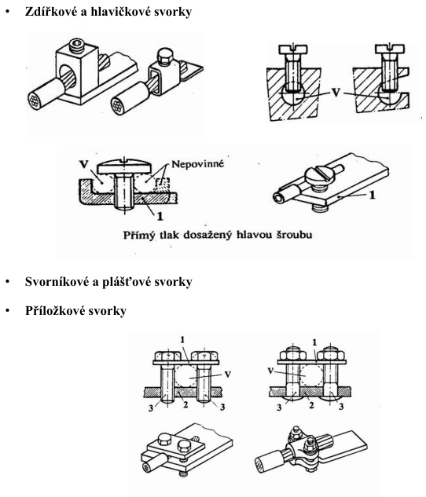
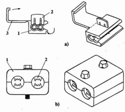
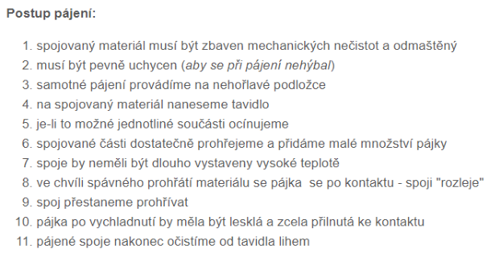
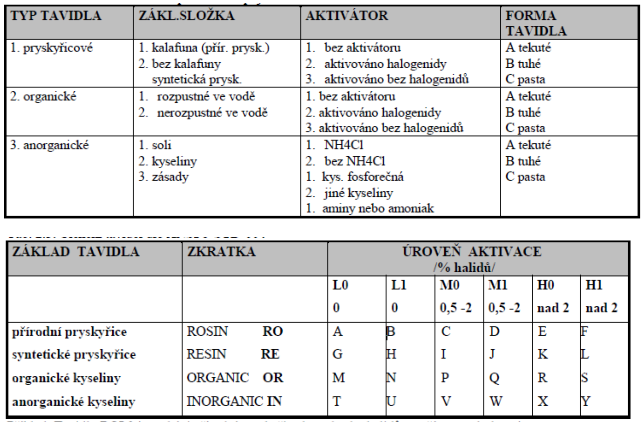
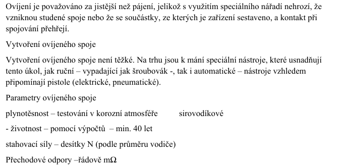
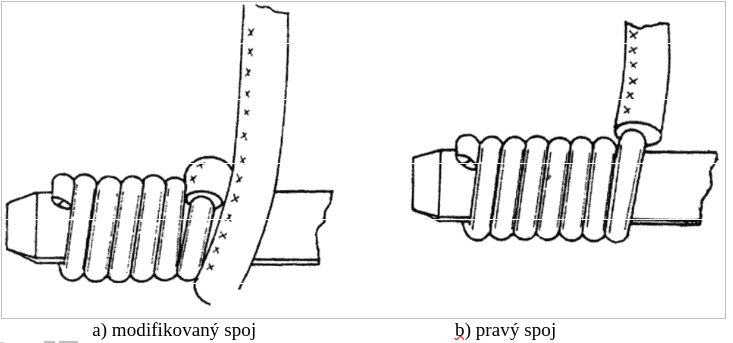
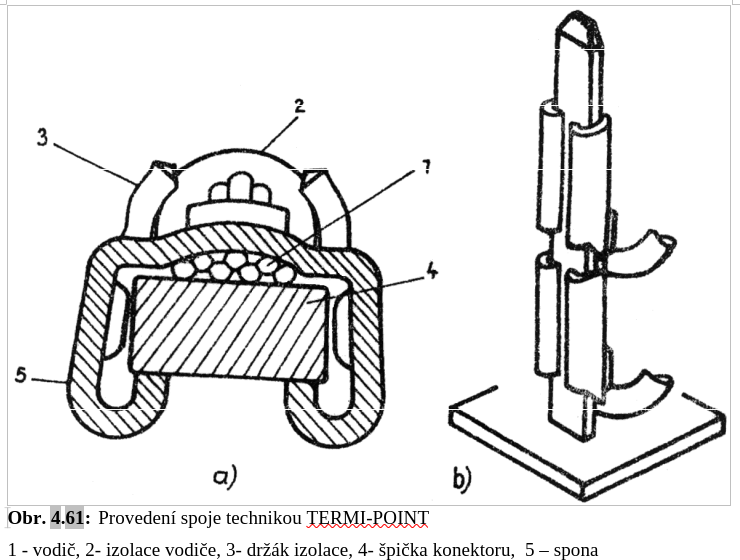
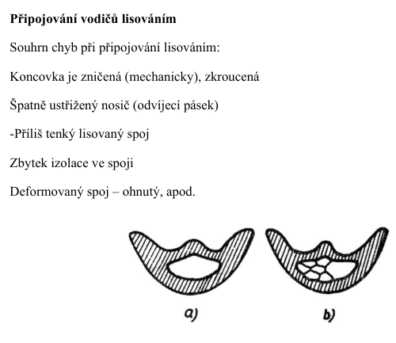
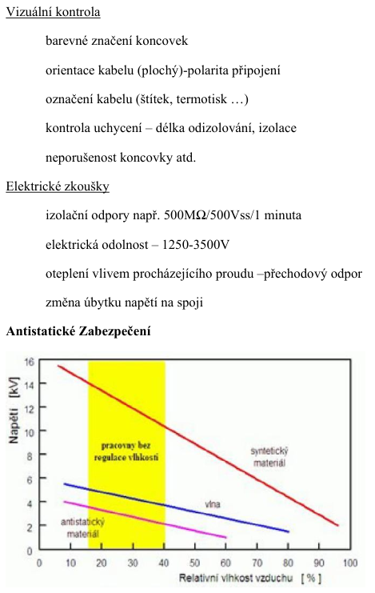
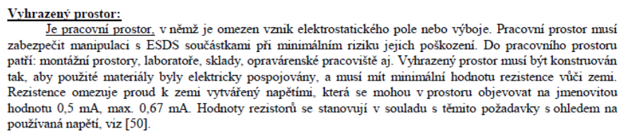

# 3\. Montážní technologie: základní systémy montážních procesů, propojovací technologie elektrických a elektronických zařízení, testovací metody. Antistatické zabezpečení.

## Zakladni systemy montaznich procesu

*"klasicke strojirenske technologie"*:
- sroubovani (reozebiratelny), nytovani (nerozebiratelny), ...
- pajeni (difuzni proces, v mech. montazich omezene -> predevsim mekke pajeni, etapy: uprava povrchu s nanesenim tavidla a pajeci proces a ocisteni po pajeni)
- svarovani (strojirenstvi; plamenem, el. obloukem i v atmosferach, kondezatorove svarovani, bodove a svove svarovani, svarovani tlakem za studena a treci svarovani, svarovani ultrazvukem, laserem, elektronovym paprskem)
- lepeni (priprava komponent, vytvrzeni, rizena teplota)

### Sroubovane spoje

- upinaci svorky prorazejici izolaci
	- 

### Bezsroubove systemy
Vodic je pritlacovan pruzinou k stabilnimu nosniku. 
Typy: neprimy tlak, primy, s uvolnovacim prvkem (v podtate jsou vsechno asi svorkovnice)

#### Nasouvaci svorky
2 a vice Cu vodicu

#### Samosmrstitelne prvky
zakladem je plast (zesitovane polyolefiny), tvarova pamet, zahrati

### Pajeni

#### Kontrola pajeni
- vizualni a optickee (automatizace)
- laserove (bodova, kontrola tisku past)
- rentgenove (tam kde nejde opticke)
- ultrazvuk
- elektricke

### Ovijeni
**(Z)**:

### Thermi-point

specialni svorky, specialni nastroj, během jednoho zapojovacího cyklu je vodič odizolován a pomocí sponky z nekonečného pásu „nastřelen“ . 

### Lisovani

## Testovaci meotdy

## Antistaticke zabezpeceni
