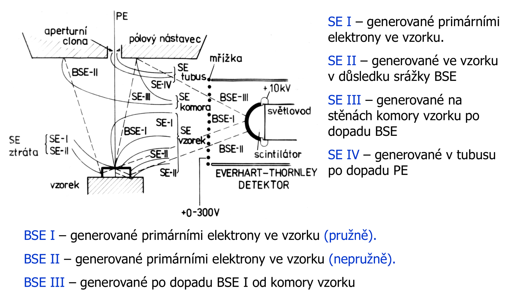
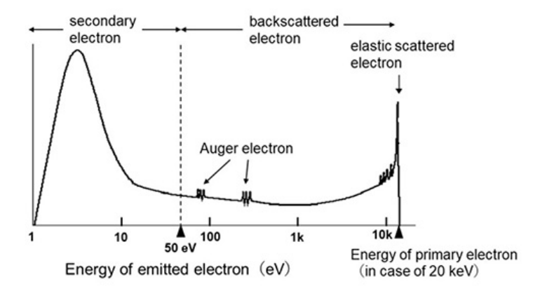
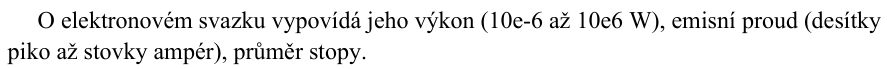
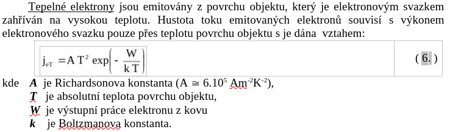
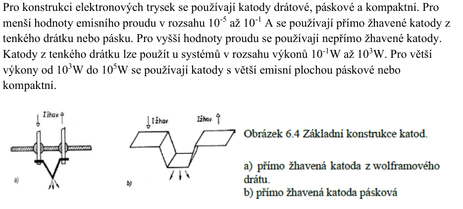
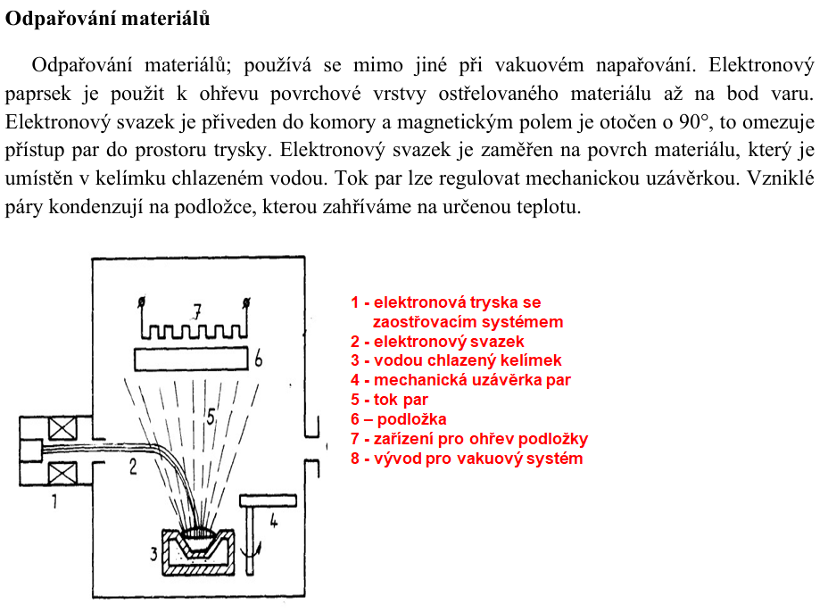
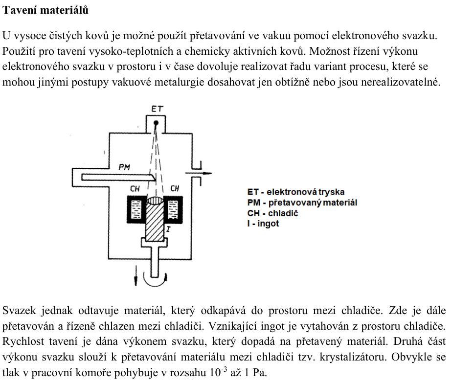
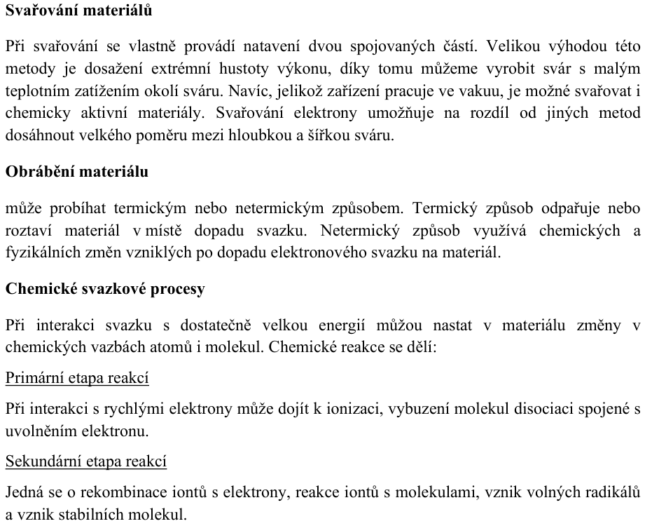

# 4\. Elektronové procesy. Získávání elektrických částic a řízení pohybu elektronů, uspořádání elektronových trysek, účinky elektronových svazků a jejich využití.

## Ziskavani elektronu

**(DIZ)**:

**(Z)**:

**(Skripta)**: 

**(Z)**:

## Vyuziti elektronovych procesu

