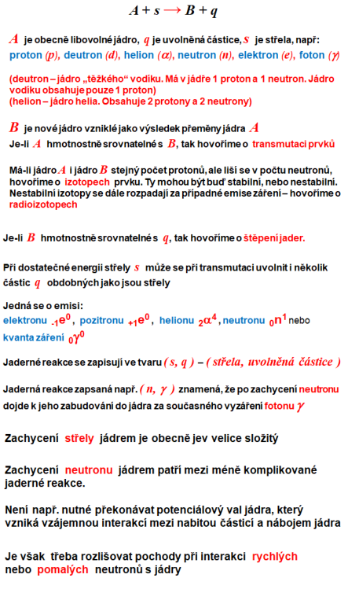
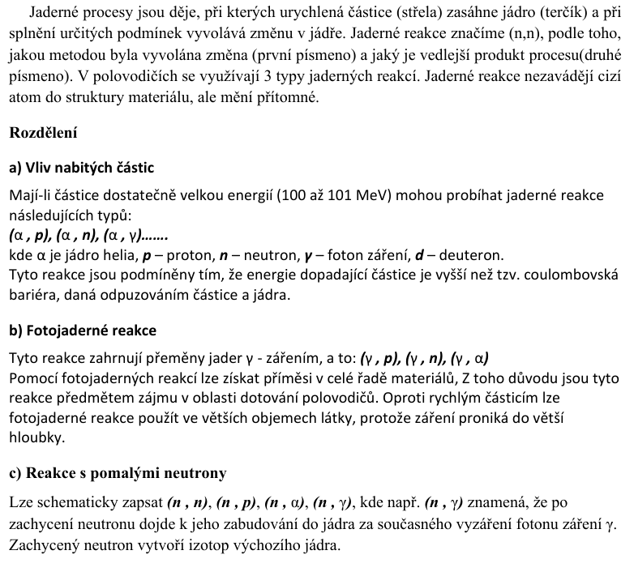
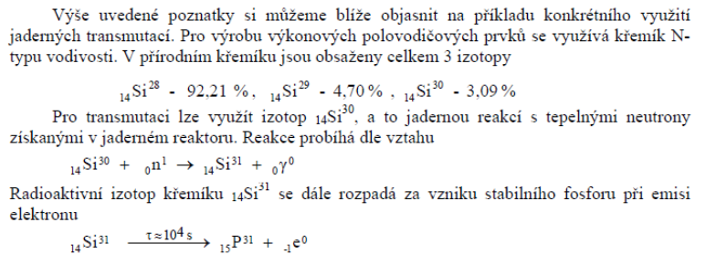
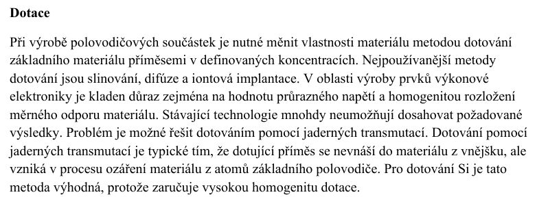

# 7\. Jaderné procesy. Základní pojmy, rozdělení jaderných reakcí, princip transmutace prvků a možnosti dotace polovodičových materiálů.

**(Z)**:

	

plocha jader pro rychle $n$: $\pi R^2$
plocha jader pro pomale $n$: $\sigma = \frac{\omega}{n\cdot v}$

