# 8\. Laserové procesy. Rozdělení laserů, základní vlastnosti laserů a laserového záření, výkonové lasery, některé aplikace laserů v technologii.

**(Z)**:
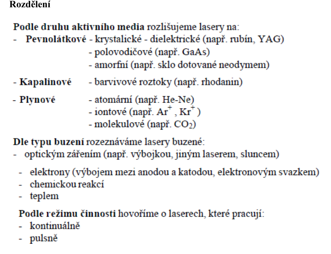
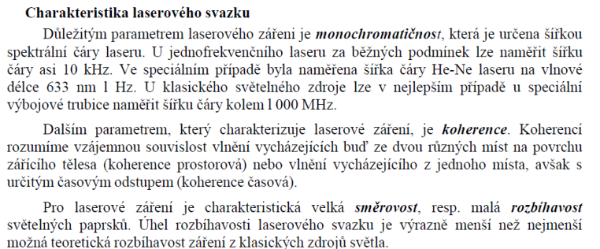

## Koherence
**([A. Principy](../../undefined))**:
- urcuje fazove zpozdeni ve vlnach
- koherence ~ interferovatelnost
- koherencni:
	1. cas $\lambda$ ... vychazi z vlnove davky
		- jak dlouho si vlna „pamatuje“ svoji fázi (delka paketu)
	2. delka $L$
		- vzdálenost, na které je ještě zachována korelace fáze
- Interference funguje jen tehdy, když je mezi oběma vlnami dobře definovaný fázový rozdíl.

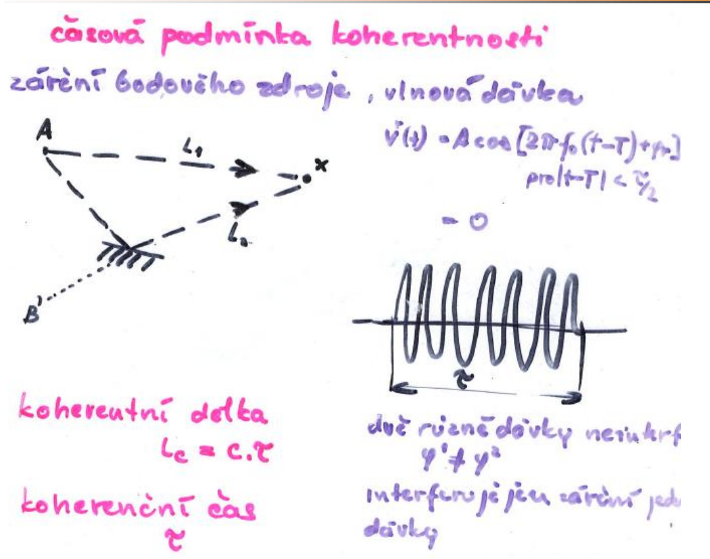

**(Z)**:
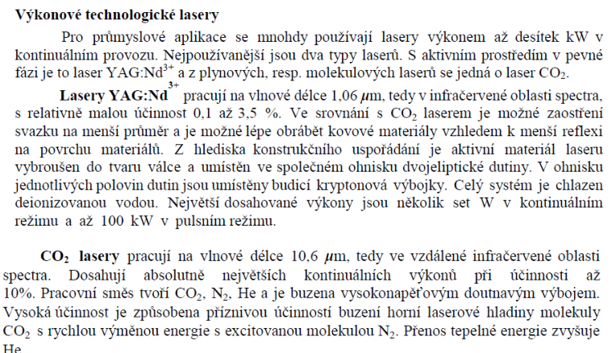

## 1\. Příměsové dielektrické / pevnolátkové lasery
**([A. Principy](../../undefined))**:
*(skripta §3.3.4)*

- aktivní médium: izolantový krystal nebo sklo dopované ionty vzácných zemin / přechodových kovů

- **Nd:YAG** ($\lambda = 1{,}064\,\mu\text{m}$):
	- čtyřhladinový, optické čerpání (výbojka, LD), CW i impulsní, Q-spínač; výkony W–kW; 2. harmonická → $0{,}532\,\mu\text{m}$ (zelená)
	- 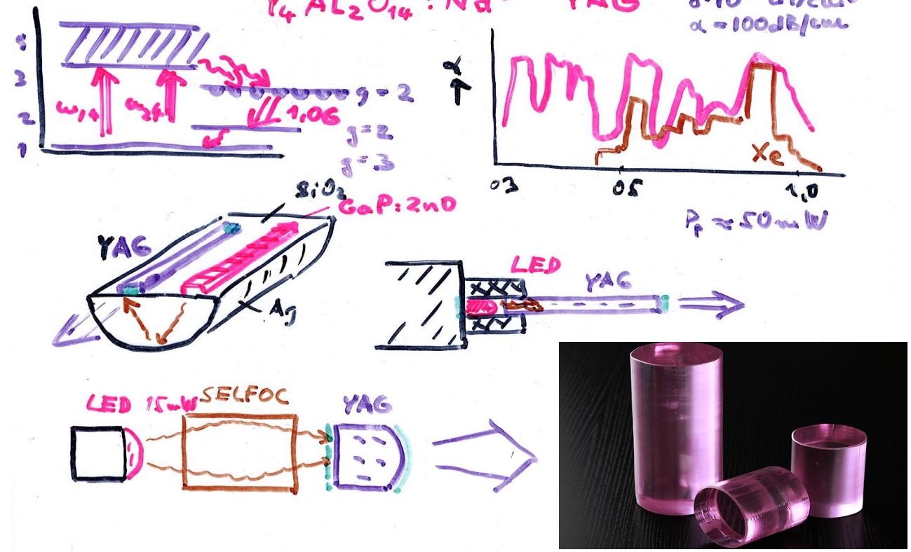

- **Rubín** (Cr$^{3+}$:Al$_2$O$_3$, $\lambda = 0{,}694\,\mu\text{m}$):
	- tříhladinový, impulsní; historicky první laser
	- 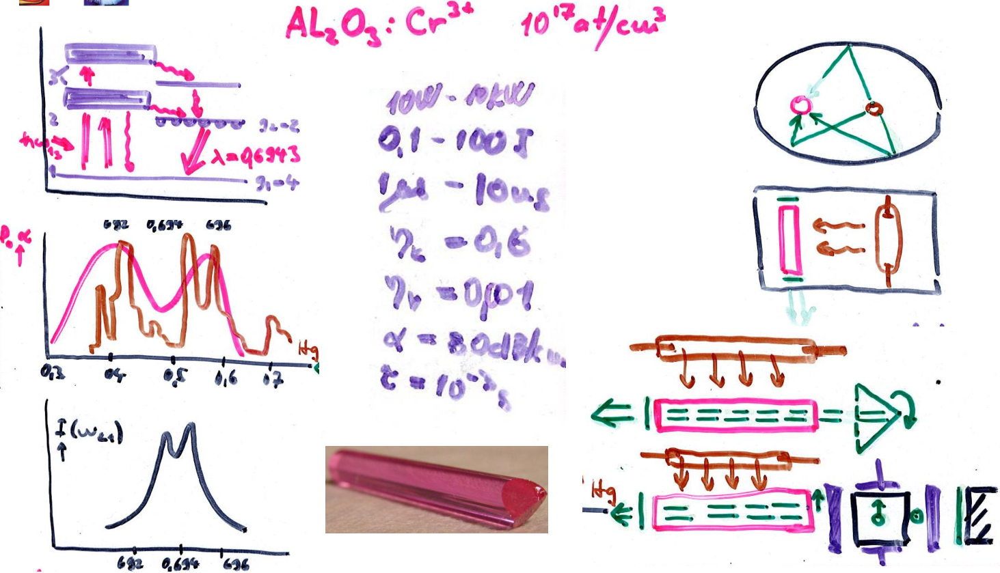

- **Er:sklo / Er:vlákno** ($\lambda = 1{,}55\,\mu\text{m}$): vláknový zesilovač EDFA

- čerpání: výbojkami (velký výkon) nebo laserovou diodou (kompaktní, účinný)

## 2\. Plynové lasery He-Ne konstrukce, CO2 konstrukce, vlastnosti, použití
**([A. Principy](../../undefined))**:
*(skripta §3.3.4)*

**He-Ne** ($\lambda = 0{,}6328\,\mu\text{m}$, dále 1,15 a 3,39 µm):
- buzení: výboj v plynu He:Ne ≈ 5:1; přenos energie srážkami He* → Ne*
- čtyřhladinový; CW; výkon mW; koherentní, úzká čára → metrologie, holografie, čárové kódy
- 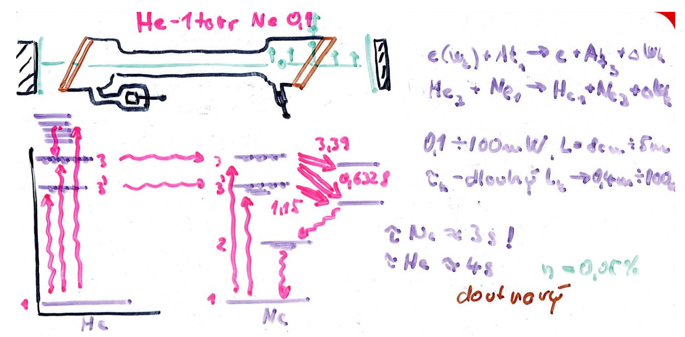

**CO₂** ($\lambda = 10{,}6\,\mu\text{m}$, dálný IR):
- buzení: výboj v CO$_2$:N$_2$:He; přenos energie ze vibrací N$_2$ na CO$_2$
- výkon W–kW (průmyslové řezání, svařování, medicína); účinnost 10–20 %
- 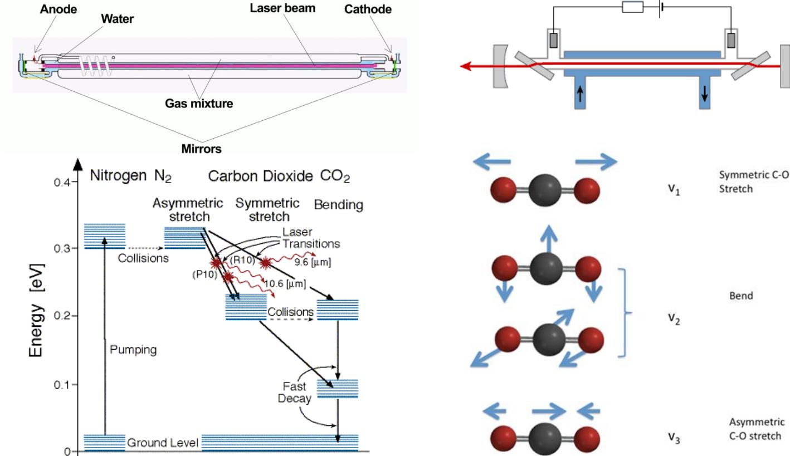

**(Z)**:
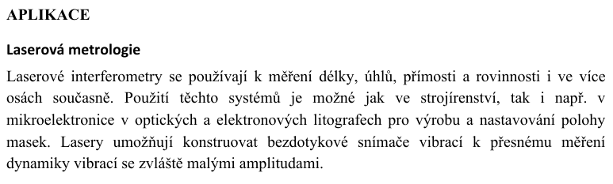
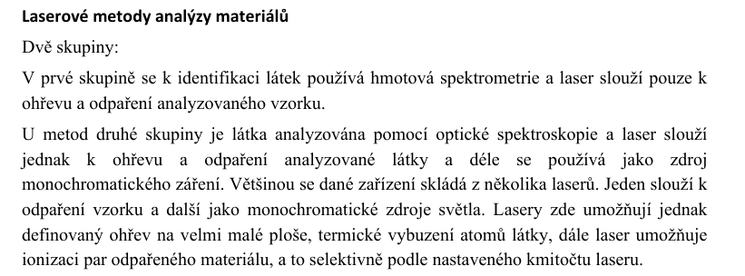
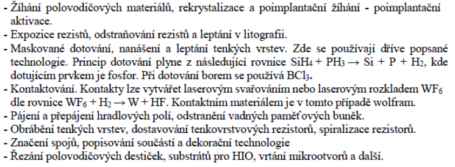