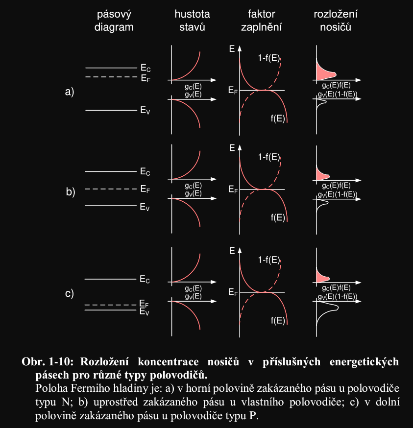
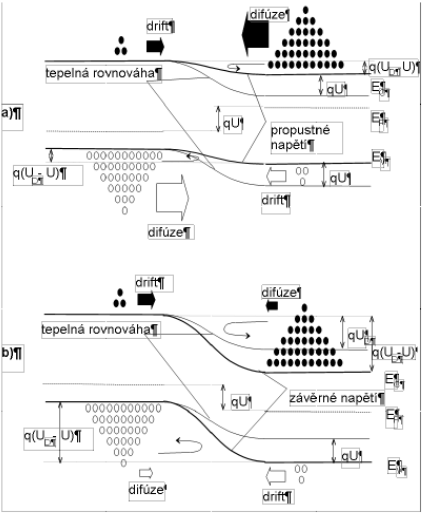
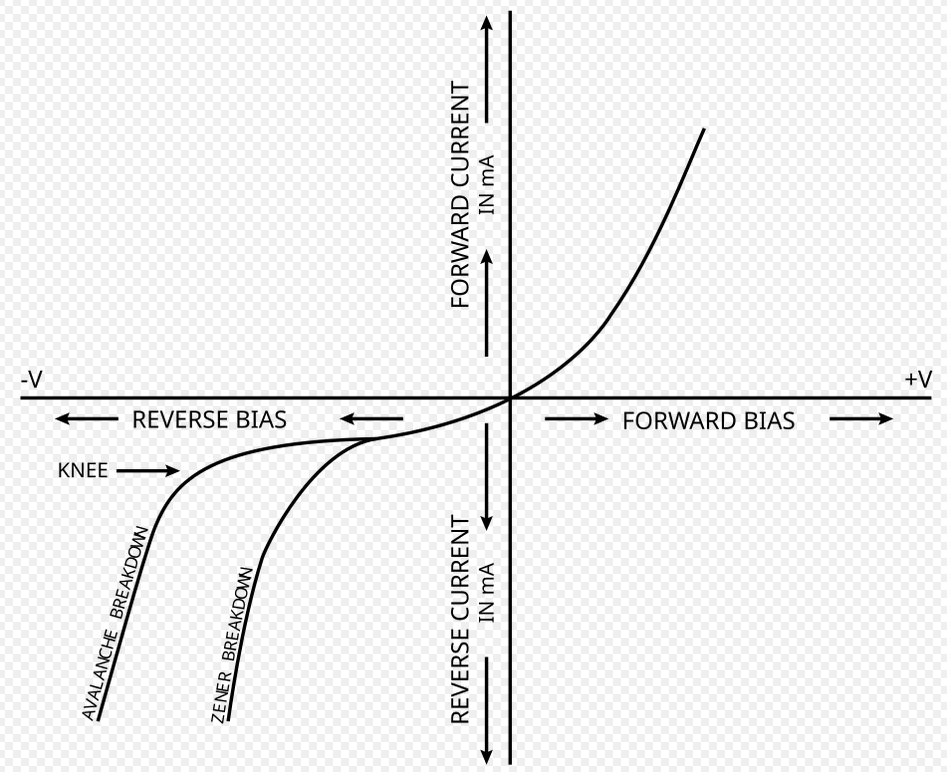
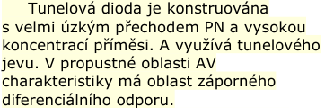
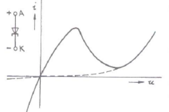
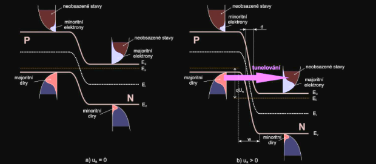
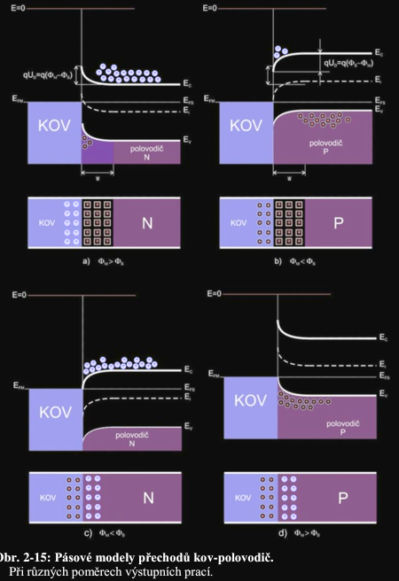

# 1. Přechod PN. Přechod PN v rovnovážném stavu, vyprázdněná oblast, difúzní napětí. Bariérová a difúzní kapacita přechodu PN. Přechod PN v propustném a závěrném směru; pásové diagramy. Ampérvoltová charakteristika přechodu PN. Průrazy přechodu PN. Tunelová dioda. Jiné typy přechodů; přechod kov-polovodič.

## Prechod
- 

## Rovnovazny stav a prechod v propustnem a zavernem smeru
- *(1): rovnovaha mezi drifotvymi a difuznimi silami*
	- Fickuv zakon difuze: $J = -D \nabla p$ (diry)
	- Drift: $J = qpv_d = qp\mu_p E$
	- kompenzace: $\frac{D}{\mu} = \frac{kT}{q}$

## Barierova a difuzni kapacita
| Barierova | Difuzni |
|-----------|---|
| $C_j = \varepsilon \frac{A}{w}$ | $C_D = \frac{q}{kT} I_p \approx \frac{I}{U_T}\tau_p$
| vice v zavernem | vice v propustem |
| v depleticni vrstve | v dusledku difundovani tece proud, nosice s energii tepelnou budou dobu $\tau$ delat kapacitu

## Charakteristika prechodu
Shockley: $J = J_0 \left( \exp\left[ \frac{Uq}{kT} \right] - 1 \right)$, v teto aproximaci pro [Si hodnota 0.67 V pro dostatecny proud](../../_dukazy/Si_dioda_0.65V.md).
Navic existuji prurazy (rozsireni modelu), viz nize.

## Prurazy a tunelova dioda
| Tunelovy (Zener) | Lavinovy | Tepelny |
|---|---|---|
| tenky prechod | depleticni oblast mnohem delsi nez $L_p, L_n$ | destruktivni, PFL (runaway)
| klesa exponencialne s teplotou | vyssi s teplotou |
| max U pro Si ~6.7V, Ge ~4.2V | dostatecne U da energii narazove ion. (Si 4.5V, Ge 2.8V) |

## Dalsi typy prechodu
- homogenni
	- PN
	- PI
	- NI
	- PIN
	- dle dotace: P+, N+, N, P
- heterogenni:
	- nestejnorode polov
	- polov-kov (viz [video](https://www.youtube.com/watch?v=yaPxtFLA3Ck))
	- (str 71, skripta) 
	- MIS 