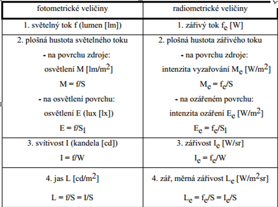
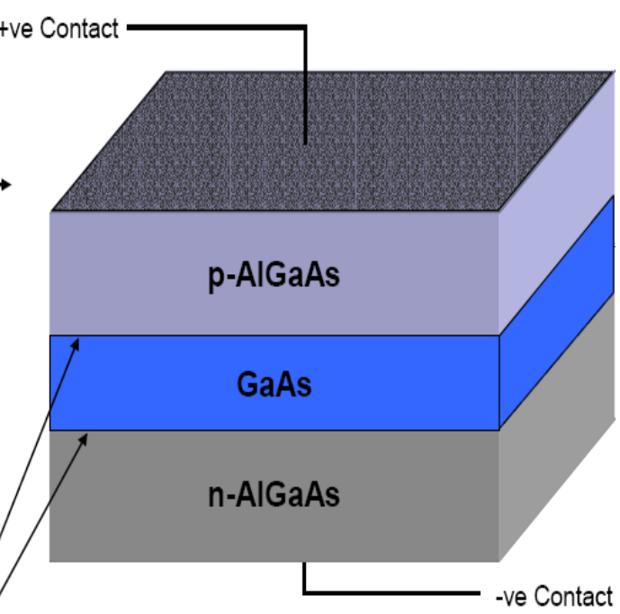
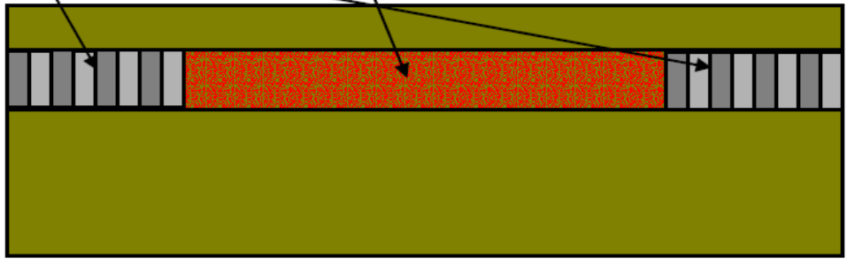
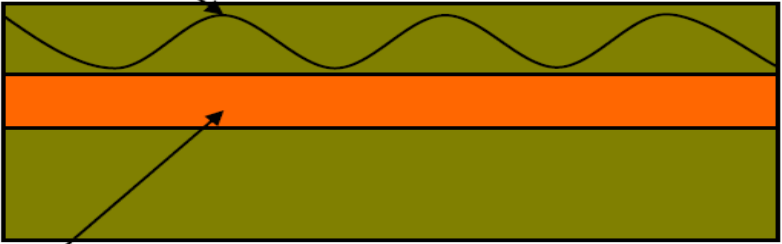
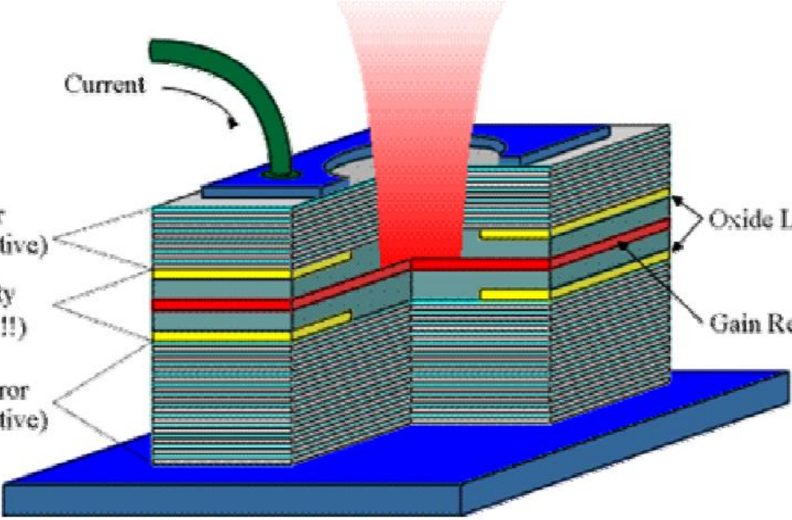

- do tří skupin na detektory, zdroje záření a speciální struktury

## Fotorezistor
**(1):** Fotorezistor je součástka s dvěma vývody, jejíž odpor závisí na míře osvětlení. Klesá při vyšším osvětlení

## Fototranzistor
**(1):** Fototranzistor je detekční optoelektronický prvek, u něhož je proud vznikající ozářením posilován tranzistorovým jevem. Zpravidla nemají vyvedenou bázi, namísto toho mají v pouzdře okénko, kterým může do báze u emitorového přechodu dopadat záření.

## Fotodioda
**(1):** Fotodioda využívá generaci nosičů vlivem osvětlení. Směrodatnými parametry jsou citlivost součástky a intenzita osvětlení. V případě, že se zapojí v závěrném směru se fotodioda chová jako fotorezistor. V hradlovém režimu se fotodioda chová jako zdroj napětí

## Luminiscencni dioda
- transformace $RGB \rightarrow Lxy$
- konstrukce (viz OOK)

**(1):** většinou označovaná jako LED se chová jako světelný zdroj. Vyzařování světla způsobuje tzv. elektroluminescence to je proces, při němž měníme elektrickou energii na světelnou. Luminiscenční diody mají špatné závěrné vlastnosti, tj. průrazné napětí mezi 3-5V. Vzhledem ke strmému tvaru charakteristiky v průrazu je lze použít jako náhradu za Zenerovy diody

## Laserove diody
- inverze populaci pomoci degenerace
- oscilator braggovou mrizkou
- aktivni latky...
**(1):** fungují při malých proudových hustotách jako LED. Při překročení prahové hodnoty hustoty proudu dochází ke stimulované rekombinaci. Díky tomu se generuje proud koherentního světla. Přední část struktury je vyleštěna velmi hladce, tak aby skrze ní mohlo záření volně procházet, stěny jsou naopak obroušeny hrubě, aby skrze ně vycházelo záření co nejméně. Tím je zajištěna směrovost záření
  
| Typ | Princip | Vlastnost | Struktura |
|-----|---------|-----------|-----------|
| **FP** | čela čipu | mnohomodový, levný | 
| **DBR** | Braggovo zrcadlo na konci | jednomodovější |
| **DFB** | Braggova mřížka v aktivní vrstvě | jednomodový, stabilní $\lambda$, telekomunikace |
| **VCSEL** | vertikální dutina (kolmá na čip) | kulatý svazek, matice, velmi nízký $I_{th}$ | 