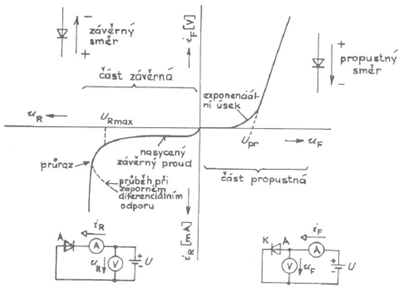
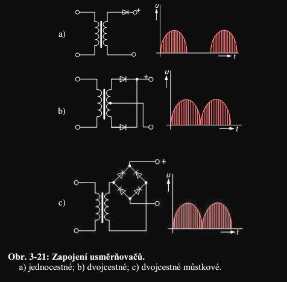
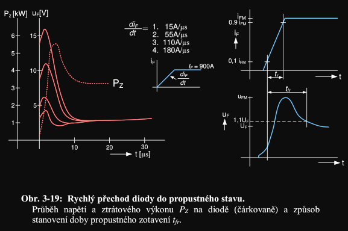
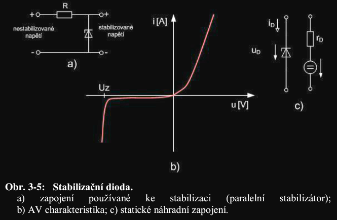
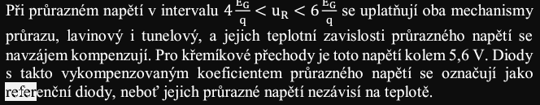
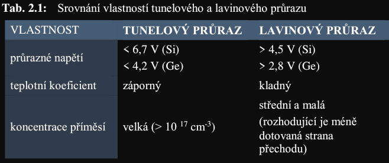
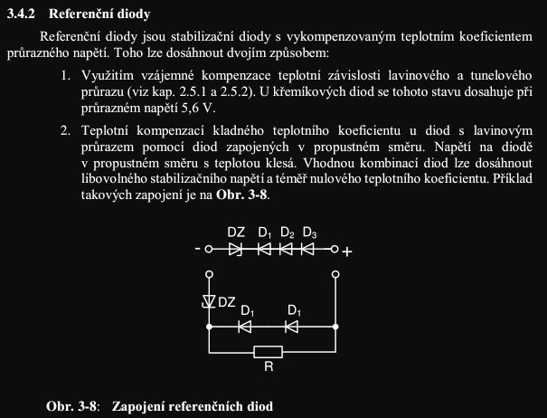
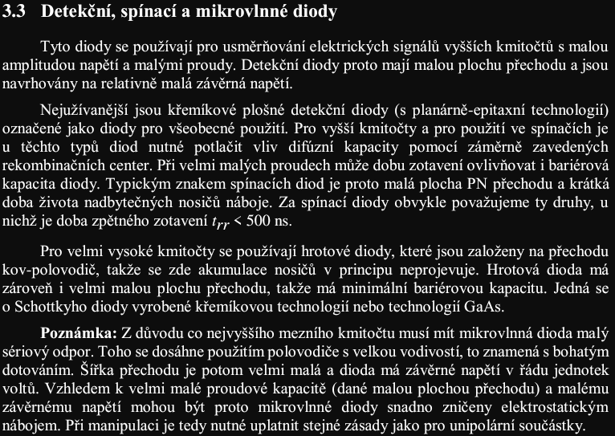

# 2. Polovodičová dioda. Ampérvoltová charakteristika diody. Dioda v propustném a závěrném směru. Dioda jako usměrňovač, zdroj referenčního napětí, spínač a řízený odpor.

## Polovodicova dioda, IV charakteristika
**(1):** Polovodičová dioda je součástka obsahující zpravidla 1 PN přechod. Může ale obsahovat i přechod MS, více přechodů nebo dokonce žádný přechod. Chová se jako přechod PN, čili v jednom směru propouští proud, ale ve druhém směru ne. U diody hovoříme o P oblasti jako o anodě a o N oblasti jako o katodě.

## Propustny, zaverny smer
**(1):** V případě, že je připojeno propustné napětí je hlavní složkou proudu difúzní proud, protože se v pásovém diagramu pásy k sobě přiblíží, čímž umožní průchod většímu počtu majoritních nosičů. U závěrně pólovaného PN přechodu naopak převládá driftová složka proudu, která není závislá na přiloženém napětí, protože se pásy od sebe navzájem vzdalují a majoritní nosiče tak nemohou procházet. V závěrném směru se šířka depletiční oblasti zvětšuje, v propustném se naopak zmenšuje.

| Parametr               | Propustne napeti    | Zaverne napeti    |
|------------------------|---------------------|-------------------|
| hlavni slozka proudu   | difuzni proud       | driftovy proud *(leakage)*
| hlavni nosic           | majornitni          | minoritni
| velikost depl. obl.    | zmenseni            | zvetseni

## Diodovy usmernovac 

**(1):** Pokud totiž dioda nemá dostatečnou rychlost budou na charakteristice překmity a dokonce nemusí usměrňovat vůbec

**rychlost diody** $\mathbf{\propto \tau \propto C}$

**(1):** V propustném směru bude na charakteristice zákmit vlivem zvýšeného proudu, který vznikl kvůli nahromaděnému náboji, při poklesu napětí se gradient koncentrace na začátku kvazineutrální oblasti zmenšuje rychleji a může se dokonce stát záporným, to se projeví jako překmit.

## Zdroj ref napeti

**(1):** Pro získání referenčního napětí se používají tzv. stabilizační (Zenerovy / tunelove) diody. [Jako pracovní oblast se používá okolí nedestruktivního průrazu, s velmi ostrým zlomem AV charakteristiky](1.%20Prechod%20PN.md). Při stále stejném napětí narůstá proud. Podmínkou správné funkce Zenerovy diody je co nejmenší diferenciální odpor, čili co největší strmost přímky. Pracovní oblast je omezena shora počátkem průrazu a zezdola maximálním výkonovým zatížením.

Kompenzaci 2 mechanizmu prurazu dojde k teplotni nezavislosti:

### Zenerka (tunelova dioda)

## Spinac, rizeny odpor
(Skripta), toto je cela kapitola 3.3:

