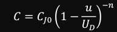
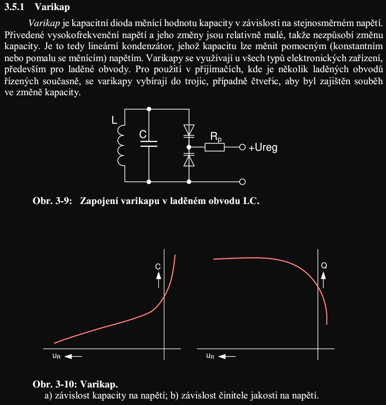
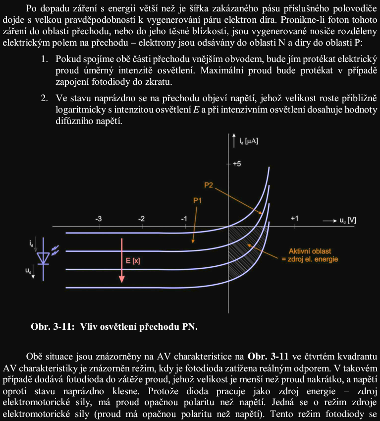
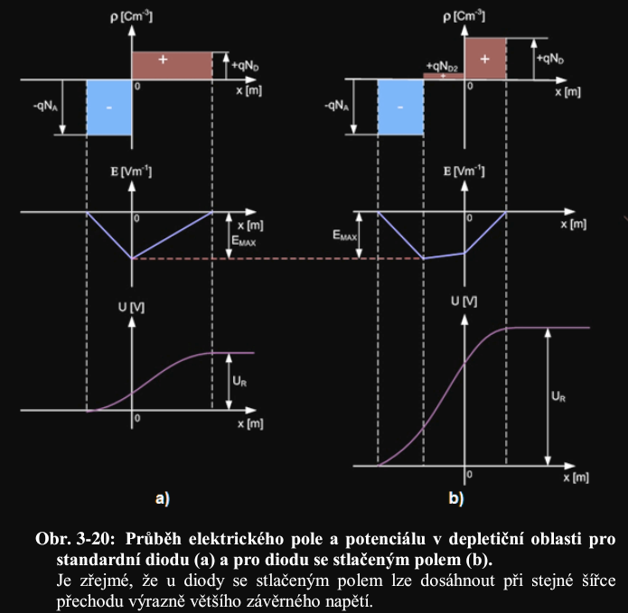
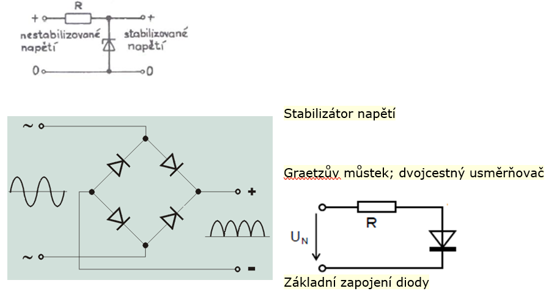

## Varikap, varaktor
**(1):** Varikap(variable kapacitor) a varaktor(variable reaktor) se označují jako kapacitní diody. Jsou navržené tak aby měli co největší činitel jakosti resp. co nejmenší  . Pracují v závěrné části VA charakteristiky. Varikap mění velikost svojí kapacity v závislosti na přiloženém stejnosměrném napětí. Funguje jako kapacitor, který má velikost kapacity řízenou napětím. Varaktor pracuje obvykle s velkými vysokofrekvenčními signály, přičemž během periody signálu dochází k výrazné změně velikosti signálu. Chová se jako nelineární kondenzátor, v němž vznikají vyšší harmonické složky proudu.

- zmena barierove kapacity *(zaverny smer)* , pro srmy prechod $n=1/2$
- **Varikap:** nastaveni pracovniho bodu DC, pak $u$ (AC) amplituda mala, takze nemeni $C$ (Skripta)
- **Varaktor:** co nejvetsi ampl. AC, takze signal ma max nelinearity; typicky nasobice kmitoctu (Skripta)

**(Skripta):** kapitola 3.5.1 a 3.5.2

## Schottky
**(Skripta):** 
- prechod kov-polovodic (MS)
- narocnejsi (asi Hi-P) aplikace GaN, SiC - jinak Si
- propustny proud poze vetsinove nosice - nizsi komutacni naboj $\rightarrow$ prakticky jen barierova kapacita prechodu (rychle)
- rychlosti v radu MHz, maly ubytek prop. napeti (snizuje ztraty)
- rel. velky zaverny proud, $\vartheta$-zavislost
- male prurazne napeti kvuli tenkemu prechodu (nevyhoda)

## Fotodioda
**(1):** Fotodioda je součástka, která je citlivá na dopadající světlo. Pokud není osvětlena, mají její charakteristiky stejný tvar jako charakteristiky standardní diody. Při osvětlení součástky v závěrném směru roste její anodový proud. Rychlost reakce fotodiod na osvětlení se pohybuje v řádech μs-ns.

**(Skripta):** 

## PIN
**(1):** Struktura PIN má mezi dotované části vložený intrizický polovodič. Při využití PIN struktury jako fotodiody pracujeme s velmi vysokými intenzitami elektrického pole v oblasti přechodu, od standardních fotodiod se liší zejména rychlostí reakce na osvětlení řádově ps-fs.

**(Skripta):** 
- delka pole -> vyssi napeti -> muzou byt mensi
- realizace rychlych diod s vetsim napetim

## Technologie vyroby
**(1):** Z konstrukčního pohledu dělíme diody na hrotové a plošné. Hrotové diody se vytváří tím stylem, že se k malé destičce Si nebo Ge, která je umístěna ve skleněné trubičce přibližuje esovitě prohnutý drát, nejčastějí z wolframu. Jakmile se drát dotkne destičky oba konce trubičky se uzavřou a do drátku se pustí formující proudový impuls, který pod hrotem drátku vytvoří dislokace v krystalu, čímž vznikne polovodič s opačnou vodivostí, než je typ vodivosti destičky. Nejedená se ovšem o přechod kov-polovodič, ale PN, drátek funguje jen jako kontakt. První technologií pro výrobu plošných diod byla tzv. slitinová technologie, při níž se na desku monokrystalu přiložila kulička nebo váleček z materiálu s opačnou vodivostí. Při vysoké teplotě se pak legující materiál zapustí do destičky a vznikne přechod. Nevýhodou je špatná reprodukovatelnost parametrů. Častěji se používá difúzní metoda, při níž za vysoké teploty proniká plyn do základní destičky umístěné v peci. Výhodou je, že při dodržení teploty a doby působení jsme schopni reprodukovat diody se stejnými parametry. Pro úpravu vlastností přechodu vzniklého difúzí můžeme použít leptání, to se označuje jako technologie mesa,snižujeme s ní zejména kapacitu přechodu. Tzv. planární technologie má výhodu v tom, že přechod PN nemá parametry ovlivněné oxidací. Destička Si se úmyslně pasivuje aby se přikryla vrstvou SiO2. Do této vrstvy je pak vyleptán otvor a provede se difúze P plynu. Poté se vyleptaný otvor nakontaktuje a znovu zakryje-přechod je chráněný. Pro potlačení parazitního odporu používáme tzv. epitaxní technologii základní deska je typu N+, na ní se nechá narůst tenká N vrstva, do které se zapouští P oblast.

## Typicka zapojeni s diodami
**(1):** 