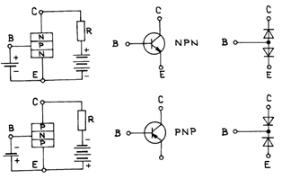
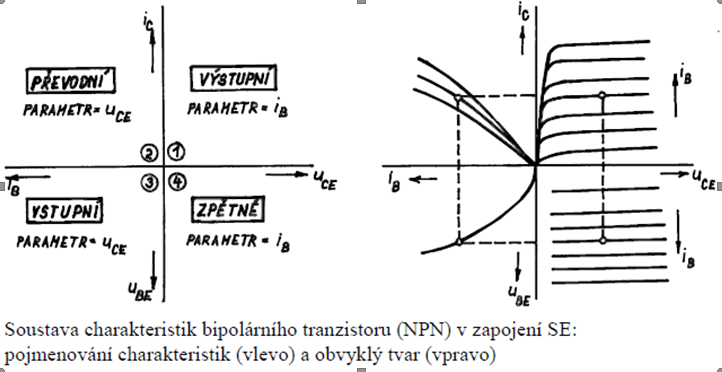

## BJT
**(1):** ... podílejí oba typy nosičů náboje ... Emitor je vůči bázi polarizován propustně, kolektor je polarizován závěrně. Pro správnou činnost je důležité aby byl emitor bohatě dotován, tloušťka báze byla velmi malá, bázový kontakt byl dál než je 5-ti násobek střední volné délky e- a plocha kolektorového přechodu byla mnohem větší než emitorového. 

Pokud přivedeme mezi bázi a emitor napětí začnou z emitoru pronikat nosiče náboje do báze. Báze je velmi tenká a je proto v oblasti přechodu silně přehlcena nosiči náboje. Vlivem přehlcení se nosiče náboje přesouvají kvůli difúzi ke kolektorovému přechodu. 
Depletiční vrstva kolektorového přechodu působí jako nora a tak přejdou nosiče náboje do kolektoru. Tímto způsobem začíná mezi emitorem a kolektorem protékat proud, přičemž jeho velikost je stále určována napětím mezi bází a emitorem.

## IV SE

## Normalni a inverzni rezim
**(1):** Tranzistor je v tzv. normálním aktivním režimu ve chvíli, kdy je emitorový přechod zapojen v propustném směru a kolektorový zapojen v závěrném směru. Tento režim je nejužívanější. V tomto režimu můžeme proudem do báze řídit proud procházející kolektorem a emitorem.
Tranzistor je v inverzním režimu ve chvíli, kdy je emitorový přechod pólován závěrně a kolektorový přechod je pólován propustně.

## Propustny a zaverny rezi
**(1):** Tranzistor je v saturaci ve chvíli, kdy jsou oba přechody polarizovány propustně. Obvodem prochází značný proud. Velikost průchozího proudu je dána velikostí napájecího napětí a velikostí odporu v kolektorovém obvodu.
Tranzistor je v závěrném režimu když jsou oba přechody polarizovány závěrně. Tranzistorem prochází jen nepatrný proud.
