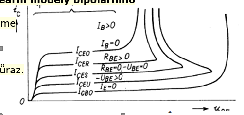
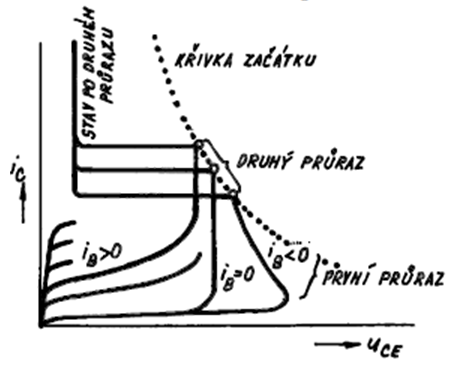
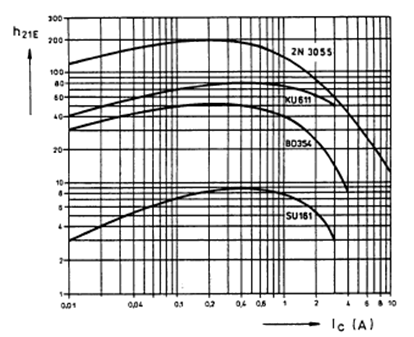
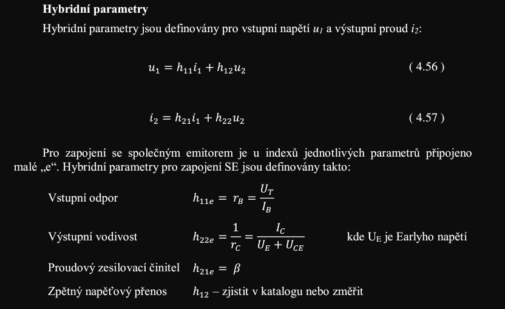
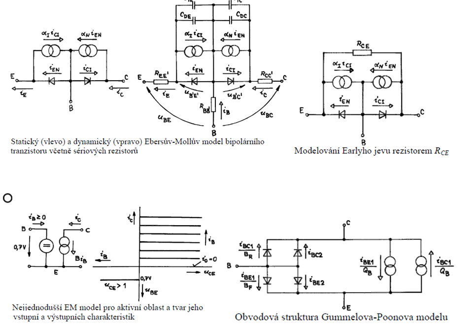

## Prvni a druhy pruraz
### Prvni 
**(1):** První průraz nastane, pokud na tranzistor přiložíme příliš velké napětí. V oblasti prostorového náboje přechodu BC dochází k lavinové nárazové ionizaci. To se projeví poklesem napětí a prudkým nárůstem kolektorového proudu. Jedná se o nedestruktivní průraz

### Druhy
**(1):** Druhý průraz tranzistorové struktury je destruktivní a může být tepelný nebo proudový. Druhý průraz se projevuje prudkým poklesem napětí Uce, ztrátou schopnosti tranzistoru řídit proudem báze. Tepelný druhý průraz nastane, pokud je v některém místě tranzistoru zvýšená proudová hustota, např. kvůli nedokonalé konstrukci. Zvýšená proudová hustota způsobuje větší zahřívání a to způsobuje větší proudovou hustotu, kladná zpětná vazba vede k dalšímu narůstání teploty až do zničení tranzistoru. Druhý proudový průraz může vzniknout při vypínání tranzistoru záporným impulsem proudu báze v obvodu s indukční zátěží. Při vypínání tranzistoru rychle roste Uce a to zpustí lavinovou ionizaci, která vede ke zvýšení Ic. Nosiče vzniklé při nárazové ionizaci jsou urychleny směrem k emitoru a působí jako velký lokální proud báze a vyvolává lokální velké zvýšení proudové hustoty-to vede k destrukci. Pro zamezení vzniku druhého průrazu je důležité dodržovat bezpečnou pracovní oblast. 

## Charakteristické závislosti parametrů tranzistorů na pracovních podmínkách
**(1):** Charakteristické vlastnosti parametrů bipolárního tranzistoru na pracovních podmínkách
- Velikost kolektorového proudu ovlivňuje proudový zesilovací činitel
- Při zvyšování teploty se mění vlastní vodivost polovodiče -> zvýšení zbytkového proudu, zkreslení výstupních charakteristik, zmenšení dovoleného napětí mezi elektrodami

**(Skripta):** 

## Nelinearni modely
**(1):** Prvním nelineárním modelem tranzistoru byl tzv. EM(Ebersův-Mollův) model, dnes se tyto modely pro malou přesnost nepoužívají. V základě jde v tomto modelu o to, že proudové zdroje jsou řízeny diodou na opačné straně báze. Mnohem větší přesnosti dosahuje tzv. GP(Gummelův-Poonův) model, nevýhodou je, že potřebuje znát cca 25 parametrů. Pro praxi je důležité, že tento model je užíván v programu SPICE.

## Linearni model
**(1):** Lineární modely můžeme pro tranzistor použít, pokud uvažujeme signál s malou amplitudou. V takovém případě můžeme tranzistor linearizovat, čili použít k jeho popisu lineární čtyřpól tj. dvojbran. K tomuto popisu můžeme využít linearizovaný EM model nebo diferenciální čtyřpólové parametry. 

**(Skripta):** 