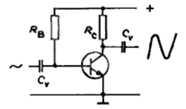
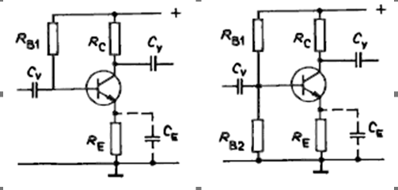

## Zapojeni a OP (priklad s SE)
**(1):** Za základní tranzistorové obvody můžeme označit tranzistor jako zesilovač, tranzistor jako spínač a darlingtonovu dvojici.
Tranzistorový zesilovač se nejčastěji zapojuje v uspořádání SE. Pro nastavení jeho pracovního bodu v základu stačí pouze 2 rezistory.

**(1):** Při tomto jednoduchém nastavení pracovního bodu předřadným odporem R  jde pouze o to splnit základní podmínku funkce tranzistoru- emitor je v propustném směru, kolektor je v závěrném. V případě NPN tranzistoru toho dosáhneme tak, že nejvyšší potenciál bude na kolektoru a nejnižší na emitoru. Poměrem velikostí odporů rezistorů se volí zesílení tranzistoru  . Častější ale bývá zapojení tranzistoru se stabilizací pracovního bodu.

Na prvním zapojení je mezi emitor a zem přidán stabilizační rezistor R . Stabilizace spočívá v tom, že napětí na rezistoru R  je dáno rozdílem napájecího napětí a úbytku napětí na rezistoru R  . Když se zvedne proud kolektoru zvětší se i úbytek napětí na R , napětí na rezistoru R  se tím pádem zmenší a tím klesne proud do báze, což znamená pokles kolektorového proudu. Dá se říci, že stabilizační účinek zapojení je tím lepší, čím větší je R a čím menší je R . Zvětšování odporu R  je ale nevýhodné, protože se na něm může objevit velká část napětí z napájecího zdroje. Proto se místo toho snižuje velikost R , čehož můžeme efektivně dosáhnout zapojením děliče R  R . Místo děliče se často používá potenciometr, kterým můžeme přesně nastavovat pracovní bod. Pro všechny typy zapojení(SE,SC i SB) se používá stejný princip, pro nastavení prac. bodu.

## Spinac s BJT
**(1):** Tranzistor jako zesilovač funguje na tom principu, že i malá změna proudu báze vyvolá velkou změnu proudu kolektoru. Zesílení můžeme posilovat zapojením více tranzistorů za sebou.

**(1):** Tranzistor v zapojení SE je nejčastěji používán, protože zesiluje napětí proud i výkon. Výstupní odpor se v tomto zapojení pohybuje mezi 20-100kΩ, vstupní odpor je 500Ω-2kΩ. V zapojení SC má tranzistor napěťové zesílení menší než 1, proudové a výkonové zesílení je ale velké. Vstupní odpor je v rozsahu 3 kΩ-1MΩ, výstupní odpor je v rozsahu 30Ω-20kΩ. V zapojení SB je napěťové zesílení velké, ale proudové malé. Vstupní odpor je 25-500Ω, výstupní odpor je 100kΩ-1MΩ. ... i uzavřeným tranzistorem prochází malý zbytkový proud $I_{CE0}$ Tento zbytkový proud jde omezit zapojením rezistoru mezi bázi a emitor. Pro tranzistory konstruované jako spínače je důležité, aby měli co nejmenší odpor v sepnutém a co největší odpor v rozepnutém stavu. Jestliže se vyskytuje tranzistor ve spínacím režimu v oblasti saturace je pro něj doba zapnutí kratší než pro nenasycený režim, ale doba vypnutí je naopak delší, protože se musejí odčerpat nosiče z báze pro přepolarizování kolektorového přechodu do závěrného směru.

**Upraveno z (1):** 
| Zapojeni | $r_{in}$  | $r_{out}$ |
|----------|-----------|-----------|
| SE       | 500-2k    | 20-100k   |
| SC       | 3k - 1meg | 30-20k    |
| SB       | 25-500    | 100k-1meg |