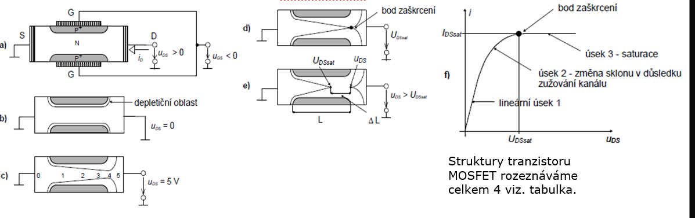
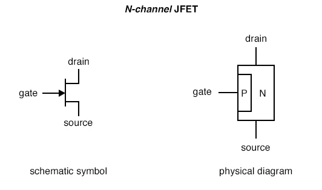
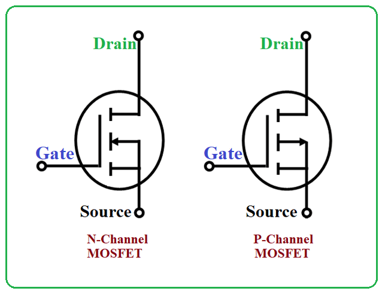
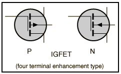
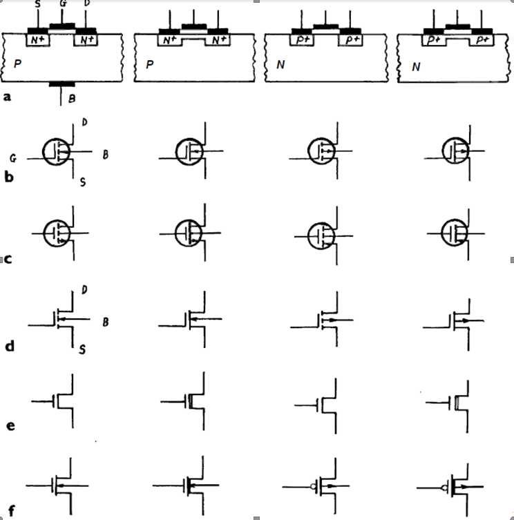
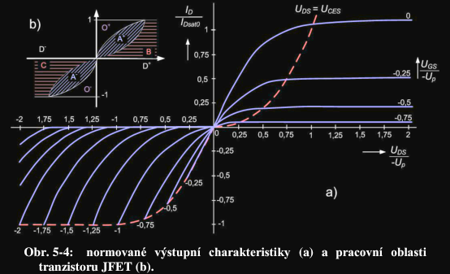
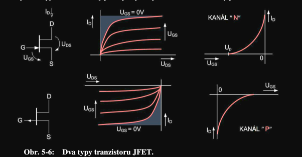
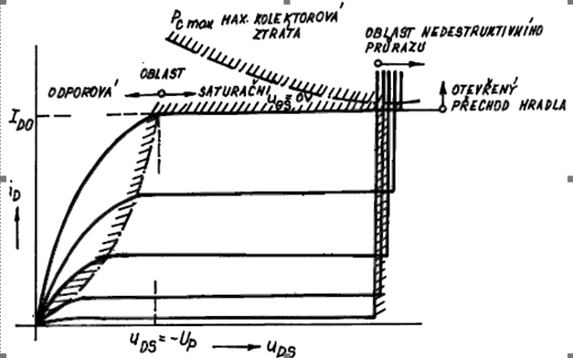
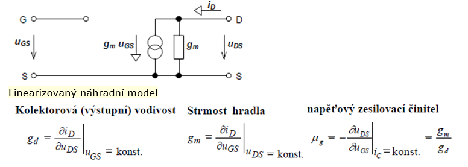

- jen majoritni nosice

## Typy
| JFET | MOSFET | IGFET | 
|------|--------|-------|
|  |  | 

- **JFET** (junction FET) - (1): pokud tranzistorem neprotéká žádný proud je tranzistor v termodynamické rovnováze a v okolí obou hradel se vytvoří tenká depleteční oblast, která je více rozšířená do méně dotované N oblasti kanálu obr. b). Pro malá napětí se JFET chová jako rezistor, čili proud roste úměrně s napětím, při zvyšování napětí se ale vlivem konečného odporu kanálu rozdělí potenciál dle obr. c). Kvůli tomuto rozložení potenciálu se bude různit šířka depletiční vrstvy, v oblasti drainu je přechod pólován ,,závěrněji“ a tak u něj bude větší šířka depletiční oblasti. Kvůli deformaci se již tranzistor nechová jako rezistor a se stoupajícím napětím již proud neroste lineárně. Tato oblast je vidět na charakteristice v úseku 2 jako ohyb. Při určitém napětí Uds dojde k úplnému zaškrcení kanálu. Proud už dále neroste a zůstává na hodnotě Ids . Napětím U  můžeme regulovat šířku depletiční vrstvy kanálu. Při určitém napětí U  je kanál zcela odříznut, depletiční vrstva je rozšířena v celém rozsahu a tranzistorem neprochází žádný proud. Toto napětí se označuje jako prahové U  nebo treshold voltage U . Tranzistor MESFET je konstrukčně i principielně téměř stejný jako JFET, rozdíl je pouze v tom, že jako hradlo je používán kontakt kov-polovodič namísto dvou polovodičů

- **MOSFET** (metal-oxide-semiconductor FET) - (1): Tranzistory MOSFET mohou mít trvalý kanál neboli automatické otevření nebo indukovaný kanál, s automatickým uzavřením, který vznikne až při přiložení určitého prahového napětí U  (Treshold voltage U ). Pod hradlem se v závislosti na typu substrátu a na přiloženém napětí vytvoří depletiční nebo akumulovaná (inverzní) vrstva.

## IV char.
**(Skripta):** 

**(1):** 

## Zapojeni
**(1):** Dle toho v jakém režimu chceme tranzistor použít pak nastavíme pracovní bod. Tranzistor jako zdroj proudu-saturační režim, tranzistor jako zesilovač-ve všech režimech, tranzistor jako řízený odpor-aktivní režim.

## Linearizovany model
