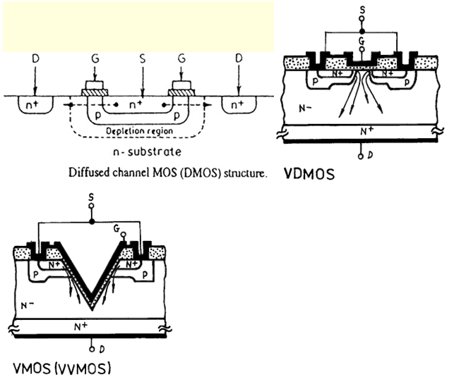
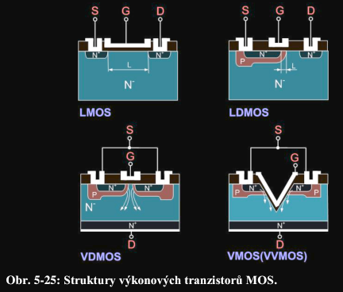
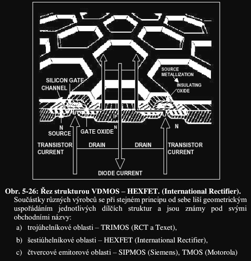
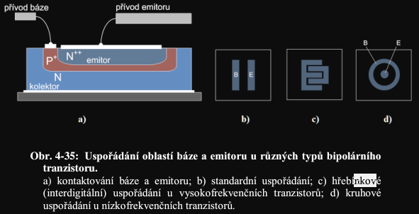
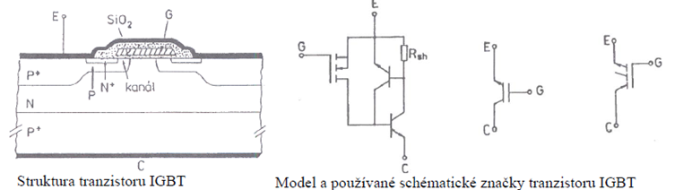
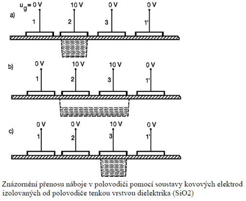

## FET struktury
**(1):** Pro vysoké výkony využíváme tzv. Vertikální FET. Výkonové tranzistory SIT se skládají z mnoha paralelně spojených struktur s velmi krátkým kanálem, pro vysoké napětí musí být vrstva N slabě dotovaná. Největším problémem výkonových tranzistorů je velký úbytek napětí v sepnutém stavu, ten je způsoben především délkou kanálu, kterou z technologických důvodů není možné zmenšit. Pro minimalizaci úbytku napětí se začali navrhovat alternativní konstrukce. DMOS-Diffused channel MOS, VDMOS- Vertical Double diffused MOS, VMOS-podle tvaru vyleptání

## Integrace FET
- Standardne CMOS

## IGBT
**(1):** Insulated gate bipolar tranzistor. Vznikl ze struktury VDMOS nahrazením N+ substrátu P+ substrátem. Při přiložení napětí na řídící elektrodu, se pod elektrodou vytvoří inverzní vrstva, která vodivým kanálem spojuje N+ oblast emitoru s N oblastí báze. Vodivé propojení vyvolává injekci děr z přechodu P+N. Injekce děr výrazně snižuje sériový odpor struktury MOS, to umožňuje používat vysokou proudovou hustotu

## CCD
**(1):** CCD-charge coupled device, jedná se o složení několika MOS tranzistorů složených na jednom substrátu v těsné blízkosti. Tyto struktury nemohou zesilovat. CCD umí uchovávat náboj v potenciálových jámách. Takto můžeme přenášet informační náboj skrze sérii potenciálových jam. Na rozdíl od MOS tranzistorů se při přiložení napětí většího než je napětí prahové nevytvoří inverzní vrstva, ale pouze vrstva zcela ochuzená o nosiče náboje. Průřez této jámy je dán průměrem elektrody a její hloubka přiloženým napětím. 

