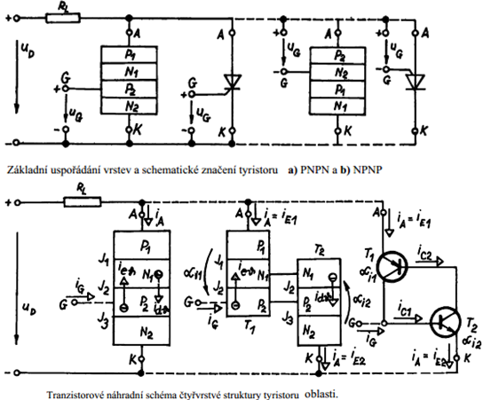
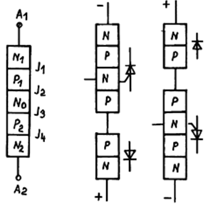
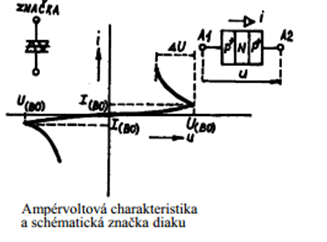

## Tyristor, struktura
**(1):** Jako tyristory obecně označujeme bistabilní polovodičové součástky, které mají 3 nebo více přechodů PN a lze je přepínat mezi propustným a závěrným směrem. Z pohledu ampervoltové charakteristiky rozlišujeme tyristory A,B,C. A-spínají v jedné polaritě, v druhé se chovají jako dioda v závěrném směru, B- spínají při obou polaritách, C-spínají při jedné polaritě v druhé se chovají jako dioda v propustném směru. Podle počtu vývodů dělíme tyristory na třídy a,b,c. a-dva hlavní vývody, b-dva hlavní vývody a jedno hradlo,c-dva hlavní vývody a dvě hradla. Pokud není blíže specifikováno pak se jako tyristor označuje součástka přívlastkem Ab. 

"po otevreni na gatu se uzavre az po snizeni K-A proudu"

## Tyristor, zaverny a propustny stav
**(1):** 
| Zaverny stav | Blokovaci stav |
|---|---|
| zapojíme u struktury PNPN záporné napětí na anodu a kladné napětí na katodu jsou přechody J1 a J3 v závěrném směru, J2 v propustném. Téměř celé napětí leží na přechodu J1. Přechod J1 bude určovat závěrné vlastnosti tyristoru, zejména průchozí saturační proud. Na řídící elektrodě G není přiloženo napětí | pokud zapojíme na anodu kladné napětí a na katodu záporné napětí jsou přechody J1 a J3 v propustném stavu a J2 v závěrném. Na J2 bude většina napětí zdroje a tento přechod určuje vlastnosti tyristoru. Na řídící elektrodě G není přiloženo napětí. |

**(1):** Přechod z blokovacího do propustného stavu- pokud na řídící elektrodu přiložíme napětí tak, že je přechod J3 polarizován v propustném stavu, bude řídící elektrodou procházet proud. Na přechodu J3 se podstatně zvýší proudová hustota a do oblasti P2 jsou z přechodu J3 injektovány minoritní nosiče-elektrony. Ty se difúzí dostanou až k přechodu J2, depletiční oblast elektrony urychlí a ty se dostanou až do oblasti N1. Vyšší koncentrace majoritních nosičů v N1 způsobí vyšší injekci minoritních nosičů(děr) z oblasti P1. Ty se difúzním pohybem dostanou až k J2, kde jsou urychleny a vstříknuty do P2. Zvýšení počtu nosičů v P2 způsobí zvýšení injekce z N2… Proces pokračuje tak dlouho, až v oblastech N1 a P2 bude takové množství minoritních nosičů, že budou plně kompenzovat náboj ionizovaných příměsí u přechodu J2. Ten se tak přepolarizuje do propustného stavu. Druhým způsobem sepnutí tyristoru je zvýšení blokovacího napětí nad hodnotu U , to vede k injekci minoritních nosičů z oblasti přechodu J3 až k přechodu J2, kde se začne kvůli vysokému napětí uplatňovat lavinový jev. Třetí možností je sepnutí vlivem světla, kde na přechodu J2 dochází ke generaci párů elektron-díra, které jsou injikovány do oblastí přechodů J1 a J3, které následkem toho emitují minoritní nosiče, zbytek je stejný jako u 1. případu. 

## Specialni druhy tyristoru
**(1):** 
- Rychlý tyristor, s krátkou zapínací a vypínací dobou a vysokou odolností proti nárůstu blokovacího napětí a propustného proudu. Max jednotky kHz. Frekvenční tyristor-rychlý tyristor s použitelností až do 10 kHz.
- GATT-Gate Assisted Turn-off Thyristor, použitelnost až do 20 kHz a krátká vypínací doba.
- GTO- Gate Turn-off Thyristor, musí při vypínání odvést ze struktury vyšší náboj než GATT, proto je členěn na tenké pásky, které obklopují řídící elektrodu.
- Tyristory řízené světlem, nebo polem.
- Triak-obousměrný triodový tyristor. Jeden krajní přechod je vždy v závěrném směru, zatímco druhý je součástí tyristorové struktury.

## Triak
**(1):** Triaky se mohou spouštět proudem obou polarit mezi A1(A2) a řídící elektrodou.

## Diak
**(1):** Diak-spínací třívrstvá dioda. Strukturou je jedná o symetrický lavinový tranzistor. Při přiložení napětí je jeden přechod polarizován v propustném a druhý v závěrném směru. Při dosažení hodnoty napětí $U_{B0}$ dosáhnou minoritní nosiče z přechodu, který je polarizován v propustném směru oblast přechodu, který je polarizován v závěrném směru, kde vyvolají lavinové násobení nosičů. Tím poklesne napětí a vzroste proud. Diaky mají symetrickou AV charakteristiku. Používají se jako napěťová ochrana např. pro MOS tranzistory.

