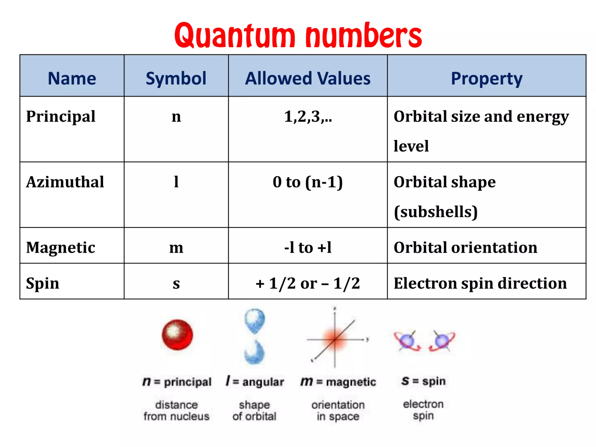
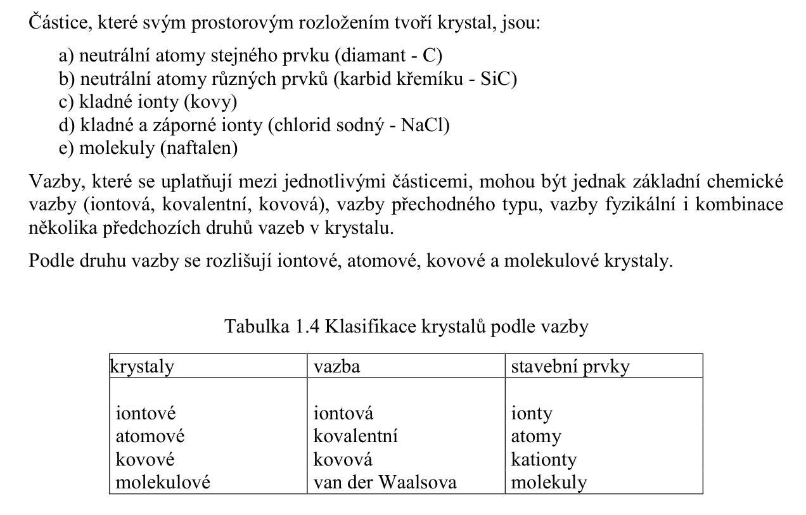
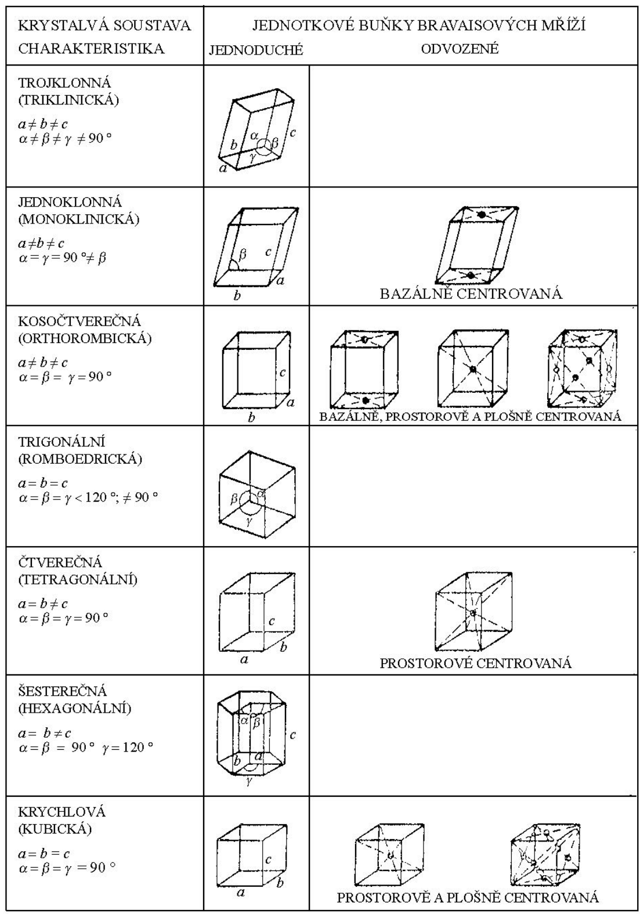

# 1\. Atomová stavba. Základní chemické vazby atomů. Látky krystalické, amorfní a reálně nekrystalické. Defekty v krystalických soustavách.

## Atomova stavba

## Zakladni chemicke vazby atomu
| Bond Name | Classification | Description | Energy Range (eV) | Typical Occurrence |
| :--- | :--- | :--- | :--- | :--- |
| **Ionic** | Chemical | Electron transfer; electrostatic attraction | 6.0 – 15.0 | NaCl (Salt) |
| **Covalent** | Chemical | Electron sharing; orbital overlap | 2.0 – 10.0 | Diamond (C) |
| **Metallic** | Chemical | Cation lattice; delocalized electron sea | 0.6 – 8.0 | Copper (Cu) |
| **Hydrogen** | Physical | H-bridge between N, O, F atoms | 0.1 – 0.4 | Water (H2O) |
| **Keesom** | Physical | Permanent dipole-dipole attraction | 0.04 – 0.25 | HCl |
| **Debye** | Physical | Permanent-induced dipole interaction | 0.02 – 0.1 | Ar in HCl |
| **London** | Physical | Fluctuating instantaneous dipoles | 0.0005 – 0.4 | Liquid Helium |

## Latky krystalicke, amorfni a realne nekrystalicke
**(S):** 

## Defekty v krystalickych soustavach
**(S):** 
Typy, popsano nize:
1. Bodove poruchy
2. Carove poruchy
3. Plosne poruchy

#### 1\. Bodove poruchy
- vaknce, interstacial, substitucni atom, Schottkyho porucha (presun ionu na povrch krystalu), Frenkelova porucha (presun castice z uzlu do interstacialni polohy)
- koncentrace vakanci: $n_v = cN \exp{\left[ -\frac{W_{vakance}}{kT} \right] }$, kde $c$ je konstanta

#### 2\. Carove poruchy (dislokace)
- podel spojitych car
- $E$ pro vznik >> $E_{bodova}$
- typy:
	1. hranova dislokace
	2. sroubova dislokace
	3. obecna dislokace
 
#### 3\. Plosne poruchy
- hranice zrn v polykrystalech
- hranice zrn a vrstevne chyby