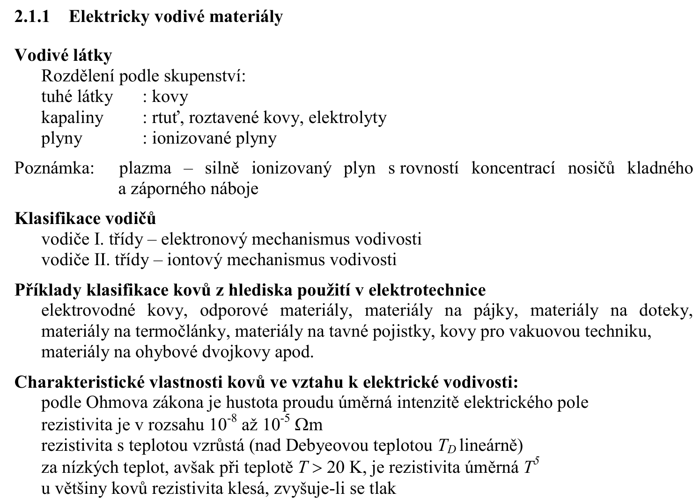
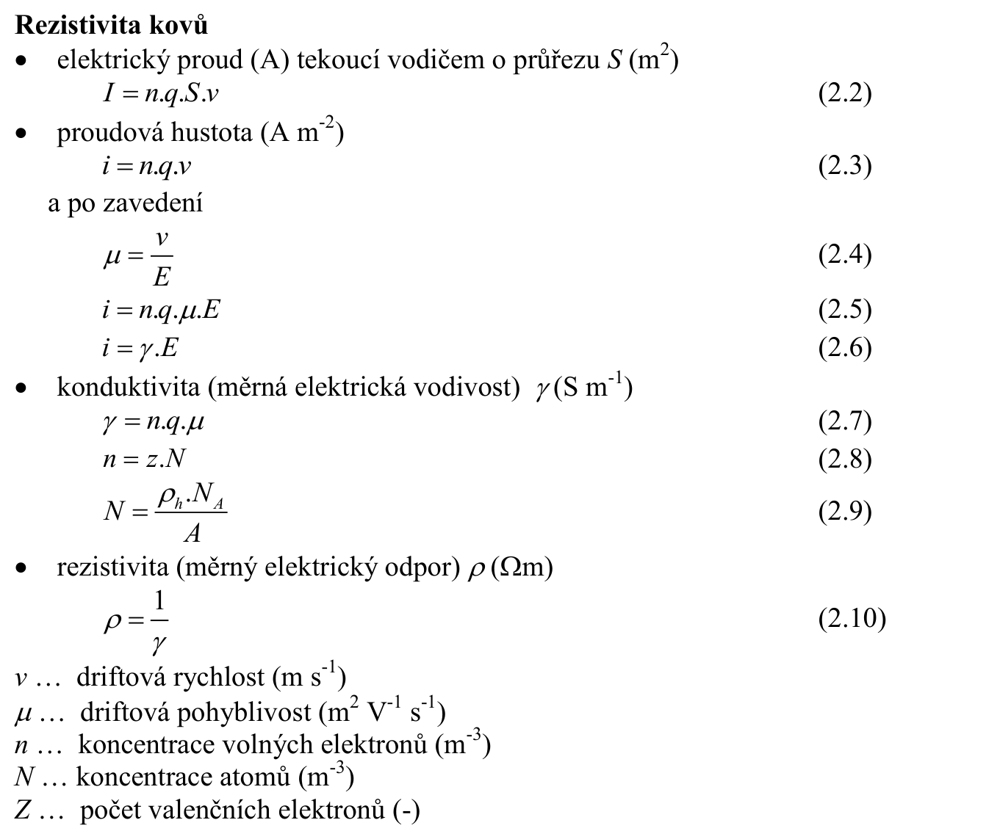
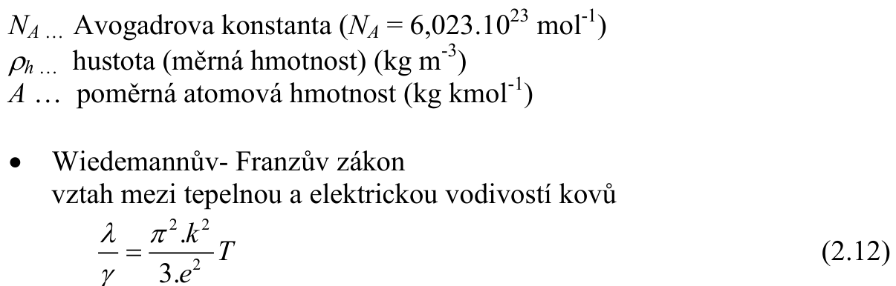
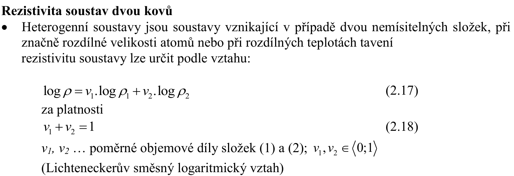
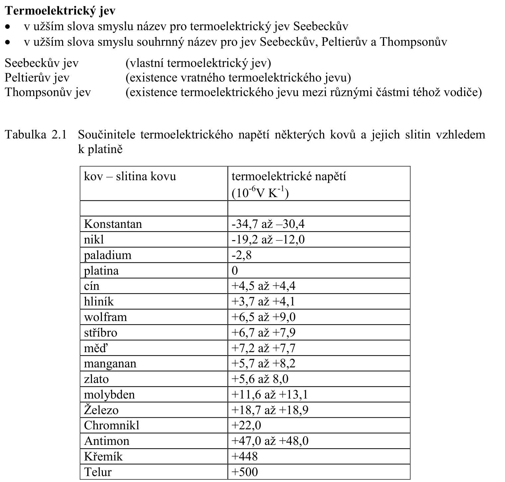

# 2\. Klasifikace vodivých materiálů pro elektrotechniku a elektroniku podle složení, struktury a vlastností. Elektrická vodivost materiálů. Základní vztahy. Vodivé materiály. Základní vlastnosti vybraných materiálů. Příklady materiálů pro kabelové vodiče, odpory, termočlánky a kontakty. Odporové materiály, požadavky na tyto materiály.

## Klasifikace vodivych materialu dle slozeni, struktury a vlastnosti
**(S):** 

## Elektricka vodivost
**(S):** 

## Zakladni vztahy
$$\sigma = \rho^{-1} = \left(\frac{SR}{l}\right)^{-1} = \frac{Gl}{S} \text{ }\left[ S/m \right]$$

## Priklady materialu pro kabelove vodice, odpory, termoclanky a kontakty
Castecne zpracovano v EMV1: [5. Vodivé a odporové materiály](../../text/EMV1/5.%20Vodivé%20a%20odporové%20materiály.md)

## Odporove materialy, pozadavky na tyto materialy
Zpracovano v EMV1: [5. Vodivé a odporové materiály](../../text/EMV1/5.%20Vodivé%20a%20odporové%20materiály.md)