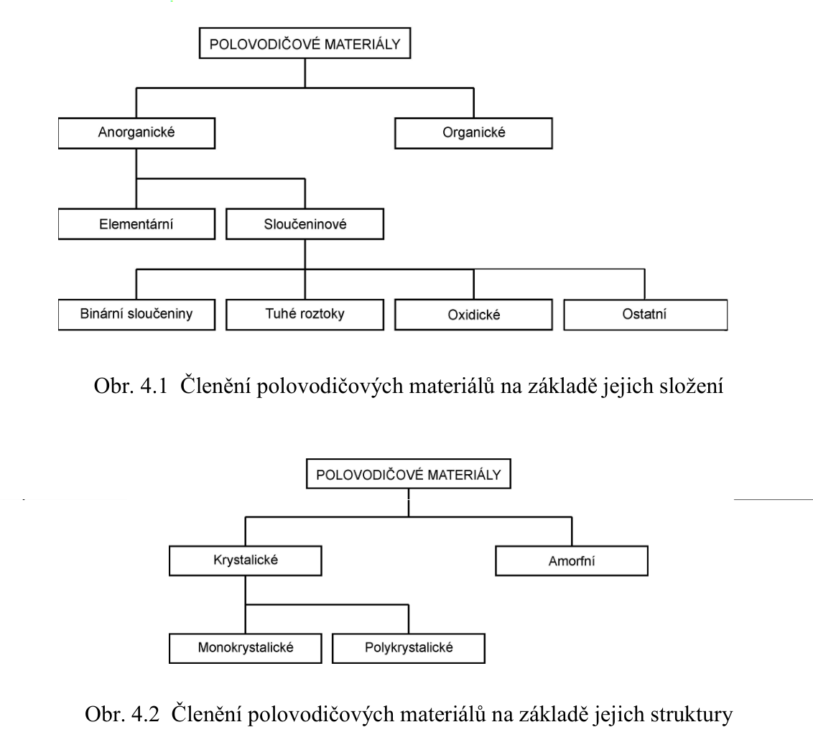
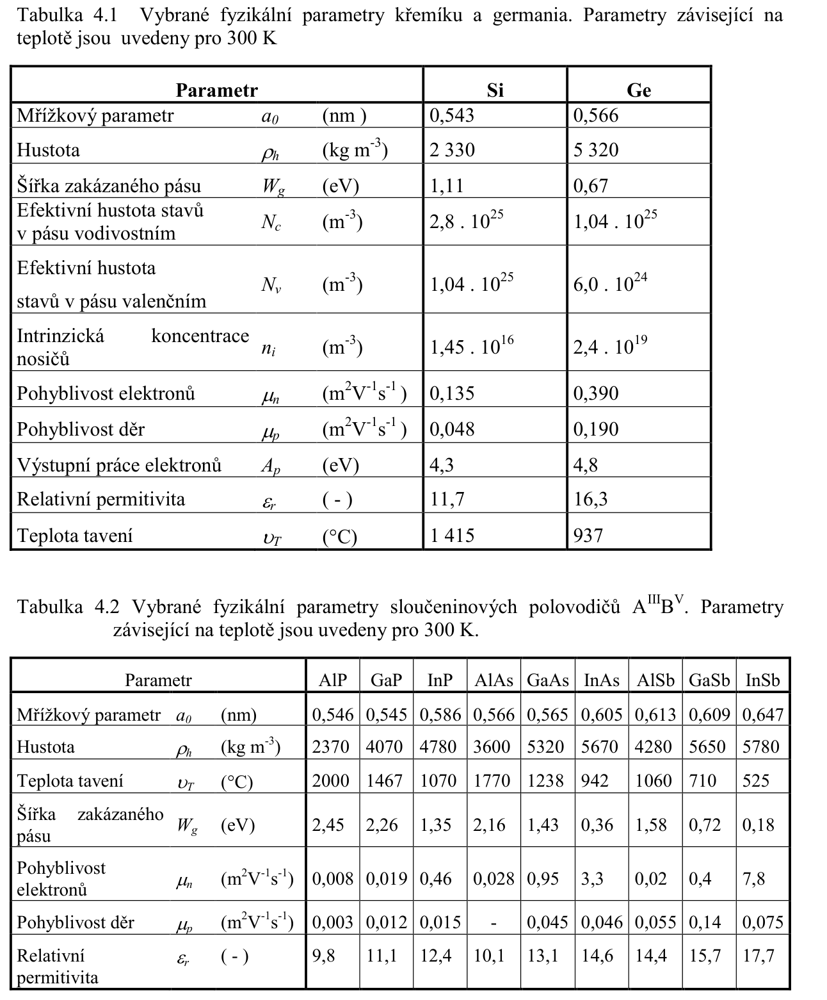
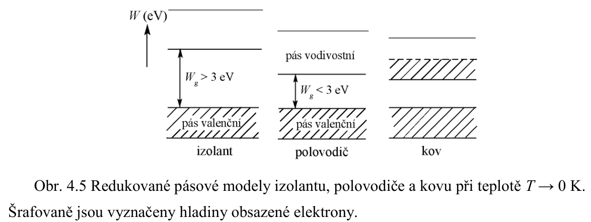

# 3\. Klasifikace polovodičových materiálů pro elektrotechniku a elektroniku podle složení, struktury a vlastností. Redukovaný vodivostní pásový model pevných látek. Konduktivita vlastního polovodiče. Polovodičové materiály. Elementární a sloučeninové polovodiče. Termodynamická rovnováha v vlastních polovodičích.

## Klasifikace polovodicovych materialu
**(S):** 

*Pozn.: **(OOK skripta §2.5.1):** organicke polovodice v OLED (vazby $\sigma$, $\pi$)*

klasifikace podle vlastnosti napriklad ($\alpha, \varrho, W_g, n_i, \mu, A_p = \phi, \dots$):

## Redukovany vodivostni pasovy model pevnych latek
**(S):** 

## Konduktivita vlastniho polovodice
$$ \sigma = q (n\mu_n + p \mu_p)$$
- Fickuv zakon difuze: $J = - q D \nabla p$ (diry)
- Drift: $J = qpv_d = qp\mu_p E$
- kompenzace: $\frac{D}{\mu} = \frac{kT}{q}$ (viz [radoby dukaz](../../_dukazy/einsteinuv_vztah.md))

$$ n_i \propto T^{3/2}\exp{\left[ -w_g/(2kT) \right]}$$

## Elementarni a slouceninove polovodice
**(Wikipedia):** Mezi polovodivé prvky patří křemík, germanium, selen, sloučeniny arsenid galia GaAs, sulfid olovnatý PbS aj.

**(OOK skripta §2.5.1):**
- **přímozónový** (GaAs, InP, GaN): minimum vodivostního pásu a maximum valenčního pásu při $\mathbf{p} = 0$
  - přímé mezipásové přechody bez fononu → vysoká pravděpodobnost, velký kvantový výtěžek, silná absorpce
  - doba života minorů $\tau \approx 10^{-10}\,\text{s}$
   
- **nepřímozónový** (Si, Ge, GaP): minima/maxima pásů v různých bodech $\mathbf{k}$-prostoru
  - přechod vyžaduje fonon (zachování impulsu) → nízká pravděpodobnost, slabá absorpce/emise
  - $\tau \approx 10^{-8}\,\text{s}$; dominují nezářivé rekombinace (Auger)
  - lze zlepšit izoelektronovými centry (N v GaP → zelená emise)
  
- vhodnost pro laserové diody: přímozónové (GaAs, InGaAsP, GaN)

**(OOK skripta §2.5.4):**

| Skupina | Příklady | Oblast záření |
|---------|----------|---------------|
| **A$^{III}$A$^V$** (binární) | GaAs, GaP, InP, GaN | 0,35–1,8 µm |
| **A$^{III}$A$^V$** (ternární) | GaAlAs, GaAsP, InGaP | laditelné $E_g$ mísením |
| **A$^{III}$A$^V$** (kvaternární) | InGaAsP, GaAlAsSb | 0,95–1,6 µm (okna vláken) |
| **A$^{II}$A$^{VI}$** | ZnS, ZnSe, CdTe | UV–VIS, elektroluminofory |

- GaAlAs-GaAs: $\lambda = 0{,}8$–$0{,}9\,\mu\text{m}$, rychlá odezva
- InGaAsP-InP: $\lambda = 0{,}95$–$1{,}6\,\mu\text{m}$ → 2. a 3. okno vláken
- GaN: modré/UV LED a lasery
- požadavky: vhodné $E_g$, přímý přechod, obě vodivosti, dobrá technologie

## Termodynamicka rovnovaha a pasovy model
Termodynamicka rovnovaha a pasovy model v ESO: [1. Prechod PN](../../text/ESO/1.%20Prechod%20PN.md)