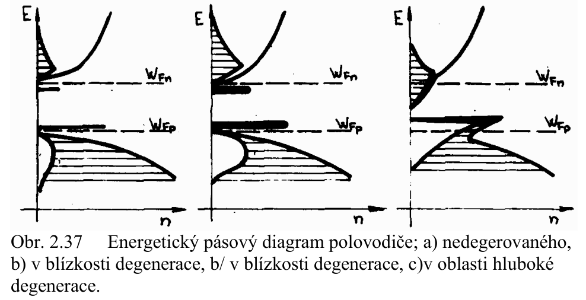

# 4\. Klasifikace polovodičových materiálů pro elektrotechniku a elektroniku podle složení, struktury a vlastností. Redukovaný vodivostní pásový model příměsových polovodičů. Konduktivita polovodiče typu N a P. Degenerovaný polovodič. Termodynamická rovnováha v příměsových polovodičích.

## Klasifikace materialu
Zpracovano v MPE otazce: [3. Polovodiče I](../../text/MPE/3.%20Polovodiče%20I.md)

## Redukovany model primesovych polovodicu
Zpracovano v MPE otazce: [3. Polovodiče I](../../text/MPE/3.%20Polovodiče%20I.md)

## Konduktivita polovodice typu N a P
Zpracovano v MPE otazce: [3. Polovodiče I](../../text/MPE/3.%20Polovodiče%20I.md)

## Degenerovany polovodic
**(OOK Skripta, str. 45):**

## Termodynamicka rovnovaha v primesovych polovodicich
Zpracovano v MPE otazce: [3. Polovodiče I](../../text/MPE/3.%20Polovodiče%20I.md)