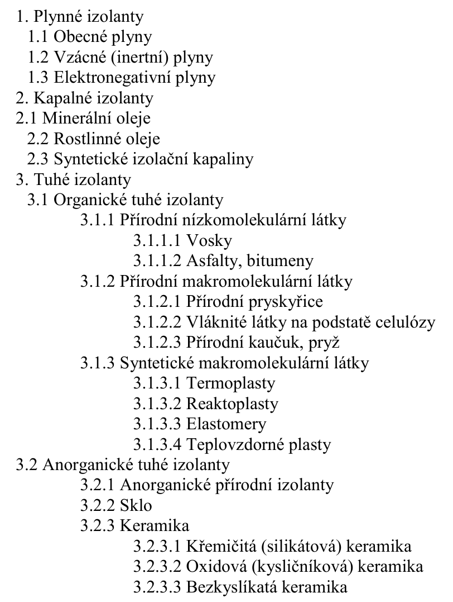
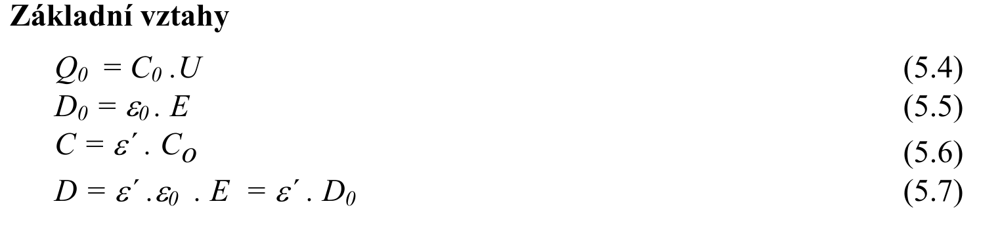
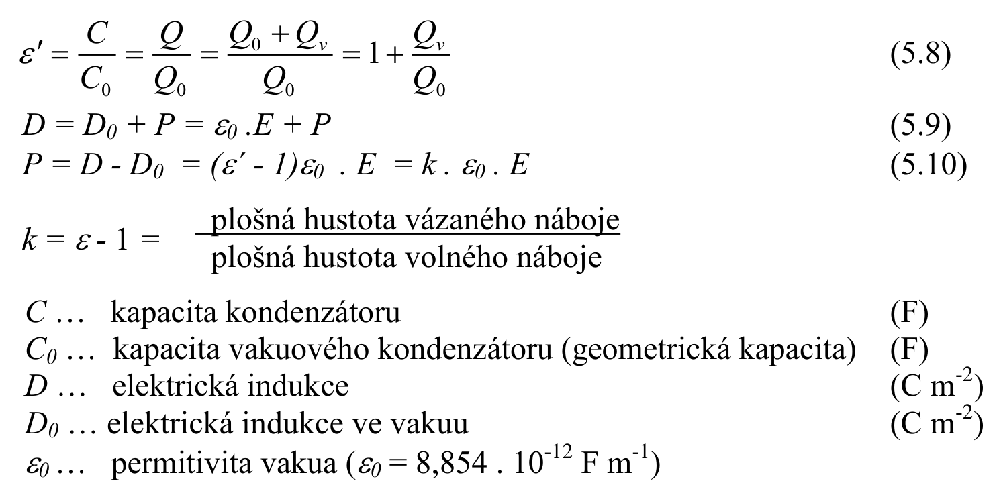
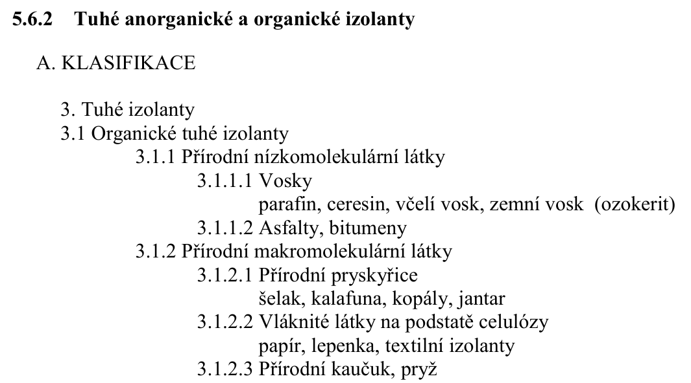
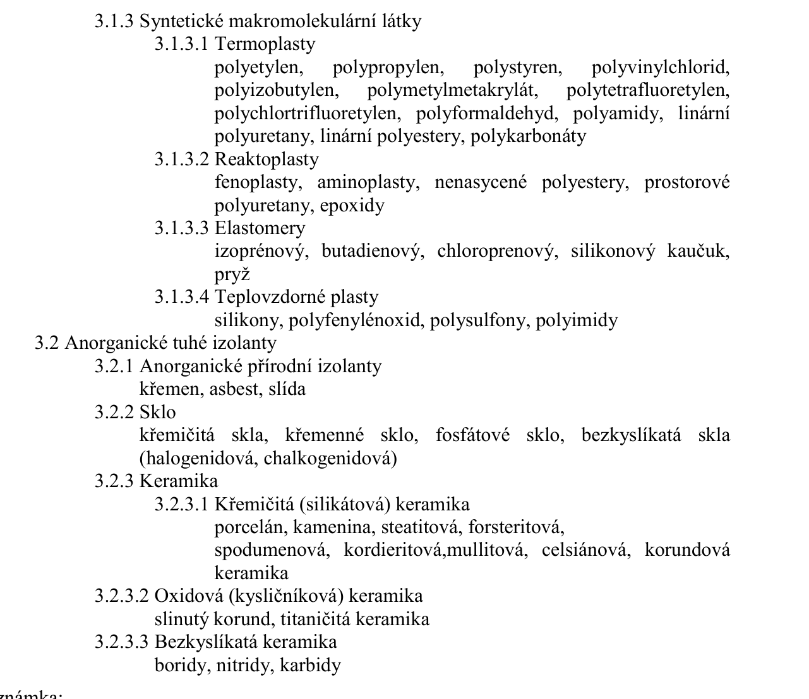

# 5\. Klasifikace dielektrických materiálů pro elektrotechniku a elektroniku podle složení, struktury a vlastností. Dielektrická polarizace a elektrická vodivost. Základní vztahy. Dielektrické materiály. Ztráty v dielektriku. Příklady organických a anorganické dielektrických materiálů.

## Klasifikace dielektrik dle slozeni, struktury a vlastnosti a dielektricke materialy
**(S):** 

## Zakladni vztahy

## Dielektricka polarizace, vodivost
Zpracovano v MVE1: [1. Dielektrika a izolanty](../../text/EMV1/1.%20Dielektrika%20a%20izolanty.md)

## Ztraty v dielektriku
Zpracovano v MVE1: [1. Dielektrika a izolanty](../../text/EMV1/1.%20Dielektrika%20a%20izolanty.md)

## Priklady org. a anorg. dielektrik
**(S, str. 100):** 

