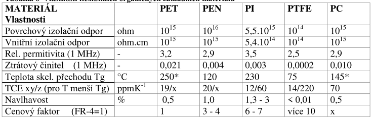
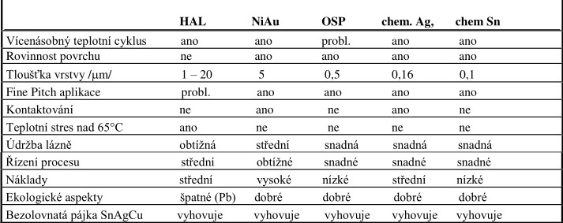
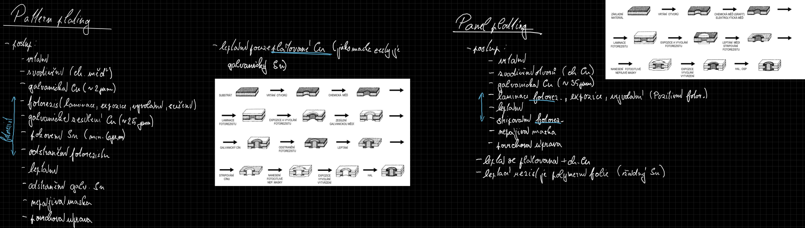
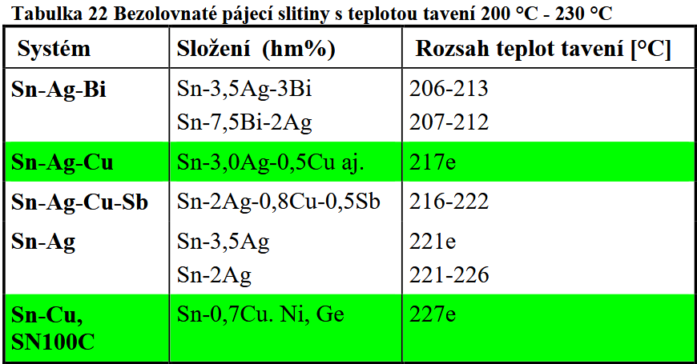

# 7\. Materiály pro výrobu plošných spojů. Substrátové materiály. Plátovací materiály. Metody výroby plošných spojů. Příklady pájek.

## Materialy pro DPS
**PSM (Otazky 1):** [Otazky ke zkousce](:/a9f8f3cf009549b7b8940cc153db5cf1)

- **ZM**:
    - izolace desky (bud dielektrikum nebo kovove jadro)
    - nosic vodiveho motivu, montaz soucastek
- **Vyztuz**:
    - mechanicka pevnost DPS a dalsi vlastnosti M
    - druhy: `sklenene vlakno`, `tvrzeny papir`, `aramidove vlakno`, `kremenne vlakno`, `uhlikove vlakno`
- **Pojivo**:
    - homogenizator, chrani pred MC
    - polymery (pro neohebne *termosety* pro ohebne *termoplasty*)
    - vyborne dielektricke vlastnosti

## Substraty
**PSM (Otazky 1, 2):** [Otazky ke zkousce](:/a9f8f3cf009549b7b8940cc153db5cf1)
- **ZM**:
    - izolace desky (bud dielektrikum nebo kovove jadro)
    - nosic vodiveho motivu, montaz soucastek
**Neohebne materialy**:

- **FR-1,2**: papir + FFD pryskyrice (krehka)
    - jednovrstva, obrabeni, cena, horsi odolnost proti oblouku, navlhavost
- FR-3: epoxi. p. + tvrzeny papir (mensi navlhavost)
- **FR-4**: epoxi. p. + skl. tkanina; lepsi $T_g$, $TCE$
    - cena asi 2x proti FR2
    - vyšší kmitočty (nižší $\varepsilon$ a $\delta$)
    - větší povrchový odpor
    - menší teplotní roztažnost v ose z
    - nižší navlhavost
    - lepší mechanické vlasnosti, ale horší obrábění
    - jednovrstva, obrabeni, cena, horsi odolnost proti oblouku, navlhavost, odlupování Cu
- CEM-1: papir + skl. tkanina + epoxi. p. *(neco mezi FR3,4)*
- keramiky
- IMS *(insulated metallic substrate)*

**Ohebne materialy**:

- **deleni**: rigid flex, semiflex *(jednorazovy ohyb)*, flex s vystuzi *(PI+FR4)*
- PET: pevny, tvarove stabilni, nenavlhavy, neda se pajet
- PEN *(polyethylennaftalat)*
- PI: velmi navlhavy, cena

## Platovaci materialy
- **Materiál pro plátování:** standardně měděná fólie (Cu) o vysoké čistotě (99.5 %+).
- **Způsob výroby fólie:**
    - *ED (Electro-deposited):* elektrolyticky vylučovaná fólie. Levnější, má drsnější povrch z jedné strany (lepší adheze k substrátu), ale je křehčí. Používá se pro rigidní (neohebné) desky.
    - *RA (Rolled-Annealed):* válcovaná a žíhaná fólie. Dražší, hladká, velmi tažná a ohebná. Ideální pro flexibilní plošné spoje (dynamické namáhání).
- **Základní tloušťky Cu fólií:** standardně vyjadřované v mikrometrech [µm]:
    - `18 µm` (označováno také jako 0.5 oz) – pro jemné motivy, signálové cesty.
    - `35 µm` (označováno jako 1 oz) – standardní tloušťka pro běžné DPS.
    - `70 µm` / `105 µm` – výkonové a napájecí vrstvy s vyšším proudovým zatížením.
- **Parametry:** důležitá je odlupovatelnost (pevnost v odtržení od substrátu) a rovnoměrnost tloušťky.

## Druhy povrchových úprav měděných ploch neosazených DPS po nanesení nepájivé masky (min. 4). Popište jejich vlastnosti a uveďte perspektivní typy.

- **HAL** - žárové nanesení pájky ($1-20 \mu m$), ta jako povrchová ochrana Cu (často stále PbSn); doba pájitelnosti min. $12$ měsíců
- **OSP** - organické inhibitory oxidace mědi; kratší doba skladovatelnosti a horší vícenásobná expozice; DP min. $3$ měsíce
- **Sn, Ag, Ni** - vrstva jednoho z materiálů *(chemicky nebo galv.)* na Cu; velmi rovinné, hůře pájitelné a malá doba skladování
- **Ni/Au *(ENIG)*** - ch. nebo galv. nanesený Ni, pak Au (difunduje); možnost kontaktování

## Metody vyroby DPS
Pro 2V DPS zpracovano v MPS: [Výroba 2V DPS](:/bc8f9d78a72b467f86164db1b45cf2a5)

## Pajky
**PSM (Otazky 21, 23):** [Otazky ke zkousce](:/a9f8f3cf009549b7b8940cc153db5cf1)
#### Lead-free pajky
- **prednosti a nevyhody**:
	- netoxicke, vetsi pevnost pajeneho spoje *(i nevyhoda - vetsi krehkost)*
	- vyssi teploty taveni, vice voidu a prasklin
	- horsi smaceni ($\sigma$)
	- vetsi matnost spoje
	- ostre hranice mezi vyvodem a pajkou
	- nesmacena Cu u paskovych vyvody *(?)*

- **porovnani LF pajek**
	- SN100C (227C) a SAC (217)
	- SAC proti SN100C hure **smaci**, **drazsi** (Ag), **agresivni** (Cu, nerez), horsi penetrace
 

#### Pasty
- **slozky**:
	- pajka *(vic nez polovina hm. procent)*, tavidlo, reologicke modifikatory
 
- **pozadavky pro tisk (vlastnosti)**:
	- oxidace na vzduchu, lepivost, odparovani rozpoustedel v tavidle, stabilita na sablone
	- teploty liquidu a solidu
	- el. a T vodivost
	- mech. pevnost
	- TCE
	- povrchove napeti $\sigma$
	- kompatibilita s PU a procesem vyroby
	- tixotropnost (zmena viskozity v case)