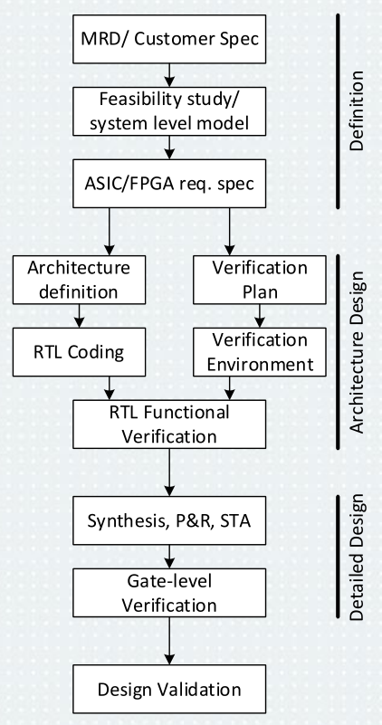

# 1\. Postup při návrhu digitálních integrovaných obvodů. Stručně popište jednotlivé fáze návrhu od počáteční specifikace až po testování v cílovém obvodu.

### Zdroje
- `3_Postup_návrhu_DIO_2025.pdf`

| Faze | Popis |
|------|--------|
| Definice | frontend | 
| Navrhu a verifikace | frontend | 
| Implementace | backend | 
| Validace | | 

| Krok | Popis 
|------|--------
| MRD  | pozadavky zakaznika
| Studie proveditelnosti | vhodna technologie? dostupnost komponent? znalost problematiky? casova narocnost?
| Specifikace FPGA | definice pozadavku (z MRD), modelovani systemu -> `requirements` *(soubor)*
| Definice architektury | rozbor pozadavku, alokace pozadavku *(semestralni projekt)*
| RTL kodovani  | register-transfer level, simulace
| Verifikacni plan | definice testu overeni
| Verifikacni prostredi | tvorba prostredi overeni
| RTL funkcni verifikace | na hotovem RTL, overeni pozadavku
| Synteza | vystupem netlist *(RTL -> obvodove struktury (LUT, registry...))*
| P&R |
| STA | vypocet zpozdeni
| Verifikace hradl. ur. (GLV) | opakovani verifikace na nizsi urovni
| Validace navrhu | 
