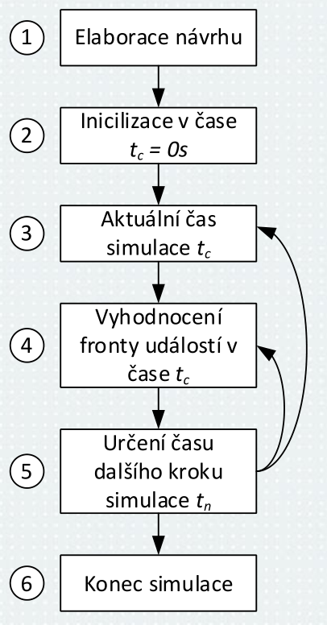
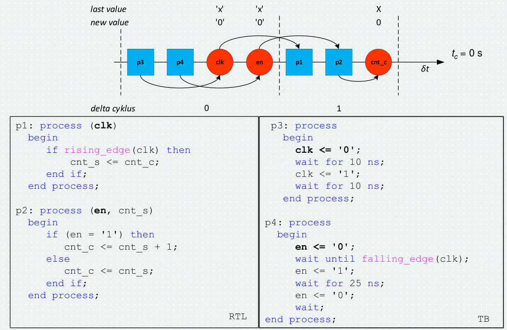

# 2\. Simulace digitálních integrovaných obvodů. Popište, jak funguje simulátor digitálních obvodů a jakým způsobem jsou simulovány souběžné příkazy. Objasněte koncept delta cyklů v jazyce VHDL.

### Zdroje
- `4_simulace_digitalních_obvodů_2024_rev1.pdf`

Simulace na urovni RTL a hradlove urovni **rizena udalostmi** -> **fronta udalosti**

## Faze simulace
1. kontrola syntaxe, hierarchie, expanze generickych konstrukci $\rightarrow$ `elaborace`
2. signalum v obvodu jsou prirazeny a dopocteny pocatecni stavy (inicializace signalu) $\rightarrow$ `inicializace v case` $t_c=0$
3. vlastni simulace:
	1. nastaveni aktualniho casu simulace $t_c$
	2. vyhodnoceni fronty udalosti v case 
	3. urceni casu dalsiho kroku simulace $t_n$
4. po vyprazdneni fronty udalosti, pak `konec simulace` -> *fronta udalosti je prazdna*

## VHDL delta cykly

**VHDL delta cykly** jsou nekonecne male casove intervaly mezi vyhodnocenim prvku fronty udalosti ve stejnem case $t_c$. Vzdy je proveden tak, ze se nastavi signaly, pak se provede proces. Mohou zpusobovat problemy, pokud jsou na sobe zavisle procesy menici se v jednom casovem okamziku na sobe zavisle. Priklad:
