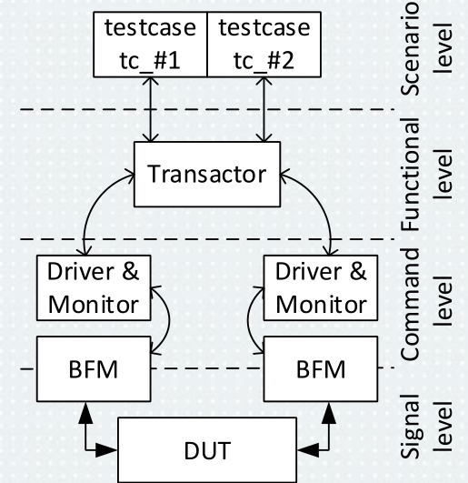

# 3\. Verifikace digitálních obvodů. Nakreslete strukturu jednoduchého verifikačního prostředí. Jaké jsou metody generování testovacích dat? Kdy je možné ukončit verifikaci? Popište pokrytí kódu a funkční pokrytí.

### Zdroje
- `5_verifikace_digitalních_obvodů_2025.pdf`

## Uvod do verifikace
- verifikace, tj. overeni pravdivosti
- ruzne metody:
	- experimentalni test
	- analyza (vypocet param. matematickym modelem)
	- inspekce (napr. po vyrobe)
	- simulace (test modelu, ne realneho HW jako v experimentu)
 
- verifikace pro analogovy a digitalni design:
	- funkcni verifikace
	- formalni verifikace (LEC, spis matematicke)
	- fyzicka verifikace (DRC)
 
- verifikace vs. validace
	- verifikace: dela obvod to, co se ocekava?
	- validace: jsou pozadovane funkce obvodu uzitecne?

## Ukonceni verifikace
- tzv. `coverage`
- rozlisuji se 2 typy pokryti: funkcni a pokryti kodu
### Pokryti kodu:
- line coverage:
	- byl kazdy kod radku aspon jednou vykonan? (bylo testovano vse?)
	- musi mit 100 %
 
- branch coverage:
	- byly pokryty vsechny vetve prikazu if-else atp.
	- musi mit 100 %
 
- expression coverage:
	- byly overeny vsechny kombinace vyrazu?
	- nemusi mit 100 %
 
- FSM coverage:
	- byly vsechny stavy navstiveny a vsechny prechody byly provedeny?
	- pokud se najde "mrtvy kod", pak je bud spatne napsan testbench nebo jsou nastaveny **podminky, ktere nemohou nikdy nastat**
	 
### Funkcni pokryti
- formalni prace, ktera musi byt testovana "rucne" do verifikacniho reportu (dle specifikaci)
- funkcni pokryti musi byt 100 % $\rightarrow$ **tehdy je ukoncena verifikace**

## Generace vstupnich dat
- pristupy:
	- test s nahodnymi daty (generovano programem)
	- prime testy (psani vlastniho stimuli) - *NDI projekt*
 
## Kontrola vystupnich dat
- pristupy:
	- rucni (nespolehlivy) - *obecne by mel provedeny test sam sebe vyhodnotit*
	- automaticky:
		- Bus Functional Model
			- kontrola vystupu na signalove urovni a casovani signalu
			- mel by kontrolovat zmenu signalu ve spravnem okamziku
		- Referencni model
			- abstraktni popis casti obvodu ve vyssim programovacim jazyce
			- generace stejnych vystupu jako DUT v danem case
			- pouziva se pro kontrolu obsahu registru, matematickych vypoctu, slozitych algoritmu
	- assertions
		- specialni konstrukce, proklamuji casove udalosti
	 
