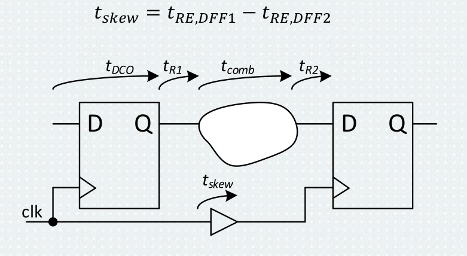

# 5\. Statická časová analýza (STA). Uveďte důležité časové parametry klopného obvodu typu D. Které další časové parametry vstupují do STA? Přechod mezi hodnovými doménami. Kdy je výhodné používat jen jednu časovou doménu?

### Zdroje
- `7_Synteza_PAR_STA_2025.pdf`

## STA
- bez funkcni, casove simulace obvhodu
- analyza vsech komb. cest
- kontrola poruseni pravidel FF:
	1. doba predstihu (setup time)
	2. doba presahu (hold time)
	- "vypocet casovych rezerv"
		- jsou dve struktury ktere zkoumame (cesty `clk` a cesty signalu) - kriticke jsou **nejdelsi** a nejkratsi cesty
	 
	- analuza pro krajni pripady (worst case, best cae, typical case)

	- `clock jitter` je nejistota
 

### Slack
- vysledkem STA je **slack** (bude na zkousce:))
	- rezerva k pozadovane periode hodinoveho signalu (definovano v uzivatelskych omezenich)
	- na kazde ceste je mozno vypocitat takovy slack, nas ale zajima **nejhorsi pripad**
	- pro hold je kriticka kratka cesta
	- pro setup je kriticka dlouha cesta
	- slack zarucuje casovou stabilitu a urcuje frekvenci

## Vice casovych domen
- na vice casovych domenach nelze provest STA

--- 
## Logicka synteza
- deterministicky prevod z `RTL` na idealni `hradla`, odtud pak na prvky `technologicke knihovny` - **vysledkem `netlist` se skutecnymi HW prvky**
- vysledkem netlist

### Postup
1. minimalizace log. fci - Booleova algebra
2. optimalizace kombinacnich fci
3. casova analyza
4. optimalizace sekvencnich obvodu - `retiming`/`register rebalancing`
	- struktura nemusi odpovidat RTL popisu - napr. teorie uzlu muze rozdelovat a reorderovat bloky